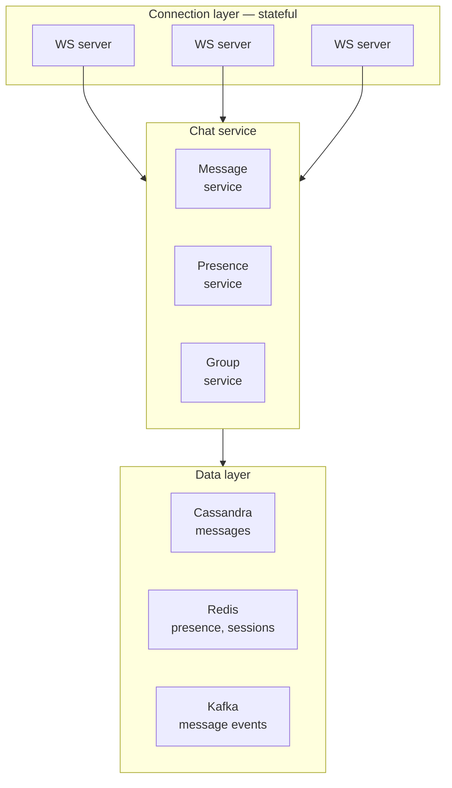

# Module 10: Design Case — Chat System and News Feed

> **Real-time communication at scale.** These systems test your ability to handle persistent connections, message ordering, fan-out patterns, and ranking algorithms.

## Navigation

| Module | Title | Link |
|--------|-------|------|
| Module 09 | Design Case — URL Shortener and Rate Limiter | [../09-case-url-shortener-rate-limiter/](../09-case-url-shortener-rate-limiter/) |
| **Module 10** | **Design Case — Chat System and News Feed** | **(current)** |
| Module 11 | Design Case — Distributed File Storage and Video Streaming | [../11-case-storage-streaming/](../11-case-storage-streaming/) |

---

## Learning Objectives

- Design a chat system with WebSocket connections
- Implement fan-out strategies for news feeds
- Handle the celebrity problem in social media
- Design real-time presence and read receipts

---

## Table of Contents

1. [Part 1: Chat System (WhatsApp/Telegram)](#part-1-chat-system-whatsapptelegram)
2. [Part 2: News Feed (Twitter/Instagram)](#part-2-news-feed-twitterinstagram)
3. [Design Comparison](#design-comparison)
4. [Practice Exercise](#practice-exercise)
5. [Common Mistakes](#common-mistakes)
6. [Discussion Questions](#discussion-questions)
7. [Key References](#key-references)

---

## Part 1: Chat System (WhatsApp/Telegram)

### Requirements

- **Functional**: 1-on-1 chat, group chat (up to 100 members), message history, presence, read receipts
- **Scale**: 500M messages/day, 50M daily active users
- **Latency**: <200ms message delivery
- **Ordering**: Messages within a conversation must be ordered
- **Persistence**: Messages stored for 30 days (free) or forever (paid)

### Capacity Estimation

```
Messages per second: 500M / 86400 ≈ 5,800 msg/sec
Peak (3x): ~17,400 msg/sec

Storage per message:
  message_id:  8 bytes
  chat_id:     8 bytes
  sender_id:   8 bytes
  content:     ~100 bytes (text), ~100KB (image)
  timestamp:   8 bytes
  Total:       ~132 bytes (text)

Per day: 500M × 132 bytes ≈ 66 GB
Per year: ~24 TB (text only)
```

### Architecture



The connection layer is the only stateful tier, and that is the whole design
problem: a WebSocket pins a user to one server, so every other component has to
be able to find *which* server, which is what the presence store is for.

### WebSocket Gateway

The connection layer is the most critical component. Each user maintains a persistent WebSocket connection.

```
  Client ──── WebSocket ────▶ WS Server
                              │
  Connection state:           │
  - user_id                   │
  - server_id (which WS server)│
  - connection_id             │
  - last_active               │
                              │
  Stored in Redis:            │
  user:{user_id} → {server_id, connection_id, last_active}
```

### Message Flow

```
  Alice sends message to Bob:

  1. Alice → WS Server A: { chat_id: "chat_123", content: "Hello" }
  2. WS Server A → Chat Service: Process message
  3. Chat Service:
     a. Assign message_id (Snowflake or similar)
     b. Write to Cassandra (async)
     c. Write to Kafka (for analytics)
     d. Check Bob's connection:
        - If Bob connected to WS Server B:
          Route message to WS Server B → Deliver to Bob
        - If Bob offline:
          Store in pending messages queue (Redis)
          Send push notification
  4. Alice receives ACK: { message_id: "msg_456", status: "sent" }
```

### Message Ordering

```
  Challenge: Multiple messages from Alice may arrive out of order
  
  Solution: Sequence numbers per conversation

  Chat 123:
  Alice → msg_seq=1 → Bob receives msg_seq=1 ✓
  Alice → msg_seq=2 → Bob receives msg_seq=2 ✓
  Alice → msg_seq=3 → Bob receives msg_seq=3 ✓

  If Bob receives msg_seq=3 before msg_seq=2:
  → Buffer msg_seq=3, wait for msg_seq=2
  → Deliver in order: 1, 2, 3
```

### Presence System

```
  ┌───────────────────────────────────────────────────┐
  │  Presence System                                  │
  │                                                   │
  │  User connects:                                   │
  │  Redis SET presence:{user_id} EX 60               │
  │  (expires after 60 seconds if no heartbeat)       │
  │                                                   │
  │  Heartbeat:                                       │
  │  Every 30 seconds: Redis EXPIRE presence:{user} 60│
  │                                                   │
  │  User goes offline:                               │
  │  Redis DEL presence:{user_id}                     │
  │  Publish "user_offline" event to chat members     │
  │                                                   │
  │  Check presence:                                  │
  │  Redis GET presence:{user_id} → EXISTS = online   │
  └───────────────────────────────────────────────────┘
```

### Read Receipts

```
  Three states: Sent ✓, Delivered ✓✓, Read ✓✓ (blue)

  Alice sends message to Bob:
  1. Message sent: status = "sent"
  2. Bob's device receives: status = "delivered"
  3. Bob opens chat: status = "read"

  Storage:
  message_read_status: { message_id, user_id, status, timestamp }

  Optimization: Batch read receipts (don't send per-message)
  Bob reads 50 messages → send one "read up to message X" event
```

---

## Part 2: News Feed (Twitter/Instagram)

### Requirements

- **Functional**: Create posts, follow users, view feed, like/comment
- **Scale**: 500M tweets/day, 200M DAU, 100:1 read/write
- **Latency**: Feed loads in <200ms
- **Ranking**: Chronological or algorithmic (engagement-based)

### The Fan-Out Problem

When a user posts, their content must appear in all followers' feeds.

```
  Fan-out on Write (Push):
  ┌───────────────────────────────────────────────────┐
  │  User posts tweet                                 │
  │  │                                                │
  │  ├──▶ Follower 1's feed (write to their feed)     │
  │  ├──▶ Follower 2's feed                           │
  │  ├──▶ Follower 3's feed                           │
  │  └──▶ Follower 10,000's feed                      │
  │                                                   │
  │  ✓ Feed read is fast (pre-computed)               │
  │  ✗ Write amplification (1 post → 10K writes)      │
  │  ✗ Celebrity problem (1 post → 10M writes!)       │
  └───────────────────────────────────────────────────┘

  Fan-out on Read (Pull):
  ┌───────────────────────────────────────────────────┐
  │  User opens feed                                  │
  │  │                                                │
  │  ├──▶ Check: Who does this user follow?           │
  │  ├──▶ Fetch recent posts from each followed user  │
  │  ├──▶ Merge and sort                              │
  │  └──▶ Return feed                                 │
  │                                                   │
  │  ✓ No write amplification                         │
  │  ✗ Feed read is slow (multiple DB queries)        │
  │  ✗ High latency for users following many people   │
  └───────────────────────────────────────────────────┘
```

### Hybrid Fan-Out (The Real Solution)

```
  ┌───────────────────────────────────────────────────┐
  │           Hybrid Fan-Out Strategy                 │
  │                                                   │
  │  Regular users ( <10K followers):                 │
  │  → Push on write (fan-out to followers' feeds)    │
  │                                                   │
  │  Celebrity users ( >10K followers):               │
  │  → Pull on read (fetch during feed generation)    │
  │                                                   │
  │  Feed generation:                                 │
  │  1. Start with pre-computed feed (pushed posts)   │
  │  2. Merge in real-time posts from celebrities     │
  │  3. Sort by ranking algorithm                     │
  │  4. Return top N posts                            │
  └───────────────────────────────────────────────────┘
```

### Feed Architecture

```
┌───────────────────────────────────────────────────────────┐
│              News Feed Architecture                       │
├───────────────────────────────────────────────────────────┤
│                                                           │
│  User posts → Post Service → Fan-out Service              │
│                              │                            │
│                    ┌─────────┼─────────┐                  │
│                    │         │         │                  │
│                    ▼         ▼         ▼                  │
│              ┌──────────┐ ┌─────┐ ┌─────────┐             │
│              │Feed Cache│ │Feed │ │Analytics│             │
│              │(Redis)   │ │DB   │ │(Kafka)  │             │
│              │per-user  │ │     │ │         │             │
│              │sorted set│ │     │ │         │             │
│              └──────────┘ └─────┘ └─────────┘             │
│                                                           │
│  Feed read:                                               │
│  1. ZREVRANGE feed:{user_id} 0 19 (top 20 posts)          │
│  2. For each post, hydrate with content/user info         │
│  3. Apply ranking algorithm                               │
│  4. Return to client                                      │
│                                                           │
└───────────────────────────────────────────────────────────┘
```

### Feed Storage in Redis

```
  Redis Sorted Set for each user's feed:

  Key: feed:{user_id}
  Score: timestamp (or ranking score)
  Value: post_id

  ZADD feed:alice 1690000001 "post_123"
  ZADD feed:alice 1690000002 "post_456"
  ZADD feed:alice 1690000003 "post_789"

  ZREVRANGE feed:alice 0 19  # Latest 20 posts

  Cleanup — two correct options:

  (a) By age: drop everything scored before the cutoff timestamp
      ZREMRANGEBYSCORE feed:alice -inf 1689395200

  (b) By size: keep only the newest 1000 entries
      ZREMRANGEBYRANK feed:alice 0 -1001
      (ranks are low→high score, so 0..-1001 is everything
       EXCEPT the top 1000)
```

> **Do not write `ZREMRANGEBYRANK feed:alice 0 -1`.** That range covers the
> entire sorted set — it is equivalent to `DEL` and wipes the whole feed.
> `-1` is the *last* element, not "leave one behind."

Option (b) is usually the better default: it bounds memory per user regardless
of how active the people they follow are. Age-based trimming leaves a heavy
user's feed unbounded and a quiet user's feed empty.

### Ranking Algorithm

```
  Engagement, weighted by interaction cost:

  engagement = (likes × 1.0) + (comments × 2.0) + (shares × 3.0)

  Post A: 100 likes, 20 comments, 10 shares → 100 + 40 + 30 = 170
  Post B: 500 likes,  5 comments,  0 shares → 500 + 10 +  0 = 510
```

Now apply time decay. **Recency must be a multiplier or a divisor, never an
additive bonus** — a term worth at most 1.0 cannot influence scores in the
hundreds:

```
  ┌─ The broken version ────────────────────────────────────┐
  │  score = engagement + (1 - hours/24)                     │
  │                                                          │
  │  Post A (2h):  170 + 0.92 = 170.92                      │
  │  Post B (20h): 510 + 0.17 = 510.17                      │
  │                                                          │
  │  B wins by 339. The recency term contributed 0.75 of     │
  │  that. Deleting it entirely changes nothing — so it is   │
  │  not actually ranking by recency at all.                 │
  └──────────────────────────────────────────────────────────┘

  ┌─ Gravity decay (Hacker News style) ─────────────────────┐
  │  score = engagement / (hours + 2)^1.8                    │
  │                                                          │
  │  Post A (2h):  170 / 4^1.8   = 170 / 12.1 = 14.0        │
  │  Post B (20h): 510 / 22^1.8  = 510 / 274  =  1.9        │
  │                                                          │
  │  Post A wins. A fresh post with solid engagement beats   │
  │  an older post with 3× the engagement — which is the     │
  │  behavior a feed actually wants.                        │
  └──────────────────────────────────────────────────────────┘
```

**Tuning the exponent** controls how aggressively the feed churns:

| Gravity | Half-life | Feels like |
|---------|-----------|------------|
| 1.2 | ~14 h | Slow — good content lingers for a day |
| 1.8 | ~5 h | Balanced (HN's default) |
| 2.5 | ~2 h | Fast churn — breaking news, live events |

An alternative used widely in practice is Reddit's **logarithmic** approach:
`score = log10(engagement) + timestamp/45000`. Because engagement is
compressed logarithmically, the first 10 upvotes move a post as much as the
next 100 — so age reliably overtakes raw volume.

---

## Design Comparison

| Aspect | Chat System | News Feed |
|--------|------------|-----------|
| **Data flow** | Bidirectional (sender ↔ receiver) | One-to-many (author → followers) |
| **Ordering** | Strict (messages in order) | Approximate (feed ranking) |
| **Storage** | Cassandra (time-series) | Redis (sorted sets) + MySQL |
| **Real-time** | WebSocket (persistent) | Polling or push notifications |
| **Fan-out** | N/A (point-to-point) | Push + pull hybrid |

---

## Practice Exercise

**25-minute design**: Design a chat system for 10M users:

- 1-on-1 and group chats (up to 50 members)
- Message history (30 days)
- Online presence indicators
- Read receipts

**Key decisions**:
1. How do you handle WebSocket connections at scale?
2. How do you store and retrieve message history?
3. How do you implement presence (online/offline)?
4. How do you handle group chat fan-out?

---

## Common Mistakes

| Mistake | Why It's Wrong | What to Do Instead |
|---------|---------------|-------------------|
| **Treating WebSocket servers as stateless** | The connection *is* the state — you can't route to Bob without knowing which server holds him | Connection registry (`user_id → server_id`) in Redis; route through it |
| **Client-generated message IDs for ordering** | Device clocks are wrong, and users cheat | Server-assigned sequence per conversation (Snowflake or a per-chat counter) |
| **Global ordering across all messages** | Needs total-order consensus at enormous cost, and nobody can perceive it | Order *within* a conversation only — that's all users notice |
| **`ZREMRANGEBYRANK key 0 -1` to trim a feed** | That range is the entire sorted set — it deletes the feed | `ZREMRANGEBYRANK key 0 -1001` to keep 1000, or `ZREMRANGEBYSCORE` by timestamp |
| **Fan-out on write for celebrities** | 100M followers means 100M writes for one post, and the queue never drains | Hybrid: push for normal accounts, pull for high-follower accounts at read time |
| **Fan-out on read for everyone** | Following 500 accounts means 500 queries per feed load | Pre-compute for the common case; pull only the celebrity tail |
| **Fanning out to inactive users** | Most of a large follower list hasn't opened the app in months | Push only to recently-active followers; the rest rebuild on next login |
| **Additive recency in a ranking score** | A term bounded at 1.0 cannot move scores in the hundreds — recency silently does nothing | Multiply or divide: `engagement / (age + 2)^gravity` |
| **Unbounded per-user feed lists** | Memory grows without limit for users who follow prolific accounts | Cap at ~1000 entries; page older content from the source of truth |
| **Presence via a write on every heartbeat** | 50M users at one heartbeat per 30s is ~1.7M writes/sec of nearly worthless data | A TTL key refreshed on heartbeat; absence *is* offline |
| **Broadcasting presence to every contact** | Presence changes fan out quadratically in dense graphs | Push only to contacts with an open chat window; others poll on demand |
| **A read receipt per message** | Opening a chat with 50 unread messages emits 50 writes | One "read up to sequence N" watermark per conversation |

---

## Discussion Questions

1. Alice sends three messages in quick succession. Bob receives #1 and #3 but #2 is delayed. What should Bob's client show, and where does that logic belong?

   **Model answer**: Buffer #3 and display only #1 until #2 arrives — showing #3 first makes a conversation unreadable, and "fixing" the order afterwards makes messages jump around on screen. That requires a monotonic per-conversation sequence number assigned server-side, so the client can detect the gap. Server-assigned matters because device clocks are unreliable and clients can lie. Add a bounded timeout: if #2 hasn't arrived in a few seconds, show #3 with a gap indicator and reconcile via history fetch, because waiting forever on a message that was genuinely lost is worse than displaying out of order.

2. A WebSocket server holding 100K connections crashes. Walk through what happens from the users' perspective, and what has to be in place for it to be survivable.

   **Model answer**: All 100K connections drop simultaneously and every client reconnects at once — a thundering herd against the remaining servers. Required: (1) Clients reconnect with **jittered** exponential backoff, or they synchronize into a second outage. (2) The registry entries must expire via TTL, not explicit cleanup, since a crashed server deletes nothing. (3) Messages routed to the dead server during the gap must be durably queued, not held in memory, so they deliver on reconnect. (4) On reconnect the client sends its last-seen sequence and the server replays the gap. The system is survivable only if messages were persisted *before* being acknowledged — if the ack came first, those messages are simply gone.

3. Justin Bieber posts. He has 100M followers. Compare fan-out on write, fan-out on read, and the hybrid — with numbers.

   **Model answer**: **Write** is 100M feed insertions for one post; at ~50K writes/sec that is over half an hour of queue drain, and the feed is stale for most followers the entire time. **Read** makes his posts free to publish but forces every follower's feed load to query him — trivial for him, but if everyone were pulled, a user following 500 accounts issues 500 queries per load. **Hybrid** is what production systems do: push for accounts below a threshold (~10-100K followers), pull for those above. Feed generation reads the pre-computed list and merges in the handful of celebrities the user follows. The cost is a merge on every read, which is cheap because a user follows only a few such accounts. The threshold is an operational tuning knob, not a constant.

4. Your group chat supports 100 members. Product asks for 100,000-member channels. What breaks?

   **Model answer**: The delivery model. At 100 members, fan-out per message is trivial. At 100K, one message is 100K deliveries — and an active channel with 10 messages/second becomes 1M deliveries/second from a single room. Presence gets worse: showing who's online is a 100K-entry query per member per refresh. Read receipts become impossible to store per-message-per-user (10 messages × 100K members = 1M rows/second). What actually changes is the abstraction: large channels stop being "chat" and become **broadcast**. Members subscribe to a shared topic instead of each having a personal inbox; history is read from a shared log on scroll; presence becomes an approximate count; read receipts are dropped entirely or reduced to an unread badge. This is why WhatsApp caps group size and Slack/Discord treat channels differently from DMs — the same design does not stretch.

5. Your feed ranking uses engagement signals. A post gets 10,000 likes in ten minutes from accounts created that week. What does this mean for the system beyond ranking?

   **Model answer**: Engagement is an adversarial input, so treating it as ground truth makes the ranker an amplifier for whoever games it hardest. Practically: weight signals by source reputation (account age, history, follower authenticity), rate-limit engagement per account, and detect coordinated bursts — 10K likes in ten minutes from week-old accounts is a detectable pattern. Architecturally this means the ranking pipeline needs a **trust/abuse stage between engagement collection and score computation**, which most designs omit entirely. The system-design consequence is that ranking cannot be a pure function of counters; it needs a separate, slower-moving abuse signal, which changes the data flow.

---

## Key References

| Resource | Type | Focus |
|----------|------|-------|
| System Design Interview (Ch. 4-5) | Book | Chat system, news feed |
| WhatsApp Engineering Blog | Blog | Message delivery at scale |
| Twitter Engineering Blog | Blog | Fan-out, timeline ranking |
| Discord Engineering Blog | Blog | Large-channel broadcast, presence at scale |
| "Building Microservices" (Ch. 5) | Book | Real-time communication |

---

## Related Modules

| Module | Connection |
|--------|-----------|
| [Module 03: Caching Strategies](../03-caching/README.md) | Redis sorted sets and TTL keys are the caching primitives behind this module's feed storage and presence system |
| [Module 04: Load Balancing and Networking](../04-load-balancing/README.md) | The WebSocket connection registry is a stateful load-balancing problem — routing to the server that holds the connection |
| [Module 05: Asynchronous Systems and Message Queues](../05-async-systems/README.md) | Kafka event streams and offline-message queues are the async decoupling patterns this module leans on |
| [Module 07: Reliability Engineering](../07-reliability/README.md) | The WebSocket-crash discussion question here is a direct case study in thundering herd and durable delivery |

---

## Summary

```
┌────────────────────────────────────────────────────────────────┐
│            Chat System & News Feed — Key Takeaways             │
├────────────────────────────────────────────────────────────────┤
│                                                                │
│  1. The WebSocket connection is the state — route through a    │
│     registry, because no server can reach a user it doesn't    │
│     know about                                                 │
│  2. Order messages within a conversation, never globally —     │
│     that's the only ordering guarantee anyone actually notices │
│  3. Never trust a client's clock for message order — assign    │
│     sequence numbers server-side, or users will find a way to  │
│     cheat it                                                   │
│  4. `ZREMRANGEBYRANK key 0 -1` isn't a trim, it's a `DEL` —    │
│     know your Redis ranges before you run them in production   │
│  5. Fan-out on write dies at celebrity scale, fan-out on read  │
│     dies at normal scale — hybrid is the only design that      │
│     survives both                                              │
│  6. Recency belongs in a multiplier or divisor, never an addend│
│     — a term capped at 1.0 cannot move a score in the hundreds │
│  7. Presence is a TTL key refreshed on heartbeat, not a write  │
│     per heartbeat — silence should mean offline                │
│  8. Engagement is an adversarial signal, not ground truth —    │
│     rank on raw counters and you've built a bot amplifier      │
│  9. Design for the crash, not just the happy path — a dead     │
│     WebSocket server means a thundering herd of reconnects,    │
│     survivable only with jittered backoff and durable pre-ack  │
│     storage                                                    │
│                                                                │
└────────────────────────────────────────────────────────────────┘
```

---

## Navigation

**Previous:** [Module 09: Design Case — URL Shortener and Rate Limiter](../09-case-url-shortener-rate-limiter/README.md)

**Next:** [Module 11: Design Case — Distributed File Storage and Video Streaming](../11-case-storage-streaming/README.md)

---

*Module 10 of 22 in the System Design Playground*
