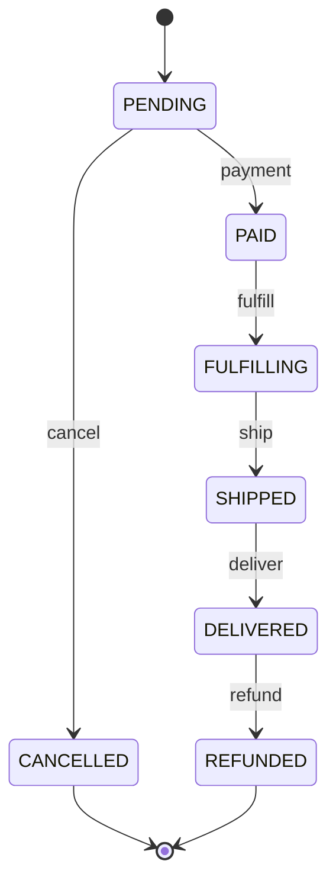
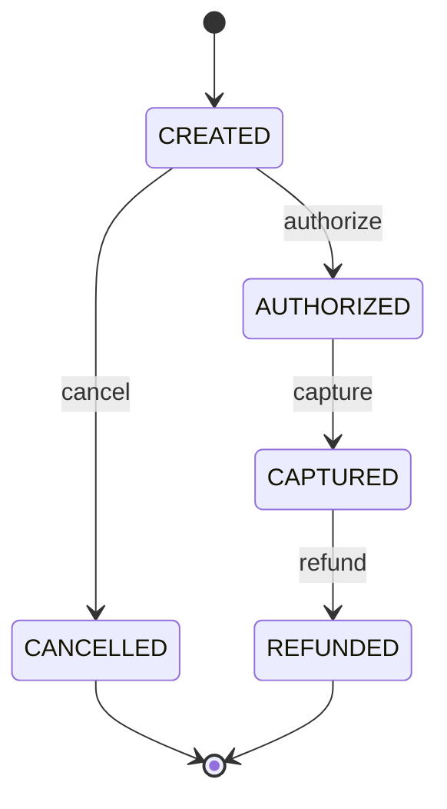

# Module 12: Design Case — Payment System and E-commerce

> **High-stakes transactional systems.** Payment systems demand strong consistency, idempotency, and audit trails. E-commerce adds inventory management, flash sales, and complex order lifecycles.

## Navigation

| Module | Title | Link |
|--------|-------|------|
| Module 11 | Design Case — Distributed File Storage and Video Streaming | [../11-case-storage-streaming/](../11-case-storage-streaming/) |
| **Module 12** | **Design Case — Payment System and E-commerce** | **(current)** |
| Module 13 | Security | [../13-security/](../13-security/) |

---

## Learning Objectives

- Design a payment system with idempotency and exactly-once processing
- Implement inventory management with race condition prevention
- Design flash sale architectures that handle traffic spikes
- Handle order lifecycle state machines

---

## Table of Contents

1. [Part 1: Payment System](#part-1-payment-system)
2. [Part 2: E-commerce System](#part-2-e-commerce-system)
3. [Design Comparison](#design-comparison)
4. [Deep Dive: Payment System Details](#deep-dive-payment-system-details)
5. [Deep Dive: E-commerce Details](#deep-dive-e-commerce-details)
6. [Practice Exercises](#practice-exercises)
7. [Common Mistakes](#common-mistakes)
8. [Discussion Questions](#discussion-questions)
9. [Key References](#key-references)

---

## Part 1: Payment System

### Requirements

- **Functional**: Process payments, refunds, reconciliation, support multiple payment methods
- **Scale**: 10K transactions/second, $1B daily volume
- **Latency**: <500ms for payment confirmation
- **Consistency**: Strong (no double charges, no lost payments)
- **Compliance**: PCI DSS, SOC 2

### Payment Flow

```
┌───────────────────────────────────────────────────────────┐
│                Payment Processing Flow                    │
├───────────────────────────────────────────────────────────┤
│                                                           │
│  Client → Payment Service → Payment Gateway → Bank        │
│                                                           │
│  1. Client submits payment                                │
│     { card: "4242...", amount: 99.99, order_id: "123" }   │
│                                                           │
│  2. Payment Service:                                      │
│     a. Validate input                                     │
│     b. Check idempotency (order_id already processed?)    │
│     c. Create payment record (status: PENDING)            │
│     d. Call payment gateway (Stripe, Adyen, etc.)         │
│                                                           │
│  3. Payment Gateway:                                      │
│     a. Tokenize card                                      │
│     b. fraud check                                        │
│     c. Route to card network (Visa, Mastercard)           │
│     d. Bank approves/declines                             │
│     e. Return result                                      │
│                                                           │
│  4. Payment Service:                                      │
│     a. Update payment status (COMPLETED / FAILED)         │
│     b. Notify order service                               │
│     c. Publish event to Kafka (for analytics)             │
│                                                           │
│  5. Client receives confirmation                          │
│                                                           │
└───────────────────────────────────────────────────────────┘
```

### Idempotency

The most critical property in payment systems. Each payment must be processed exactly once.

```
  Problem:
  1. Client sends payment request
  2. Payment succeeds at bank
  3. Response lost (network timeout)
  4. Client retries (thinks it failed)
  5. DOUBLE CHARGE!

  Solution: Idempotency keys

  Client sends: { order_id: "123", amount: 99.99, idempotency_key: "abc-123" }
  
  Payment Service:
  1. Check: Has idempotency_key "abc-123" been processed?
  2. No → Process payment, store {key: "abc-123", result: SUCCESS}
  3. Yes → Return stored result (don't process again)

  Storage: Redis with TTL (24 hours)
  SET idempotency:abc-123 EX 86400
```

### Exactly-Once Processing

```
  ┌───────────────────────────────────────────────────┐
  │  Exactly-Once Payment Processing                  │
  │                                                   │
  │  1. Begin transaction                             │
  │  2. Check idempotency key in DB                   │
  │  3. If exists → return cached result              │
  │  4. Process payment with gateway                  │
  │  5. Store result with idempotency key             │
  │  6. Commit transaction                            │
  │                                                   │
  │  If crash at any point:                           │
  │  - Before commit: Transaction rolled back         │
  │  - After commit: Idempotency key prevents retry   │
  └───────────────────────────────────────────────────┘
```

### Reconciliation

Daily reconciliation ensures all systems agree on transaction state.

```
  ┌───────────────────────────────────────────────────┐
  │  Reconciliation Process                           │
  │                                                   │
  │  End of day:                                      │
  │  1. Fetch all transactions from our DB            │
  │  2. Fetch all transactions from payment gateway   │
  │  3. Match by transaction_id                       │
  │                                                   │
  │  Match status:                                    │
  │  ✓ Matched: Both systems agree                    │
  │  ⚠ Mismatch: Amount or status differs             │
  │  ✗ Missing in gateway: Payment we think succeeded │
  │  ✗ Missing in our DB: Payment we missed           │
  │                                                   │
  │  Auto-resolve: 95%+ match automatically           │
  │  Manual review: Remaining 5% flagged for review   │
  └───────────────────────────────────────────────────┘
```

---

## Part 2: E-commerce System

### Order Lifecycle



### Inventory Management

The classic race condition problem:

```
  Problem: Two users buy the last item simultaneously

  User A: Check stock → 1 remaining → Buy → Stock = 0 ✓
  User B: Check stock → 1 remaining → Buy → Stock = -1 ✗ (oversold!)

  Solution 1: Pessimistic locking
  SELECT stock FROM inventory WHERE product_id = 123 FOR UPDATE;
  -- Now locked, other transactions wait
  UPDATE inventory SET stock = stock - 1 WHERE product_id = 123 AND stock > 0;

  Solution 2: Optimistic locking
  UPDATE inventory SET stock = stock - 1, version = version + 1
  WHERE product_id = 123 AND stock > 0 AND version = 5;
  -- If affected_rows = 0, version changed → retry

  Solution 3: Atomic operation
  UPDATE inventory SET stock = stock - 1
  WHERE product_id = 123 AND stock >= 1;
  -- Database ensures atomicity
```

### Flash Sale Architecture

Flash sales create massive traffic spikes (100x normal).

```
┌───────────────────────────────────────────────────────────┐
│              Flash Sale Architecture                      │
├───────────────────────────────────────────────────────────┤
│                                                           │
│  Before sale:                                             │
│  1. Pre-warm cache with product details                   │
│  2. Pre-compute inventory in Redis (atomic DECR)          │
│  3. Queue-based entry (virtual waiting room)              │
│                                                           │
│  During sale:                                             │
│  1. User enters virtual queue                             │
│  2. Queue assigns position: "You are #1,234 in line"      │
│  3. As users ahead complete/fail, position advances       │
│  4. When it's your turn: 15-minute window to purchase     │
│                                                           │
│  Purchase flow:                                           │
│  1. Redis DECR inventory:{product_id}                     │
│  2. If result >= 0: Reserve item (TTL: 10 minutes)        │
│  3. If result <  0: INCR back immediately, then reject    │
│  4. Process payment                                       │
│  5. If payment succeeds: Confirm reservation              │
│  6. If payment fails: INCR inventory back                 │
│                                                           │
│  Key optimizations:                                       │
│  - All reads from Redis (no DB until payment)             │
│  - Payment processed async (queue)                        │
│  - Rate limiting per user (1 purchase per user)           │
│                                                           │
└───────────────────────────────────────────────────────────┘
```

**Step 3 is not optional.** A bare `DECR` that rejects without restoring drives
the counter arbitrarily negative once stock runs out — and with 1M users hitting
a 10,000-unit sale, it lands somewhere around -990,000. Then the first refund
`INCR` has to climb back through a million phantom decrements before the counter
is positive again, so genuinely returned stock never becomes buyable.

Do the check and the decrement atomically instead:

```lua
-- reserve.lua — KEYS[1] = inventory key, ARGV[1] = qty
-- Never lets the counter go below zero, so no repair path is needed.
local stock = tonumber(redis.call('GET', KEYS[1]) or '0')
if stock >= tonumber(ARGV[1]) then
  return redis.call('DECRBY', KEYS[1], ARGV[1])
end
return -1        -- out of stock; counter untouched
```

Redis runs each script atomically, so the read and the write cannot interleave
with another buyer. `DECR`-then-compensate has a window where the counter lies;
this does not.

### Cart Design

```
  ┌───────────────────────────────────────────────────┐
  │  Cart Storage Strategy                            │
  │                                                   │
  │  Logged-in users:                                 │
  │  Redis: cart:{user_id} → Hash of product:quantity │
  │  MySQL: carts table (durable backup)              │
  │                                                   │
  │  Guest users:                                     │
  │  Redis: cart:{session_id} → Hash of product:qty   │
  │  TTL: 7 days                                      │
  │  On login: Merge guest cart with user cart        │
  │                                                   │
  │  Cart operations:                                 │
  │  HSET cart:123 product_456 2  (add 2 of product)  │
  │  HGET cart:123 product_456     (get quantity)     │
  │  HDEL cart:123 product_456     (remove product)   │
  │  HGETALL cart:123              (get all items)    │
  └───────────────────────────────────────────────────┘
```

---

## Design Comparison

| Aspect | Payment System | E-commerce |
|--------|--------------|------------|
| **Consistency** | Strong (financial) | Strong (inventory) |
| **Idempotency** | Critical | Important |
| **Latency** | <500ms | <200ms (browsing) |
| **Peak traffic** | Steady | Flash sales (100x) |
| **Compliance** | PCI DSS | Less strict |

---

## Deep Dive: Payment System Details

### Payment State Machine



**Why two phases.** *Authorize* holds funds on the card without moving money;
*capture* actually transfers it. Splitting them lets you confirm the order —
and verify inventory — before charging anyone, and an authorization that is
never captured simply expires.

### Idempotency Implementation

```python
import json

import redis

class PaymentService:
    def __init__(self):
        self.redis = redis.Redis()
        self.db = Database()

    def process_payment(self, order_id, amount, idempotency_key):
        """The idempotency key is REQUIRED and must come from the client.

        Generating one server-side would defeat the whole mechanism: a retry
        would arrive with a fresh key, miss the dedup check, and charge the
        customer twice — exactly the failure idempotency exists to prevent.
        The key must be stable across retries of the same logical intent, so
        only the caller can mint it.
        """
        if not idempotency_key:
            raise ValueError("idempotency_key is required for payment writes")

        dedup_key = f"idempotency:{idempotency_key}"

        # Claim the key BEFORE charging. SET NX is atomic, so exactly one
        # concurrent request wins the claim; the rest see the in-flight
        # marker. Checking-then-setting would let two parallel retries both
        # pass the check and both charge.
        claimed = self.redis.set(dedup_key, json.dumps({"status": "in_flight"}),
                                 nx=True, ex=86400)

        if not claimed:
            existing = json.loads(self.redis.get(dedup_key))
            if existing["status"] == "in_flight":
                # A concurrent attempt is mid-charge. Tell the client to retry
                # rather than risking a second charge.
                raise ConcurrentRequestError("payment already in flight", retry_after=2)
            return existing["result"]  # Replay the recorded response

        try:
            result = self.payment_gateway.charge(
                order_id, amount,
                # Pass the key downstream too — the gateway dedups as well.
                idempotency_key=idempotency_key,
            )

            # Persist durably FIRST, then record the response for replay.
            # Redis is a cache; the ledger is the source of truth.
            self.db.save_payment(order_id, idempotency_key, result)
            self.redis.setex(dedup_key, 86400,
                             json.dumps({"status": "done", "result": result}))
            return result

        except Exception:
            # Release the claim so a legitimate retry can proceed. Leaving the
            # marker in place would block the customer for the full 24h TTL.
            self.redis.delete(dedup_key)
            raise
```

**The subtle failure mode:** if the gateway charge *succeeds* but the process
dies before `save_payment`, the `except` branch never runs and the claim
survives with `status: "in_flight"` until its TTL lapses — the customer is
charged with no local record. This is exactly the gap that daily
**reconciliation** (above) exists to close: compare the gateway's settled
transactions against your ledger and repair the difference. No amount of
in-process cleverness removes the need for it.

### Fraud Detection

```
  ┌───────────────────────────────────────────────────────┐
  │  Fraud Detection Pipeline                             │
  │                                                       │
  │  Transaction → Rule Engine → ML Model → Decision      │
  │                                                       │
  │  Rule Engine (fast, deterministic):                   │
  │  - Amount > $10,000 → FLAG                            │
  │  - Country mismatch (card US, IP Russia) → FLAG       │
  │  - 10+ transactions in 1 minute → BLOCK               │
  │  - Known fraudulent card → BLOCK                      │
  │                                                       │
  │  ML Model (slower, more accurate):                    │
  │  - Features: amount, time, location, device, history  │
  │  - Score: 0-1 probability of fraud                    │
  │  - Threshold: >0.8 → BLOCK, >0.5 → FLAG               │
  │                                                       │
  │  Decision:                                            │
  │  - APPROVE: Process payment                           │
  │  - FLAG: Process but review manually                  │
  │  - BLOCK: Reject payment                              │
  └───────────────────────────────────────────────────────┘
```

---

## Deep Dive: E-commerce Details

### Inventory Reservation Pattern

```
  Problem: User adds to cart → pays → item out of stock

  Solution: Reserve inventory during checkout

  ┌───────────────────────────────────────────────────────┐
  │  Inventory Reservation Flow                           │
  │                                                       │
  │  1. User clicks "Checkout"                            │
  │     → Redis DECR inventory:{product_id}               │
  │     → If result >= 0: Reserve (TTL: 10 minutes)       │
  │     → If result < 0: "Out of stock"                   │
  │                                                       │
  │  2. User completes payment (within 10 minutes)        │
  │     → Confirm reservation (remove TTL)                │
  │     → Decrement DB inventory                          │
  │                                                       │
  │  3. User abandons checkout (after 10 minutes)         │
  │     → reservation key expires                         │
  │     → sweeper returns the unit to inventory           │
  │     → Item becomes available again                    │
  │                                                       │
  │  Benefits:                                            │
  │  - No overselling                                     │
  │  - Automatic release on timeout                       │
  │  - Redis handles contention (atomic operations)       │
  └───────────────────────────────────────────────────────┘
```

> **Redis does not run your code when a key expires.** A TTL deletes the key
> silently — it will not `INCR` anything. "TTL expires → INCR inventory" needs
> an actual mechanism:
>
> | Mechanism | Trade-off |
> |-----------|-----------|
> | **Keyspace notifications** (`Kx`, event `expired`) | Near-real-time, but delivery is fire-and-forget — a disconnected subscriber loses the event and that unit leaks permanently |
> | **Sweeper job** over a reservation `ZSET` scored by expiry time | Reliable and replayable; reclaims within one poll interval (a few seconds) |
> | **Reconcile against the DB** | Backstop for whatever the first two miss |
>
> Make the sweeper the primary path. On a flash sale, a lost expiry event means
> permanently unsellable stock — worse than a few seconds of reclaim delay.
>
> Note also that Redis expires keys **lazily** (on access) as well as via a
> background sampler, so even the notification can arrive well after the nominal
> TTL. Never treat a TTL as a scheduler.

### Flash Sale Detailed Flow

```
  ┌───────────────────────────────────────────────────────┐
  │  Flash Sale: 10,000 items, 1M users                   │
  │                                                       │
  │  T-24h: Pre-warm                                      │
  │  - Load product details into Redis                    │
  │  - Set inventory:10000 in Redis                       │
  │  - Pre-render product page (static HTML)              │
  │  - CDN cache the page                                 │
  │                                                       │
  │  T-0: Sale starts                                     │
  │  - Virtual queue: users get position number           │
  │  - Position 1-10000: "You can buy!"                   │
  │  - Position 10001+: "You're in queue, wait..."        │
  │                                                       │
  │  Purchase (position 1-10000):                         │
  │  1. Redis DECR inventory → result = 9999              │
  │  2. Reserve: SET reservation:user_123 EX 600          │
  │  3. Redirect to payment                               │
  │  4. Payment succeeds → Confirm: DEL reservation       │
  │  5. Payment fails → INCR inventory back               │
  │                                                       │
  │  Queue advancement:                                   │
  │  - User completes/fails → Next position advances      │
  │  - Position 10001 becomes 10000 → "You can buy!"      │
  │  - Push notification: "It's your turn!"               │
  └───────────────────────────────────────────────────────┘
```

---

## Practice Exercises

### Exercise 1: Payment System Design (30 min)

Design a payment system for a marketplace that:
- Processes 5K transactions/second
- Supports credit cards, debit cards, and digital wallets
- Handles refunds and disputes
- Requires PCI DSS compliance

**Key decisions:**
- How do you handle idempotency?
- How do you prevent double charges?
- How do you store card data securely?
- How do you handle payment failures?

### Exercise 2: Inventory System (25 min)

Design an inventory system for an e-commerce platform:
- 100K products, 1K SKUs per product (size/color)
- Handles flash sales (100x traffic spike)
- Prevents overselling
- Supports multi-warehouse allocation

**Key decisions:**
- Where do you store inventory (DB vs Redis)?
- How do you handle concurrent purchases?
- How do you allocate across warehouses?
- How do you handle backorders?

### Exercise 3: Reconciliation System (20 min)

Design a daily reconciliation system:
- 1M transactions/day
- Match against 3 payment gateways
- Auto-resolve 95% of mismatches
- Flag 5% for manual review

**Key decisions:**
- How do you match transactions?
- How do you handle timing differences?
- How do you report discrepancies?
- How do you prevent duplicate reconciliations?

## Common Mistakes

| Mistake | Why It's Wrong | What to Do Instead |
|---------|---------------|-------------------|
| **Generating the idempotency key server-side** | A retry arrives with a fresh key, misses dedup, and charges twice — defeating the entire mechanism | The client mints a key that is stable across retries of one intent |
| **Check-then-set for idempotency** | Two concurrent retries both pass the check and both charge | Atomic claim (`SET NX`) *before* calling the gateway |
| **Storing money as a float** | `0.1 + 0.2 != 0.3`; rounding errors accumulate into real losses | Integer minor units (cents) or exact `DECIMAL` |
| **Trusting the client's amount** | Anyone can post `{"amount": 1}` for a $1,000 order | Recompute the total server-side from authoritative prices |
| **No reconciliation** | A charge that succeeds at the gateway but fails to record locally is invisible until the customer complains | Daily gateway-vs-ledger comparison with an explicit repair path |
| **`DECR` without restoring on rejection** | The counter drifts far negative, and returned stock never becomes buyable again | Check-and-decrement atomically in one Lua script |
| **Relying on TTL expiry to release stock** | Redis deletes keys silently; it does not run your code | Sweeper over a reservation `ZSET`, with reconciliation as a backstop |
| **Deleting or mutating ledger rows** | Financial history must be auditable and reconstructible | Append-only ledger; corrections are new compensating entries |
| **Capturing at authorization time** | You take money before you can fulfil, so every failure becomes a refund | Authorize on order, capture on fulfilment |
| **Non-idempotent refunds** | A retried refund pays the customer twice | Key refunds by `refund_id` and dedupe on it |
| **Treating a payment as a two-state flag** | Real payments are pending, authorized, captured, failed, disputed, refunded | An explicit state machine with legal transitions only |

---

## Discussion Questions

1. You're building a payment system. A user reports they were charged twice for the same order. How do you investigate and resolve this?

   **Model answer**: (1) Check idempotency key — was the same key used for both charges? (2) Check payment gateway — did they receive one or two requests? (3) Check our logs — were there two separate API calls? (4) If double charge confirmed: refund one, add idempotency key to prevent future occurrences, investigate root cause (was it a client retry, network timeout, or bug?).

2. Design a flash sale for a product with 10,000 units and 1M interested users. How do you prevent overselling while keeping the UX smooth?

   **Model answer**: Use Redis for inventory (atomic DECR). Virtual queue for fair access. Reserve inventory during checkout (TTL: 10 minutes). If payment fails or user abandons, inventory returns to pool. Key: all inventory operations in Redis (not DB) to handle 1M concurrent requests.

3. Your payment gateway is down for 30 minutes. 10K users tried to pay during this time. How do you handle the aftermath?

   **Model answer**: (1) Users see "payment temporarily unavailable" (fail-open or fail-closed based on policy). (2) After gateway recovers: (a) Check which payments succeeded at gateway but we didn't record → reconcile. (b) Notify users to retry. (c) Monitor for duplicate payments. (d) Extend order hold times to prevent auto-cancellation.

4. Explain the difference between authorization and capture in payment processing. When would you use each?

   **Model answer**: Authorization = verify funds are available and hold them (no money moves). Capture = actually transfer money. Use authorization for: pre-orders (hold funds until item ships), hotel bookings (hold until checkout), flash sales (reserve during checkout). Use immediate capture for: digital goods (instant delivery), low-value items (no need to hold).

5. Design a refund system that handles partial refunds, full refunds, and disputed charges.

   **Model answer**: Refund states: PENDING → PROCESSED → SETTLED. Partial refunds: track refunded amount per order (order.total - order.refunded = remaining). Disputed charges: separate flow (chargeback → evidence submission → resolution). Key: refund must be idempotent (same refund_id = same result), and must update inventory (return items to stock).

---

## Key References

| Resource | Type | Focus |
|----------|------|-------|
| Stripe Documentation | Docs | Payment processing best practices |
| System Design Interview (Ch. 8-9) | Book | Payment system, e-commerce |
| "Building Microservices" | Book | Order lifecycle, saga pattern |
| AWS Architecture Blog | Blog | Flash sale patterns |
| PCI DSS Standard | Spec | Payment security compliance |

---

## Related Modules

| Module | Connection |
|--------|-----------|
| [Module 08: Distributed Systems Deep Dive](../08-distributed-systems/README.md) | Idempotency and exactly-once processing are distributed-transaction problems; this module covers the consensus and transaction theory behind the payment patterns here |
| [Module 03: Caching Strategies](../03-caching/README.md) | Redis underpins idempotency claims, inventory counters, cart storage, and the flash-sale hot key — this module covers the Redis patterns and hot-key pitfalls in depth |
| [Module 02: Databases and Storage](../02-databases-storage/README.md) | Inventory's pessimistic and optimistic locking (`SELECT ... FOR UPDATE`, version columns) are ACID transaction techniques covered there |
| [Module 07: Reliability Engineering](../07-reliability/README.md) | Payment gateway outages and daily reconciliation are retry-strategy and disaster-recovery problems this module addresses directly |

---

## Summary

```
┌────────────────────────────────────────────────────────────────┐
│          Payment System & E-commerce — Key Takeaways           │
├────────────────────────────────────────────────────────────────┤
│                                                                │
│  1. Mint idempotency keys on the client, never the server — a  │
│     server-generated key on retry defeats the entire mechanism │
│  2. Claim before you charge: atomic `SET NX` on the idempotency│
│     key, not check-then-set, or concurrent retries both slip   │
│     through and double-charge                                  │
│  3. Store money as integer cents, never floats — rounding      │
│     errors compound into real losses                           │
│  4. Never trust a client-supplied amount — recompute the total │
│     server-side from authoritative prices, always              │
│  5. Reconciliation is not optional — it's the only backstop for│
│     a charge that succeeded at the gateway but never made it   │
│     into your ledger                                           │
│  6. A `DECR` without a restore path drifts arbitrarily negative│
│     — check-and-decrement atomically in one script, or returned│
│     stock never becomes sellable again                         │
│  7. Redis TTL expiry is silent — it will not run your code, so │
│     inventory release needs an active sweeper, not a hope that │
│     something is listening                                     │
│  8. Authorize at order time, capture at fulfillment — capture  │
│     too early and every downstream failure becomes a refund    │
│  9. Payments and orders are state machines, not booleans — real│
│     lifecycles have many states, and only some transitions are │
│     legal                                                      │
│                                                                │
└────────────────────────────────────────────────────────────────┘
```

---

## Navigation

**Previous:** [Module 11: Design Case — Distributed File Storage and Video Streaming](../11-case-storage-streaming/README.md)

**Next:** [Module 13: Security](../13-security/README.md)

---

*Module 12 of 22 in the System Design Playground*
