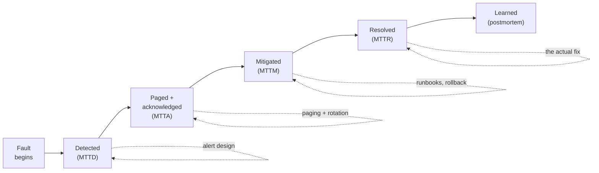
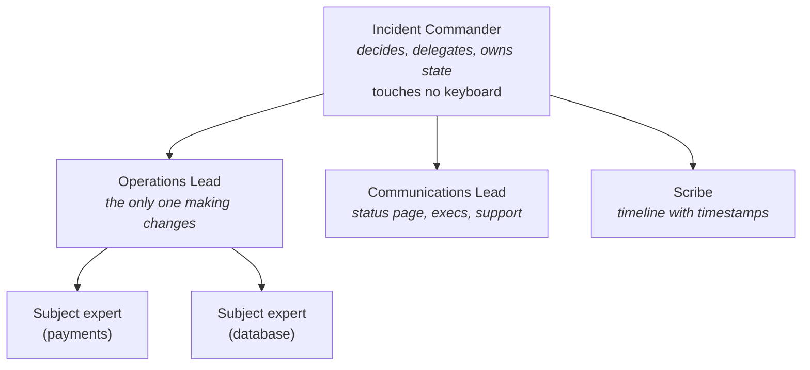
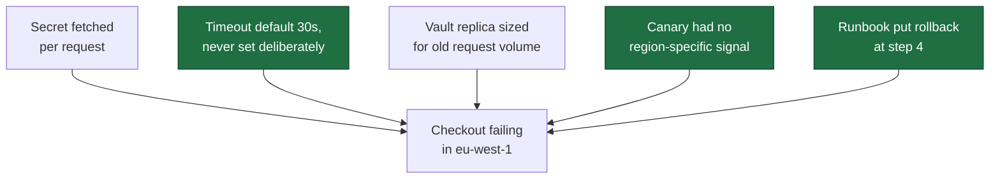

# Module 16: Incident Response and On-Call

> "You do not rise to the level of your monitoring. You fall to the level of your runbooks."

Module 15 gave you telemetry. Telemetry is not an outage response. Between "the
data exists" and "the user stopped being harmed" sits a set of human systems —
who gets woken, what they do first, who decides, and what the organisation
learns afterwards. Those systems are designed, badly or deliberately, in every
company that runs anything.

This module is the deliberate version. It is also the module that shows up in
senior interviews under the innocuous phrasing *"so, how would you operate
this?"*

## Navigation

| Module | Title | Link |
|--------|-------|------|
| Module 15 | Observability | [../15-observability/](../15-observability/) |
| **Module 16** | **Incident Response and On-Call** | **(current)** |
| Module 17 | Machine Learning System Design | [../17-ml-system-design/](../17-ml-system-design/) |

---

## Learning Objectives

By the end of this module, you will be able to:

1. **Decompose** time-to-recovery into detect, page, acknowledge, mitigate, and resolve — and target the stage that actually dominates
2. **Build** SLO burn-rate alerts that page on symptoms rather than causes
3. **Write** a runbook that a half-awake stranger can execute, ordered to mitigate before diagnosing
4. **Classify** incident severity from user impact and budget burn rather than from how alarmed people feel
5. **Run** an incident with separated roles, so the person deciding is not the person typing
6. **Design** an on-call rotation whose load a team can absorb indefinitely
7. **Facilitate** a blameless postmortem that produces action items someone will actually finish

---

## Table of Contents

1. [The Incident Lifecycle](#1-the-incident-lifecycle)
2. [Alerting That Deserves a Page](#2-alerting-that-deserves-a-page)
3. [Dashboards and Runbooks](#3-dashboards-and-runbooks)
4. [Severity, Roles, and Incident Command](#4-severity-roles-and-incident-command)
5. [On-Call That People Can Sustain](#5-on-call-that-people-can-sustain)
6. [Worked Incident: A p99 Regression](#6-worked-incident-a-p99-regression)
7. [Blameless Postmortems](#7-blameless-postmortems)
8. [Case Study: Incident Management at Google](#8-case-study-incident-management-at-google)
9. [Practice Exercise](#9-practice-exercise)
10. [Common Mistakes](#10-common-mistakes)
11. [Discussion Questions](#11-discussion-questions)
12. [Key References](#12-key-references)

---

## 1. The Incident Lifecycle

"Mean time to recovery" is the number everyone quotes and almost nobody
decomposes. Decomposed, it stops being a vague virtue and becomes a list of
separately fixable engineering problems.



The stages fail for unrelated reasons, and they are fixed by unrelated work:

| Stage | The question | What shortens it | Typical failure |
|-------|--------------|------------------|-----------------|
| **Detect** | Do we know? | SLO alerts on symptoms; synthetic probes | A customer tells you first |
| **Acknowledge** | Is a human on it? | Paging that escalates; a rotation that isn't fictional | The page went to someone on holiday |
| **Mitigate** | Did users stop being harmed? | Rollback buttons, feature flags, load shedding, runbooks | Everyone is debugging and nobody has rolled back |
| **Resolve** | Is the fault gone? | The actual fix, tested | Mitigation is mistaken for a fix and quietly persists for a year |
| **Learn** | Will it recur? | Blameless postmortem with owned actions | A document nobody reads and four unstarted action items |

> **The single highest-leverage separation in this module: mitigation is not
> diagnosis.** Rolling back a suspect deploy takes two minutes. Understanding
> why it broke takes an hour. Users are billed for the first number only. A team
> that treats "we don't know the cause yet" as a reason not to mitigate will
> post consistently bad recovery times no matter how good its telemetry is.

Two corollaries that follow from taking the decomposition seriously:

- **If detection dominates, more engineers on-call will not help.** You have an
  alerting problem, and adding responders adds cost without moving the number.
- **If mitigation dominates, better dashboards will not help either.** You need
  mechanisms — a rollback that works on a Sunday, a flag that actually kills the
  code path, a degraded mode somebody has tested.

Measure the stages separately or you will keep buying the wrong fix.

---

## 2. Alerting That Deserves a Page

Most alerting is bad in a specific, diagnosable way: it pages on **causes**
instead of **symptoms**, and it fires at fixed thresholds instead of on
user-visible harm.

### 2.1 Alert on Symptoms

```
  CAUSE-BASED (page-generating, mostly ignorable)

    "CPU > 80% on web-07"        → Does anyone care? Auto-scaling may
                                   already be handling it. Maybe that box
                                   is doing legitimate work.
    "Disk 85% full"              → On a log volume that rotates? Noise.
    "Pod restarted"              → Kubernetes restarts pods. That's the job.
    "Memory > 90%"               → JVM heap sits at 90% by design.

  SYMPTOM-BASED (worth waking someone)

    "Checkout success rate < 99% for 5 minutes"
    "p99 latency > 2s, burning error budget 14x"
    "Order queue depth growing for 15 minutes with no drain"

  Symptoms describe what USERS experience. Causes belong on dashboards
  and in runbooks — you look at them AFTER a symptom alert fires, to
  find out why.
```

The test for any alert: **if this fires and nobody does anything, does a user
notice?** If no, it should not page. Demote it to a ticket or a dashboard panel.

### 2.2 Burn-Rate Alerts

Module 07 introduced error budgets. Burn-rate alerting is what turns a budget
into a paging policy that is neither too twitchy nor too slow.

**Burn rate** = how fast you are consuming budget relative to the rate that
would exactly exhaust it over the whole window. Burn rate 1 means you finish the
30-day window with exactly zero budget left. Burn rate 14.4 means you exhaust
30 days of budget in about 50 hours.

```
  30-day window = 720 hours

  budget_fraction_consumed = burn_rate × hours_elapsed / 720
  error_rate_threshold     = burn_rate × (1 − SLO)
  time_to_exhaustion       = 720 / burn_rate   hours

  For a 99.9% SLO (allowed error rate 0.1%):

  ┌────────────┬───────┬──────────────┬───────────────┬──────────┐
  │ Budget     │ In    │ Burn rate    │ Error rate    │ Action   │
  │ consumed   │       │              │ that triggers │          │
  ├────────────┼───────┼──────────────┼───────────────┼──────────┤
  │ 2%         │ 1 h   │ 14.4×        │ 1.44%         │ PAGE     │
  │ 5%         │ 6 h   │  6×          │ 0.60%         │ PAGE     │
  │ 10%        │ 3 d   │  1×          │ 0.10%         │ TICKET   │
  └────────────┴───────┴──────────────┴───────────────┴──────────┘

  Check: 2% in 1h → burn = 0.02 × 720 / 1  = 14.4  ✓
         5% in 6h → burn = 0.05 × 720 / 6  =  6    ✓
        10% in 3d → burn = 0.10 × 720 / 72 =  1    ✓
```

**Why multiple windows?** A single window is wrong in one direction or the
other. A 1-hour window alone is slow to fire on a small-but-steady leak. A
5-minute window alone fires on every blip. Two burn rates cover both: the fast
one catches acute outages, the slow one catches chronic degradation.

**Why pair each long window with a short one?** Without it, an alert keeps
firing long after the problem is resolved — the 1-hour average stays elevated
for an hour after recovery. Requiring the short window (1/12 of the long one) to
*also* be breaching means the alert clears promptly.

```python
"""Multi-window multi-burn-rate SLO alert evaluation."""

from dataclasses import dataclass

WINDOW_HOURS = 720  # 30-day SLO window

@dataclass(frozen=True)
class BurnRatePolicy:
    name: str
    budget_fraction: float   # e.g. 0.02 for "2% of budget"
    long_window_hours: float
    severity: str

    @property
    def burn_rate(self) -> float:
        return self.budget_fraction * WINDOW_HOURS / self.long_window_hours

    @property
    def short_window_hours(self) -> float:
        # One twelfth of the long window: long enough to be statistically
        # meaningful, short enough that the alert resolves quickly.
        return self.long_window_hours / 12

    def error_rate_threshold(self, slo: float) -> float:
        return self.burn_rate * (1 - slo)

POLICIES = (
    BurnRatePolicy("fast_burn",   0.02, 1,  "page"),
    BurnRatePolicy("medium_burn", 0.05, 6,  "page"),
    BurnRatePolicy("slow_burn",   0.10, 72, "ticket"),
)

def evaluate(slo: float, error_rate_over) -> list[str]:
    """`error_rate_over(hours)` returns the observed error rate for a window.

    Both the long AND short window must breach. The long window establishes
    that the problem is real; the short window establishes that it is still
    happening.
    """
    firing = []
    for policy in POLICIES:
        threshold = policy.error_rate_threshold(slo)
        long_breach = error_rate_over(policy.long_window_hours) > threshold
        short_breach = error_rate_over(policy.short_window_hours) > threshold

        if long_breach and short_breach:
            firing.append(
                f"[{policy.severity.upper()}] {policy.name}: "
                f"burn {policy.burn_rate:.1f}x "
                f"(>{threshold:.2%} errors); "
                f"budget gone in {WINDOW_HOURS / policy.burn_rate:.0f}h"
            )
    return firing

# A sustained 2% error rate against a 99.9% SLO.
def steady_two_percent(_hours: float) -> float:
    return 0.02

for alert in evaluate(0.999, steady_two_percent):
    print(alert)
# [PAGE] fast_burn: burn 14.4x (>1.44% errors); budget gone in 50h
# [PAGE] medium_burn: burn 6.0x (>0.60% errors); budget gone in 120h
# [TICKET] slow_burn: burn 1.0x (>0.10% errors); budget gone in 720h
```

Equivalent alerting rule in PromQL form:

```promql
# Fast burn: 14.4x over 1h AND still burning over the last 5m.
(
  (
    sum(rate(http_requests_total{status_class="5xx"}[1h]))
    / sum(rate(http_requests_total[1h]))
  ) > (14.4 * 0.001)
)
and
(
  (
    sum(rate(http_requests_total{status_class="5xx"}[5m]))
    / sum(rate(http_requests_total[5m]))
  ) > (14.4 * 0.001)
)
```

### 2.3 Alert Fatigue Is a Reliability Problem

An ignored alert is worse than no alert: it consumes attention and it teaches the
team that alerts are noise. Treat the alert set as something you actively curate.

| Symptom | Fix |
|---------|-----|
| More than ~2 pages per on-call shift | Raise thresholds, or fix what keeps firing |
| Alerts routinely resolve themselves | The threshold is too tight, or the window too short |
| A recurring alert with a known manual fix | Automate the fix, then delete the alert |
| An alert nobody can act on | Delete it. Undeletable-but-unactionable means it belongs on a dashboard |
| Alert with no runbook | Write one, or accept that the responder starts from zero at 3am |

> **Every paging alert needs a runbook link in the payload.** Not in a wiki
> someone has to find — in the alert itself. The responder is half-awake and
> under time pressure; make the next step unambiguous.

---

## 3. Dashboards and Runbooks

### 3.1 A Dashboard Per Question, Not Per Metric

The failure mode is the 60-panel dashboard that nobody reads because no panel
answers a question anyone is asking.

```
  ┌─────────────────────────────────────────────────────────────┐
  │  SERVICE: checkout          env: prod    version: 4.2.1     │
  ├─────────────────────────────────────────────────────────────┤
  │                                                             │
  │  TOP ROW — "is it healthy?"  (the four golden signals)      │
  │  ┌───────────┬───────────┬───────────┬───────────┐          │
  │  │ Requests  │ Error     │ Latency   │ Saturation│          │
  │  │ /sec      │ rate %    │ p50/95/99 │ (pool %)  │          │
  │  └───────────┴───────────┴───────────┴───────────┘          │
  │                                                             │
  │  SECOND ROW — "how much budget is left?"                    │
  │  ┌─────────────────────────┬─────────────────────────┐      │
  │  │ SLO: 99.9%  ███████░░░  │ Burn rate (1h / 6h)     │      │
  │  │ 68% budget remaining    │ 0.4x / 0.9x             │      │
  │  └─────────────────────────┴─────────────────────────┘      │
  │                                                             │
  │  THIRD ROW — "where is it going wrong?"                     │
  │  ┌─────────────────────────┬─────────────────────────┐      │
  │  │ Errors by endpoint      │ Latency by dependency   │      │
  │  │ (which route is broken) │ (which hop is slow)     │      │
  │  └─────────────────────────┴─────────────────────────┘      │
  │                                                             │
  │  Deploy markers on every time axis ──┤ 14:03 v4.2.1         │
  └─────────────────────────────────────────────────────────────┘
```

**Deploy annotations are the highest-value, lowest-effort thing on a dashboard.**
Most incidents correlate with a change. A vertical line at each deploy turns
"when did this start?" from an investigation into a glance.

### 3.2 Rules That Keep Dashboards Useful

| Rule | Reason |
|------|--------|
| Golden signals in the top row, always | The responder should not scroll to learn whether it's broken |
| One screen, no scrolling, for the primary view | Anything below the fold is not read during an incident |
| p50 **and** p99 on the same axis | p50 shows the typical user; the gap between them shows the tail |
| Annotate deploys, config changes, feature flags | Change correlation is the fastest hypothesis generator |
| Link straight to traces and logs | A dashboard that dead-ends forces the responder to start over |
| Delete panels nobody looks at | Every unread panel dilutes attention on the ones that matter |

### 3.3 Runbooks

A runbook is not documentation; it is a decision procedure for someone with no
context at 3am.

```
  RUNBOOK: checkout error rate high

  1. IMPACT — how bad?
     Dashboard: <link>. Check error rate and burn rate.
     Under 1% with burn < 2x → ticket, not a page. Stop here.

  2. CHANGE — did we do this?
     Recent deploys: <link>. Feature flags: <link>.
     If a deploy landed within 30 min → roll back FIRST, diagnose after.

  3. LOCALIZE — where?
     Traces filtered to errors: <link>.
     Is one dependency responsible, or is it broad?

  4. MITIGATE — options in order of preference:
     a. Roll back the recent deploy
     b. Disable the feature flag <name>
     c. Shed load: enable degraded mode <link>
     d. Scale up: <command>

  5. ESCALATE — if not mitigated in 15 minutes:
     Payments: @payments-oncall. Infra: @infra-oncall.

  6. AFTER — file an incident, link the trace, schedule a review.
```

Note the ordering: **mitigate before diagnose.** Rolling back a suspicious
deploy takes two minutes; understanding why it broke takes an hour. Users care
about the first number.

---

## 4. Severity, Roles, and Incident Command

### 4.1 Severity Should Be a Calculation, Not a Mood

Severity levels exist to answer three operational questions: who gets woken,
who gets told, and what may be skipped to fix it. When severity is assigned by
how alarmed the loudest person in the channel sounds, all three answers become
unreliable. Derive it instead from measurable impact.

| Sev | Impact | Response | Comms |
|-----|--------|----------|-------|
| **SEV1** | Core flow broken for most users, or any data loss / confidentiality breach | Page immediately, all hands allowed, IC required | Status page + exec update within 30 min |
| **SEV2** | Core flow degraded, or broken for a segment (one region, one tier); budget burning ≥ 6x | Page immediately, IC required | Status page; internal updates every 30 min |
| **SEV3** | Non-core feature broken, or degradation with no SLO threat | Ticket, business hours | Internal channel only |
| **SEV4** | Cosmetic, or internal-only | Backlog | None |

Two rules make this work in practice:

**Declare early, downgrade freely.** The cost of declaring SEV2 for something
that turns out to be SEV3 is a few people briefly interrupted. The cost of
running a SEV1 as a SEV3 for forty minutes is the entire incident. Asymmetric
costs should produce asymmetric bias, and downgrading must be culturally free —
if "you over-declared" is ever used as criticism, everyone under-declares within
a month.

**Data loss and confidentiality breaches are always SEV1**, regardless of how
many users are affected. A leak of one record is not a small incident; the
severity of a breach is not proportional to its blast radius, and this is the one
row of the table that is not about SLO burn.

```python
"""Severity from measured impact, not from the tone of the channel."""

from dataclasses import dataclass

@dataclass(frozen=True)
class Impact:
    core_flow: bool          # is a revenue/primary path affected?
    fraction_users: float    # 0.0-1.0 of active users affected
    burn_rate: float         # SLO budget burn, from Module 15's telemetry
    data_loss: bool = False
    confidentiality: bool = False

def severity(i: Impact) -> str:
    # Integrity and confidentiality do not scale with blast radius.
    if i.data_loss or i.confidentiality:
        return "SEV1"
    if i.core_flow and i.fraction_users >= 0.5:
        return "SEV1"
    if i.core_flow and (i.fraction_users >= 0.05 or i.burn_rate >= 6):
        return "SEV2"
    if i.burn_rate >= 1:
        return "SEV3"
    return "SEV4"

print(severity(Impact(core_flow=True, fraction_users=0.08, burn_rate=14.4)))
# SEV2  — one region's checkout, burning fast
print(severity(Impact(core_flow=False, fraction_users=1.0, burn_rate=0.2,
                      confidentiality=True)))
# SEV1  — an exposed field in an API response, affecting nobody's uptime
```

Note what the second example demonstrates: a bug with *zero* availability impact
outranks a partial regional outage. Severity is about consequence, not about
how much of the graph turned red.

### 4.2 Separate the Person Deciding From the Person Typing

Past roughly two responders, an incident needs structure, and the structure is
borrowed from emergency services: the **Incident Command System**. The core idea
is counter-intuitive to engineers and is the whole point:

> **The Incident Commander fixes nothing.**



| Role | Owns | Anti-pattern it prevents |
|------|------|--------------------------|
| **Incident Commander** | The decision, the current state, who does what next | The best debugger disappears into a stack trace and nobody is steering |
| **Operations Lead** | All mutations to production, announced before execution | Two people restart the same service and a third rolls back the rollback |
| **Communications Lead** | Status page, execs, support, customers | The IC spends the incident answering "any update?" in five channels |
| **Scribe** | Timestamped timeline as it happens | The postmortem is reconstructed from memory a week later, wrongly |

In a small incident one person holds all four hats, and that is fine — the roles
are a *checklist of responsibilities*, not a staffing requirement. What matters
is that when the incident grows, splitting them is a known move rather than an
improvisation. Hand off explicitly and out loud: **"You are now IC."** — silent
handoffs are how incidents end up with two commanders or none.

**Why "announce before you execute" matters more than it sounds.** The most
expensive minutes in many incidents are spent establishing what state production
is actually in, because three people made concurrent undocumented changes. One
Operations Lead making announced, serialized changes keeps the system's state
knowable — which is the precondition for every subsequent decision.

### 4.3 Communication Is a Deliverable

An incident has two audiences and they need different things on different
clocks:

| Audience | Wants | Cadence | Content |
|----------|-------|---------|---------|
| Users | "Is it me? Should I keep retrying?" | On declare, on change, on resolve | Impact and workaround. Never a root cause guess |
| Support | What to tell people who call | Immediately, then on change | Symptoms, affected segment, expected duration |
| Execs | Business impact, is it contained | Every 30 min for SEV1/2 | Impact, mitigation status, ETA confidence |
| Responders | Current hypothesis and who owns what | Continuously | The live incident document |

The most common self-inflicted wound is publishing a **cause** early. Early
causes are wrong most of the time, and a status page saying "a database issue"
that turns out to be a config change is worse than one that said "checkout is
failing for some users in Europe; we are investigating." Publish impact
confidently; publish causes only after the incident.

---

## 5. On-Call That People Can Sustain

On-call is a system with a capacity limit, and the limit is human. A rotation
that exceeds it does not fail gradually — it fails by attrition, and by
responders who acknowledge pages without reading them.

### 5.1 The Arithmetic of a Rotation

```
  Weeks between shifts  =  rotation size (people)
  Sleep-hour exposure   ≈  1/3 of shift hours, unless you follow the sun
  Sustainable pages     ≈  2 per shift, of which ~0 should be at 3am

  6 people, weekly shifts → on-call every 6 weeks
  3 people, weekly shifts → on-call every 3 weeks  ← too often to sustain
  2 people                → not a rotation; it's two people permanently on-call
```

Below about six people, a rotation stops being sustainable: someone is on-call
every third week, holidays and illness have no slack, and there is no reasonable
secondary. The usual fix is not hiring — it is **merging rotations** across
teams that share a runbook, or moving overnight coverage to a team in another
timezone. Follow-the-sun costs handoff quality and buys back sleep; below a
certain page rate, it is not worth the coordination, and above it, nothing else
works.

```python
"""Is this rotation survivable? Compute the load before you staff it."""

from dataclasses import dataclass

@dataclass(frozen=True)
class Rotation:
    people: int
    shift_days: int = 7
    pages_per_week: float = 0.0   # measured, not hoped for
    follow_the_sun: bool = False

    @property
    def weeks_between_shifts(self) -> float:
        return self.people * self.shift_days / 7

    @property
    def pages_per_shift(self) -> float:
        return self.pages_per_week * self.shift_days / 7

    @property
    def night_pages_per_shift(self) -> float:
        # Roughly a third of the clock is sleep hours for a single-region
        # rotation; a follow-the-sun rotation hands those hours away.
        return 0.0 if self.follow_the_sun else self.pages_per_shift / 3

    def verdict(self) -> list[str]:
        problems = []
        if self.people < 6:
            problems.append(
                f"rotation of {self.people} → on-call every "
                f"{self.weeks_between_shifts:.0f} week(s); no slack for "
                f"leave or illness")
        if self.pages_per_shift > 2:
            problems.append(
                f"{self.pages_per_shift:.1f} pages/shift exceeds the ~2 "
                f"budget; responders will start ignoring pages")
        if self.night_pages_per_shift > 0.5:
            problems.append(
                f"{self.night_pages_per_shift:.1f} sleep-hour pages/shift; "
                f"consider follow-the-sun or fixing the top pager")
        return problems or ["sustainable"]

for r in (Rotation(people=4, pages_per_week=9),
          Rotation(people=8, pages_per_week=1.5),
          Rotation(people=8, pages_per_week=9, follow_the_sun=True)):
    print(r.people, "people:", "; ".join(r.verdict()))
# 4 people: rotation of 4 → on-call every 4 week(s); no slack for leave
#           or illness; 9.0 pages/shift exceeds the ~2 budget; responders
#           will start ignoring pages; 3.0 sleep-hour pages/shift; consider
#           follow-the-sun or fixing the top pager
# 8 people: sustainable
# 8 people: 9.0 pages/shift exceeds the ~2 budget; responders will start
#           ignoring pages
```

The third case is the instructive one: follow-the-sun removes the *sleep* damage
but not the *volume* damage. Nine pages a shift is a broken alert set in any
timezone, and no amount of rotation design fixes an alert set. That work belongs
in Section 2.

### 5.2 Handoff Is Where Context Dies

Shift handoffs lose more incidents than they should, because the outgoing
responder knows things that never got written down. A handoff is a short written
artefact, not a wave:

```
  ON-CALL HANDOFF — checkout, 2026-08-31 09:00

  OPEN
    - INC-4471 (SEV3): elevated 429s from fraud vendor since Thu.
      Vendor ticket open. Mitigation: retry budget raised. Do not raise further.
    - Silenced: disk_usage_high on log-03 until Mon (known, ticket LOG-88).

  WATCH
    - v4.3.0 ships Tue 14:00. Rollback: `deploy rollback checkout`.
    - Kafka consumer lag trending up ~5%/day for a week. Not yet paging.

  CHANGED
    - fast_burn threshold moved 14.4x → 10x after last week's near-miss.
```

Three sections, thirty seconds to read. **Silences are the most dangerous item
on the list** — a silence nobody inherits becomes an alert that stopped existing,
and every silence needs an expiry, never "forever".

### 5.3 The Obligations That Come With Paging Someone

If your design pages a human at 3am, the design has incurred obligations. State
them explicitly, because they are frequently the difference between a rotation
people join and one they leave:

- **Every page has a runbook link in the payload.** Not in a wiki to be found.
- **Every page is actionable.** If the responder's only correct action is to
  observe it, it was never a page.
- **Paging time is compensated**, in money or in time off. A rotation that is
  economically invisible is one nobody is empowered to fix.
- **The page budget is a real budget.** Sustained breach of ~2 pages per shift
  is a reliability defect that outranks feature work — because it is a
  *detection* defect, and detection is the top of the lifecycle in Section 1.
- **Recovery time after a night page is not optional.** A responder up from 2am
  to 5am should not also ship code that day; a tired engineer is how the next
  incident gets written.

---

## 6. Worked Incident: A p99 Regression

Theory is easier to retain attached to a concrete investigation. Here is the
order the pillars actually get used.

**The page:**

```
  [PAGE] fast_burn: checkout SLO 99.9%, burn 14.4x (>1.44% errors)
         Runbook: https://runbooks/checkout-error-rate
```

### Step 1 — Metrics: how bad, and since when?

```
  Error rate, checkout                     Deploy markers
  3% ┤                    ╭──────────      │
  2% ┤                    │                ┤ 14:03  v4.2.1
  1% ┤                    │                ┤ 09:15  v4.2.0
  0% ┼────────────────────╯
     └──────────────────────────────
      13:00   13:30   14:00   14:30

  Onset: ~14:05. A deploy landed at 14:03.
```

Two minutes in and you have a prime suspect. **Per the runbook, this is already
enough to roll back** — you do not need to understand the bug to stop the
bleeding. Diagnosis continues in parallel.

### Step 2 — Metrics: is it everything, or one thing?

```
  Errors by endpoint:              Errors by region:
    /checkout      3.1%   ←          us-east-1   0.1%
    /cart          0.1%              eu-west-1   9.4%   ←
    /orders        0.1%              ap-south-1  0.1%

  Narrow: one endpoint, one region. Not a global failure.
```

This immediately rules out whole categories of cause. A code path that broke for
everyone would not be region-specific; a regional network fault would not be
endpoint-specific. Something about `/checkout` interacts with something regional.

### Step 3 — Traces: where is the time going?

Filter to failed `/checkout` traces in `eu-west-1`, and compare against a
successful trace from before the deploy:

```
  BEFORE (v4.2.0, 190ms)          AFTER (v4.2.1, 30s timeout)
  ├─ auth.verify        12ms      ├─ auth.verify        12ms
  ├─ cart.get           34ms      ├─ cart.get           34ms
  ├─ inventory.reserve  61ms      ├─ inventory.reserve  61ms
  ├─ payment.charge     78ms      ├─ payment.charge  ← 30s TIMEOUT
  │  ├─ fraud.score     41ms      │  ├─ fraud.score     41ms
  │  └─ stripe.POST     33ms      │  └─ (never started)
  └─ notify.enqueue      5ms      └─ (never reached)

  The failure is inside payment.charge, AFTER fraud.score returns
  and BEFORE the Stripe call is issued.
```

Traces have localized it to a few lines of code. Notice what metrics could not
have told you: the endpoint was slow, but not *which hop*, and not that the hop
failed *between* two of its own children.

### Step 4 — Logs: why?

Filter logs by `trace_id` from one failed trace:

```json
{"event":"payment_charge_started","trace_id":"4bf9...","region":"eu-west-1"}
{"event":"fraud_score_ok","trace_id":"4bf9...","score":0.02}
{"event":"secret_fetch","trace_id":"4bf9...","key":"stripe_api_key",
 "backend":"vault-eu-west-1"}
{"event":"secret_fetch_timeout","trace_id":"4bf9...","elapsed_ms":30000,
 "error_code":"deadline_exceeded","level":"ERROR"}
```

**Cause found.** v4.2.1 moved the Stripe API key from an environment variable to
a per-request Vault fetch. The `eu-west-1` Vault replica was overloaded by the
new request volume, so the fetch timed out — before the Stripe call could be
made.

### Step 5 — The fixes

| Horizon | Fix |
|---------|-----|
| **Immediate** | Roll back v4.2.1 (already done at step 1) |
| **Short term** | Cache the secret in-process with a TTL instead of fetching per request |
| **Medium term** | Timeout on the secret fetch measured in *milliseconds*, not 30s — and a fallback to the last known-good value |
| **Systemic** | The 30s timeout was inherited from a default nobody set deliberately. Audit timeout defaults across all clients (Module 07) |

### What Made This Fast

```
  Metrics  → detected it, dated it, and narrowed it to endpoint + region
  Traces   → localized it to one hop, and to a gap between two child spans
  Logs     → explained it, via trace_id correlation

  Total: minutes.

  Without correlation, step 4 would have been "search eu-west-1 logs
  around 14:05" — millions of lines, no way to isolate one request's
  path through them.

  Without traces, you would know /checkout was slow in one region and
  would be reading the v4.2.1 diff hoping something jumped out.

  Note also what the FIRST action was: roll back, at step 1, before
  any of the diagnosis. Mitigation and diagnosis are separate tracks.
```

---

## 7. Blameless Postmortems

The postmortem is where an incident converts into a permanent capability, or
fails to. Most fail to, in three recognisable ways.

### 7.1 Blameless Means Something Specific

Blameless is not politeness and it is not the absence of accountability. It is a
methodological claim:

> **When a human action contributed to an outage, treat that action as a
> symptom of the system, not as the cause.** The question is never "why did they
> do that?" but "why was doing that possible, reasonable, and undetected?"

The engineer who ran the migration on prod is information about your tooling. If
your response is to counsel them, you have learned nothing and the next engineer
has the same opportunity. If your response is a confirmation prompt that names
the environment, a permission boundary, and a dry-run default, you have removed
the class.

This has a hard-nosed justification, not only a humane one: **blame produces
lies.** People who expect blame report less, later, and less precisely, and the
information you need most is the information they are most reluctant to give.

### 7.2 The Counterfactual Trap

The single most common defect in postmortem writing is the counterfactual — a
statement about what someone *should have* done:

| Counterfactual (unhelpful) | Reframed (actionable) |
|---|---|
| "The engineer should have noticed the failing canary" | "The canary result was one panel among forty and had no alert. Nothing surfaced it." |
| "We should have tested this case" | "The test suite had no case for an empty result set, and no coverage gate would have caught the gap." |
| "On-call should have rolled back sooner" | "The runbook's first step was diagnosis; rollback appeared at step 4. On-call followed it correctly." |

Counterfactuals feel like analysis because they identify a point where things
could have gone differently. But they describe a *world that did not exist* —
one where the responder had information they demonstrably did not have.
Hindsight makes the signal obvious in a way it never was at 02:14. Write only
what was actually available at the time, then ask why the useful signal was not
among it.

A practical test: if a sentence contains "should have", "failed to", or
"neglected to", it is describing a person. Rewrite it to describe a system.

### 7.3 Five Whys Is Weaker Than It Looks

Five Whys produces a single chain, and outages are rarely a chain. Real
incidents have several contributing factors that were individually survivable —
which is exactly why the system had been running fine with all of them present.



The green nodes are the ones worth fixing, and none of them is "the root cause".
Ask instead: **which contributing factors, removed, would have made this a
non-event — and which of those removals also prevents incidents we haven't had
yet?** The 30-second timeout default is worth more than the Vault sizing,
because it is latent in every client in the fleet.

### 7.4 Action Items Are the Only Output That Matters

A postmortem's prose is read once. Its action items are the artefact. They fail
in predictable ways:

| Bad action item | Why it dies | Better |
|---|---|---|
| "Add more monitoring" | Unfalsifiable, unowned, never done | "Alert on `secret_fetch` p99 > 250ms, owner @kai, by 2026-09-15" |
| "Be more careful with deploys" | Not a change to any system | "Canary must hold 10 min per region before fleet rollout" |
| "Investigate Vault performance" | Open-ended; expires quietly | "Load-test Vault eu-west-1 at 3x current RPS; report by 2026-09-30" |
| Twenty-three action items | Nothing gets done; the list is decoration | Three, prioritised, with the rest explicitly declined in writing |

Every action item needs an owner (a person, not a team), a date, and a
falsifiable definition of done. And track completion rate as a team metric —
**an organisation whose postmortem action items complete at 20% is not learning
from incidents, it is documenting them.** That distinction is worth measuring
because it is invisible otherwise: the postmortems look identical either way.

One more rule worth adopting: **the mitigation you applied during the incident
is not an action item — it is technical debt with a deadline.** The raised retry
budget, the disabled feature flag, the manually scaled cluster. Each needs an
explicit entry to unwind it, or your production configuration slowly becomes a
sediment of forgotten emergency measures.

---

## 8. Case Study: Incident Management at Google

Google's practice, documented in *Site Reliability Engineering* chapters 12-15,
is worth studying because it was derived from a specific failure: incidents
where plenty of competent engineers were present and the response was still
chaotic.

### 8.1 The Diagnosed Problem

Their post-hoc reviews of badly-run incidents found the same pattern
independently of the technical cause:

- Responders worked on whatever interested them, with overlapping and
  contradictory changes.
- No single person could state the current status when an executive asked.
- Nobody was talking to the people affected, because everyone was debugging.
- The timeline was reconstructed afterwards, from memory, and was wrong.

None of that is a technology problem, which is why no amount of better tooling
had fixed it.

### 8.2 The Design Answers

| Problem | Answer |
|---------|--------|
| Freelancing responders | Explicit roles; only the Operations Lead mutates production |
| Nobody owns status | The IC owns state and is deliberately not debugging |
| Affected parties in the dark | A dedicated Communications Lead from the start |
| Reconstructed timelines | A live incident document, written *during* the event |
| Handoffs lose everything | Formal, verbal, acknowledged transfer of command |
| Fear of over-reacting | Declaring early is explicitly encouraged and never criticised |

The **live incident document** deserves particular attention. It is a single
shared page holding current status, the working hypothesis, who holds each role,
what has been changed, and a timestamped log. It serves the incident (anyone
joining reads one thing to catch up) and then becomes the factual spine of the
postmortem — which is why Google's timelines are accurate and most companies'
are not.

### 8.3 Practising Before You Need It

Two rehearsal practices matter as much as the structure:

- **Wheel of Misfortune** — a role-playing drill where a facilitator narrates a
  historical incident and a responder works it live, with the graphs they would
  actually have had. It surfaces missing runbooks in a room rather than at 3am.
- **DiRT (Disaster Recovery Testing)** — company-wide exercises that break real
  things on a schedule, including taking key *people* offline to test whether
  knowledge is concentrated in one head.

Module 07's chaos engineering tests whether the *system* survives failure. These
test whether the *organisation* does — and the second one fails more often.

### 8.4 What Has Changed Since

| Then | Now |
|------|-----|
| Incident doc in a shared editor | ChatOps: a bot opens the channel, doc, and bridge from one command |
| Manual status page updates | Templated, drafted by the Comms Lead, one click to publish |
| Postmortems in a wiki nobody searched | Indexed, tagged by contributing factor, mined for recurring patterns |
| Roles assigned verbally | Bot-tracked, visible in the channel topic |

The structure survived; the friction went away. The bot that creates the channel
and the document in one command is doing something more valuable than it looks —
it removes the last excuse not to declare early.

---

## 9. Practice Exercise

### Design the On-Call System for Checkout

Continue with the checkout path from Module 15: API gateway → checkout service →
inventory service → payment service → external payment gateway, plus a Kafka
topic for order events.

**Given:**

- 5,000 checkouts/minute at peak; SLO 99.9% success, p99 under 1s
- One team of 7 engineers, all in a single timezone
- Current state: 11 pages per week, most self-resolving; no runbooks; the
  team lead is called for every serious incident regardless of rotation

**Deliverables:**

1. **Burn-rate policy.** Give the windows, burn rates, error-rate thresholds,
   and which page versus ticket. Show the arithmetic for a 99.9% SLO.

2. **Alert triage.** You have 11 pages/week and a budget of ~2 per shift. Sort
   a plausible alert list into page / ticket / dashboard / delete, and state the
   test you applied.

3. **Runbook.** Write the runbook for "checkout error rate high", ordered so a
   stranger mitigates before diagnosing. Name the mitigations available and
   their order of preference.

4. **Severity.** Define SEV1-3 for this service in terms of measurable impact.
   Which of these is which: total outage in ap-south-1; card numbers in a log
   file; the order-confirmation email delayed by 20 minutes?

5. **Rotation.** Design the rotation for 7 people. State shift length, secondary
   arrangement, what happens overnight, and the compensation model. Compute
   weeks between shifts and expected pages per shift after deliverable 2.

6. **Roles.** For a SEV1 at 02:00 with three responders awake, assign the four
   ICS roles and justify the assignment. What changes at 09:00 when twelve
   people are available?

7. **Postmortem.** Take the p99 regression from Section 6 and write the
   contributing-factor list plus three action items, each with owner, date, and
   a falsifiable definition of done.

**Follow-ups:**

- The team lead is still called for every SEV1. Name the failure this indicates,
  and how you would fix it without reducing the quality of incident response.
- A mitigation from four months ago (retry budget raised for a vendor issue) is
  still in place and nobody remembers why. What process would have caught this,
  and where does it belong?
- Your alert set is now quiet — 1.5 pages per shift. Six weeks later a SEV1 goes
  undetected for 40 minutes. How do you tell whether you over-tuned, without
  simply reverting to noise?

---

## 10. Common Mistakes

| Mistake | Why It's Wrong | What to Do Instead |
|---------|---------------|-------------------|
| **Alerting on causes** | CPU, memory, and pod restarts fire constantly without user impact, and train the team to ignore alerts | Page on symptoms; keep causes on dashboards and in runbooks |
| **Fixed-threshold alerts** | "Error rate > 1%" is either too twitchy at low traffic or too slow at high traffic | Multi-window burn-rate alerts tied to the SLO |
| **Single-window burn-rate alerts** | One window is either slow to detect acute failures or noisy on blips, and it keeps firing after recovery | Pair a long window with a short one; use both a fast and a slow burn rate |
| **Dashboards with 60 panels** | Nobody reads them, and the important signal is buried among the noise | Golden signals in the top row, one screen, no scrolling; delete unread panels |
| **No deploy annotations** | "When did this start?" becomes an investigation instead of a glance | Mark deploys, config changes, and flag flips on every time axis |
| **Paging alerts with no runbook** | The responder starts from zero, half-awake and under time pressure | Runbook link in the alert payload, with mitigation ordered before diagnosis |
| **Diagnosing before mitigating** | Users are billed for time-to-mitigate, and understanding a bug takes 30x longer than rolling one back | Roll back or flag off first; diagnose on a parallel track |
| **The Incident Commander is also the best debugger** | The person steering vanishes into a stack trace and the incident loses its only coordinator | IC touches no keyboard; delegate repair to the Operations Lead |
| **Several responders changing production at once** | Nobody can state what state production is in, which invalidates every subsequent decision | One Operations Lead; announce each change before executing it |
| **Waiting for certainty before declaring** | Under-declaring costs the whole incident; over-declaring costs a brief interruption | Declare early, downgrade freely, and never criticise an over-declare |
| **Publishing a suspected cause on the status page** | Early causes are usually wrong, and a wrong public cause outlives the incident | Publish impact and workaround confidently; publish causes only afterwards |
| **A rotation of three** | On-call every third week with no slack for leave, illness, or a secondary | Six or more, or merge rotations with a team that shares your runbooks |
| **Silences with no expiry** | A permanently silenced alert is an alert that has been deleted without anyone deciding to | Every silence has an expiry and an owner, and appears in the handoff |
| **Postmortems that name people** | Blame suppresses reporting, so you lose exactly the information you most need | Treat human action as a symptom: why was it possible, reasonable, and undetected? |
| **"Should have noticed" in a postmortem** | A counterfactual describes a world where the responder had information they lacked | Write only what was available at the time, then ask why the signal was not among it |
| **"Add more monitoring" as an action item** | Unfalsifiable, unowned, and quietly abandoned | A named alert, on a named metric, with an owner and a date |
| **Leaving incident mitigations in place** | Emergency config becomes permanent sediment nobody understands | Every mitigation gets an unwind action item with a deadline |
| **Measuring MTTR as one number** | Detection, paging, and mitigation problems need unrelated fixes, and the aggregate hides which one you have | Track detect / acknowledge / mitigate / resolve separately |

---

## 11. Discussion Questions

1. Your team gets 15 pages per on-call shift. Most resolve themselves within minutes. What is happening, and how do you fix it without going blind?

   **Model answer**: This is alert fatigue, and it is a reliability problem rather than an annoyance — at 15 pages a shift, responders start acknowledging without reading, so the one real page gets missed. Self-resolving alerts diagnose the cause: thresholds are too tight or windows too short, so normal variance trips them. The fix, in order: (1) Audit every alert against "if this fires and nobody acts, does a user notice?" — everything failing that becomes a ticket or a dashboard panel. (2) Replace fixed thresholds with multi-window burn-rate alerts, which by construction only fire when the SLO is genuinely threatened. (3) Pair long windows with short ones so alerts clear on recovery instead of ringing for an hour afterwards. (4) Any alert with a known manual fix gets automated, then deleted. Crucially, this doesn't reduce coverage: SLO-based alerting still catches everything users experience. What disappears is the alerts about *causes* that had no user impact.

2. A SEV1 is declared at 02:00. Three engineers are awake: the on-call primary (knows the service, average debugger), a staff engineer (best debugger in the company, doesn't know this service), and the team lead. Assign the ICS roles and defend the assignment.

   **Model answer**: The staff engineer must *not* be IC — the strongest debugger is the worst choice for the role that isn't allowed to debug. Put them on Operations Lead, where their skill is the constraint that matters, with the on-call primary feeding them service context. The team lead takes IC: they have the authority to make calls like "we are rolling back the release" and the organisational reach to pull in a fourth person, and neither of those requires deep knowledge of the code. The primary takes Communications initially, since at 02:00 the audience is small; the moment the status page or an exec update is needed, that becomes a real job and the IC should page someone specifically for it rather than absorbing it. Scribe is the role most often dropped at 02:00 and it is the one you regret — if genuinely nobody is free, the IC pastes timestamped decisions into the incident channel, which is a poor scribe but a real timeline. The general principle: assign roles by what the role *requires*, not by seniority. Seniority maps naturally to IC only because IC needs decision authority.

3. Your team's postmortems are consistently thorough and consistently useless: incidents recur. Action item completion is 22%. What do you change first, and how would you know it worked?

   **Model answer**: Completion at 22% means the postmortem process is producing documentation rather than change, and the fix is upstream of the writing. First change: cap action items at three per postmortem and require an owner (a named person), a date, and a falsifiable done-condition on each — most of the missing 78% are unfalsifiable items like "improve monitoring" that nobody can start or finish. Second: give them the same tracking as feature work, in the same backlog with the same review, because a parallel list that only the SRE team looks at is a list that loses every prioritisation conflict. Third: check whether the items are addressing contributing factors or symptoms — if each postmortem produces an item specific to that incident and nothing structural, you will keep fixing individual bugs while the class persists. The measurement: completion rate is the leading indicator (target 80%+ within a quarter), but the real one is recurrence — the fraction of incidents whose contributing factors appeared in a previous postmortem. If completion goes to 90% and recurrence doesn't move, you are completing the wrong items, which is a different and more interesting problem.

4. A junior engineer runs a migration against production instead of staging and causes a two-hour outage. Your VP wants them removed from on-call. Make the case for what should actually happen.

   **Model answer**: The action is data about the system, not about the engineer. Concretely: the two environments were reachable with indistinguishable commands, nothing required confirmation naming the target, the credentials in scope allowed it, and no dry-run was the default. Any engineer on a bad night hits that; the junior one hit it first. Removing them from on-call fixes nothing — the next person has the identical opportunity — and it costs you something real: every engineer now knows that reporting a mistake is career-damaging, so the next near-miss goes unreported and you lose the cheap warning. The fixes are mechanical: environment named in the prompt, production migrations gated behind a second pair of eyes or a time-boxed approval, dry-run by default, and separate credentials that make the wrong target impossible rather than merely inadvisable. I'd also be direct with the VP about the trade: their proposal is emotionally satisfying and buys zero reduction in recurrence probability, and it converts a reporting culture into a concealing one. Worth conceding the legitimate concern underneath — if an individual repeatedly ignores established controls, that is a performance conversation. But that is a pattern over time, not the inference to draw from a single incident on a system with no controls to ignore.

5. You reduce pages from 11 per week to 1.5 per shift. Six weeks later a SEV1 goes undetected for 40 minutes. Did you over-tune?

   **Model answer**: Don't answer from the outcome — a single miss is consistent with both a well-tuned and an over-tuned alert set, and reacting to it by restoring noise is how teams end up back at 11 pages a week. Ask instead what class the missed failure was in. If the alerts you deleted were cause-based (CPU, restarts, disk) and the SEV1 was a symptom nobody was measuring, this isn't over-tuning at all — it's a *coverage gap that predated the tuning* and was previously being caught by luck, because some cause-alert happened to correlate. The fix is a new symptom-based SLI, not the old alerts back. If instead you raised a threshold on a symptom alert that would have fired at the old setting, then yes, you over-tuned that specific alert, and you adjust that one — with the arithmetic, not the vibe. The diagnostic question that separates the two: at the moment of onset, did any *SLI* breach and no alert fire (over-tuned), or did no SLI move at all because nothing measured that failure mode (coverage gap)? Detection gaps and threshold errors look identical from the outside and have opposite fixes.

---

## 12. Key References

### Books

| Resource | Focus |
|----------|-------|
| *Site Reliability Engineering* (Google), Ch. 12-15 | Effective troubleshooting, emergency response, incident management, postmortem culture — the source of Section 8 |
| *The Site Reliability Workbook* (Google), Ch. 5 "Alerting on SLOs" | Multi-window multi-burn-rate alerting — the source of Section 2.2 |
| *The Site Reliability Workbook* (Google), Ch. 8-9 | On-call rotation design and incident response in practice |
| *Seeking SRE* (ed. David Blank-Edelman) | Multiple organisations' on-call models, including small-team realities |
| *The Field Guide to Understanding 'Human Error'* (Sidney Dekker) | The intellectual foundation for blameless analysis and the counterfactual trap |
| *Drift into Failure* (Sidney Dekker) | Why systems fail without anyone doing anything wrong |

### Papers and Reports

| Resource | Focus |
|----------|-------|
| [How Complex Systems Fail (Richard Cook)](https://how.complexsystems.fail/) | Eighteen theses; the origin of "human error is a symptom, not a cause" |
| [ICS: Incident Command System (FEMA)](https://www.fema.gov/emergency-managers/nims/components) | The emergency-services structure that IMAG borrows from |
| [Google: Incident Response](https://sre.google/sre-book/managing-incidents/) | The free online text of the incident management chapter |

### Documentation

| Resource | Focus |
|----------|-------|
| [Prometheus: Alerting Rules](https://prometheus.io/docs/prometheus/latest/configuration/alerting_rules/) | Rule syntax, `for` clauses, and labels for routing |
| [Alertmanager: Routing and Silences](https://prometheus.io/docs/alerting/latest/alertmanager/) | Grouping, inhibition, silences with expiry |
| [PagerDuty Incident Response](https://response.pagerduty.com/) | A complete, openly published incident response handbook |

---

## Related Modules

| Module | Connection |
|--------|-----------|
| [Module 07: Reliability](../07-reliability/README.md) | Defines SLOs and error budgets; chaos engineering tests the system, Section 8.3 tests the organisation |
| [Module 12: Payment System](../12-case-payment-ecommerce/README.md) | The checkout path used in the worked incident and the exercise |
| [Module 15: Observability](../15-observability/README.md) | Produces every signal this module alerts on and investigates with |
| [Module 22: Production AI](../22-production-ai-system/README.md) | Applies incident response to LLM systems, where "degraded" is a quality judgement rather than an error rate |

---

## Summary

```
┌──────────────────────────────────────────────────────────────┐
│              Incident Response Principles                    │
├──────────────────────────────────────────────────────────────┤
│                                                              │
│  1. Decompose MTTR: detect, acknowledge, mitigate,           │
│     resolve — they have unrelated fixes                      │
│  2. Mitigate before you diagnose; rollback beats             │
│     understanding by a factor of thirty                      │
│  3. Page on symptoms and burn rates, not causes and          │
│     fixed thresholds                                         │
│  4. Every page needs a runbook in the payload, and an        │
│     action a half-awake stranger can take                    │
│  5. Severity is computed from impact, not from alarm;        │
│     declare early and downgrade freely                       │
│  6. The Incident Commander fixes nothing — separate          │
│     deciding from typing                                     │
│  7. One person mutates production, announcing each change    │
│  8. Publish impact confidently; publish causes only after    │
│  9. ~2 pages per shift is a budget, and six people is        │
│     the floor for a rotation                                 │
│ 10. Blameless means human action is a symptom of the         │
│     system — blame produces lies, not safety                 │
│ 11. Three owned, dated, falsifiable action items beat        │
│     twenty-three decorative ones                             │
│                                                              │
└──────────────────────────────────────────────────────────────┘
```

---

## Navigation

**Previous:** [Module 15: Observability](../15-observability/README.md)

**Next:** [Module 17: Machine Learning System Design](../17-ml-system-design/README.md)

---

*Module 16 of 22 in the System Design Playground*
