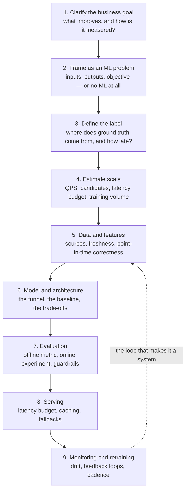
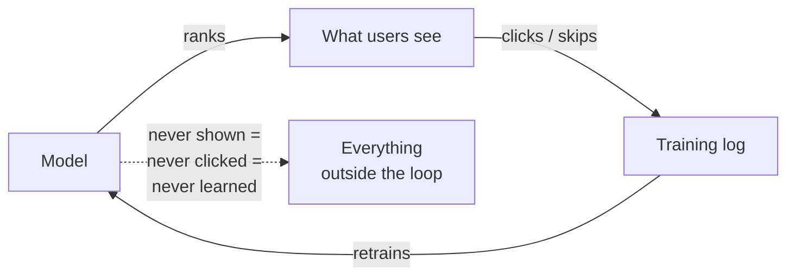
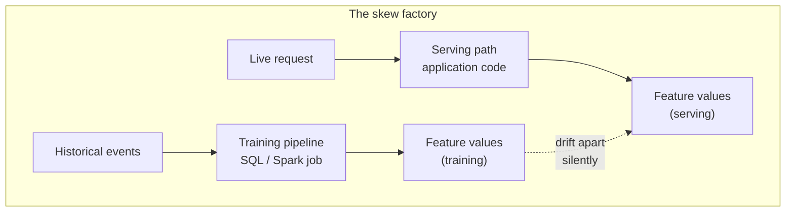
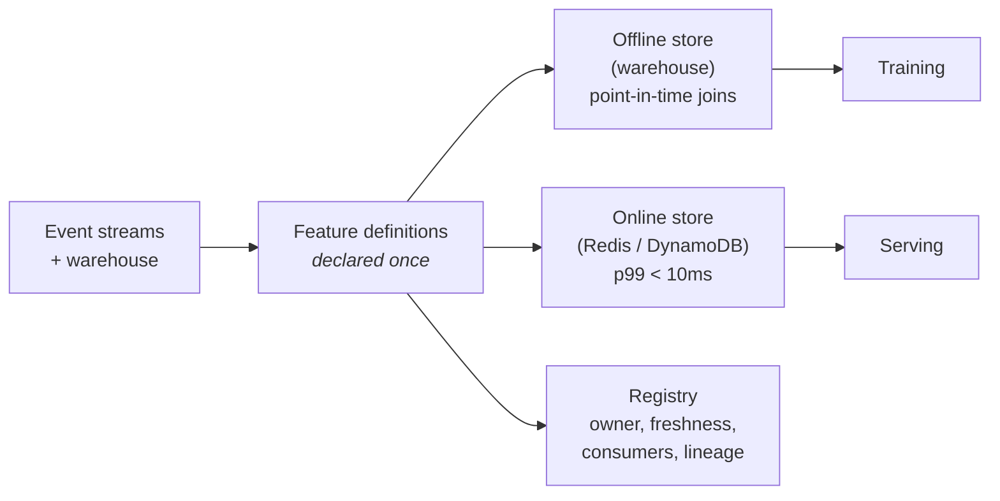
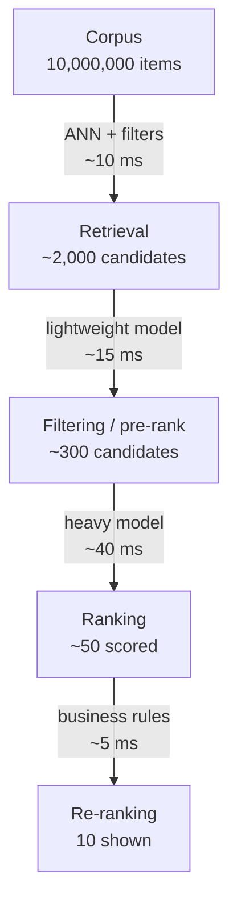
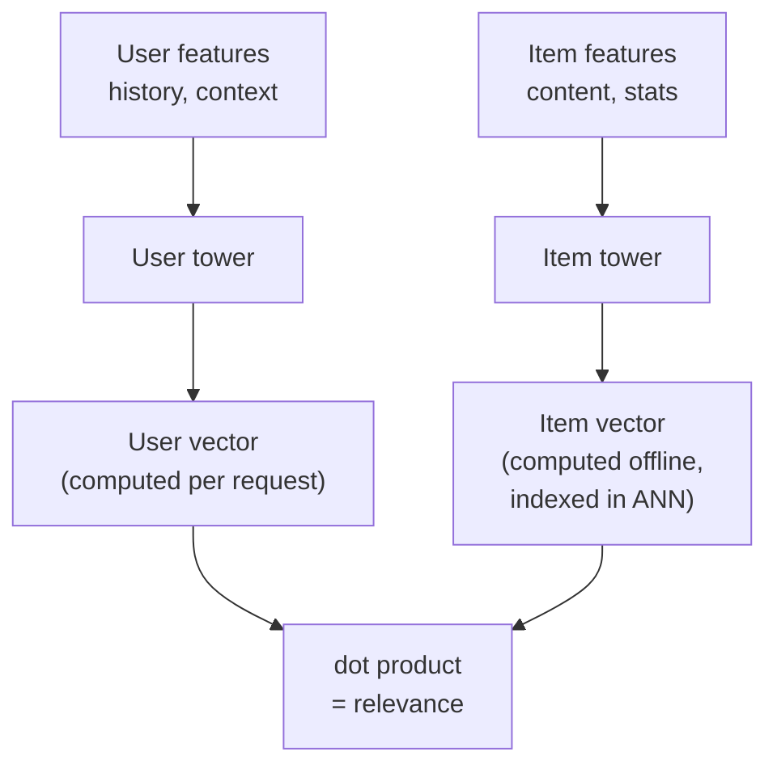
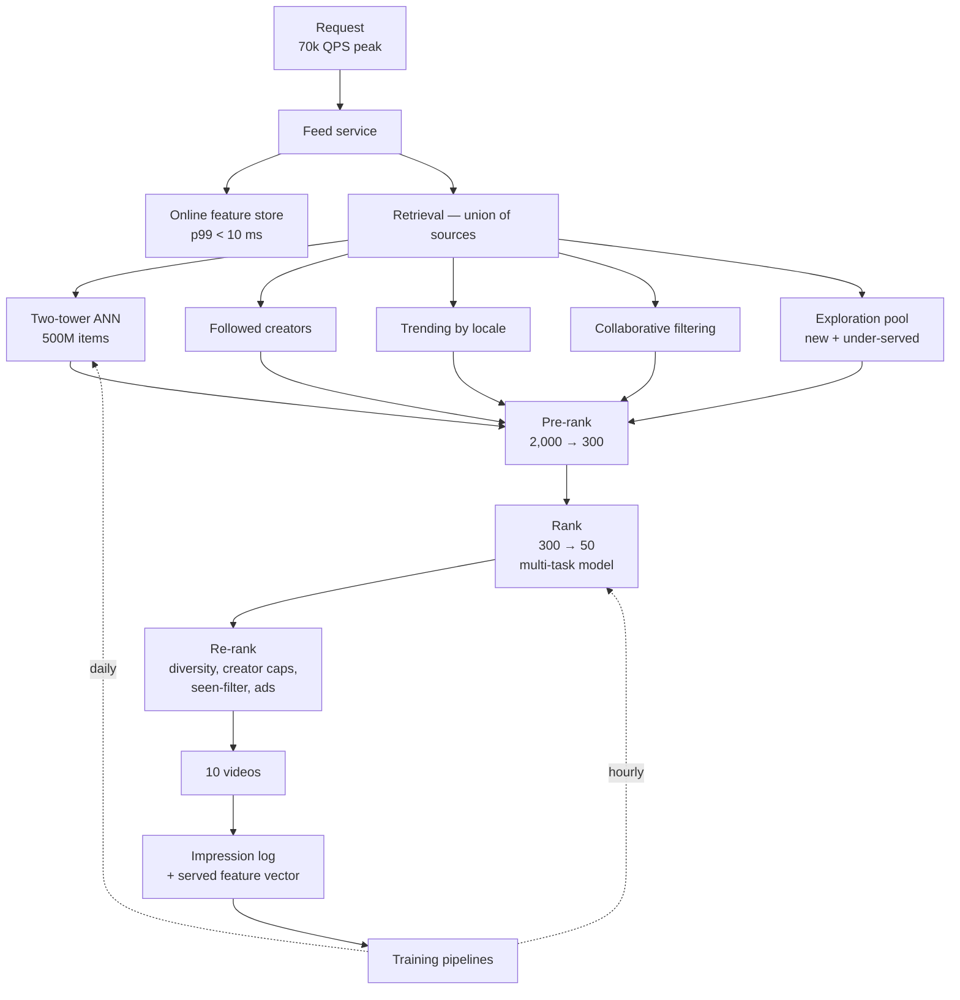

# Module 17: Machine Learning System Design

> "The model is 5% of the system and 95% of the conversation. Interviewers know this. Candidates rarely do."

Every module before this one designed systems whose behaviour was written down
by a person. This one designs systems whose behaviour is *learned from data* —
and that single change breaks assumptions you have been relying on since Module
01. Correctness becomes statistical. The system's own outputs contaminate its
future training data. The ground truth arrives days late, if at all.

None of that is about model architecture, and neither is an ML system design
interview. Nobody will ask you to derive backpropagation. They will ask you to
design the thing *around* the model, and they will be watching for whether you
know that the hard parts are data, features, and evaluation.

## Navigation

| Module | Title | Link |
|--------|-------|------|
| Module 16 | Incident Response and On-Call | [../16-incident-response/](../16-incident-response/) |
| **Module 17** | **Machine Learning System Design** | **(current)** |
| Module 18 | LLM Inference Serving | [../18-llm-inference-serving/](../18-llm-inference-serving/) |

---

## Learning Objectives

By the end of this module, you will be able to:

1. **Explain** the four properties that make ML systems structurally unlike the systems in Modules 01-16
2. **Translate** a vague business goal into an ML objective, a label, and a metric — and name the proxy you accepted
3. **Diagnose** training/serving skew as an architecture defect rather than a bug
4. **Design** point-in-time-correct feature pipelines that cannot leak the future into training
5. **Architect** the multi-stage retrieval → ranking funnel and defend its stage budgets with arithmetic
6. **Choose** offline metrics knowing which ones predict online outcomes and which routinely don't
7. **Detect** feedback loops, position bias, and drift before they quietly degrade the system
8. **Design** a recommendation system end to end under a real latency and cost budget

---

## Table of Contents

1. [What Makes ML Systems Different](#1-what-makes-ml-systems-different)
2. [A Framework for ML System Design](#2-a-framework-for-ml-system-design)
3. [From Business Metric to ML Objective](#3-from-business-metric-to-ml-objective)
4. [Data, Labels, and the Feedback Loop](#4-data-labels-and-the-feedback-loop)
5. [Features and the Feature Store](#5-features-and-the-feature-store)
6. [Multi-Stage Retrieval and Ranking](#6-multi-stage-retrieval-and-ranking)
7. [Serving and the Latency Budget](#7-serving-and-the-latency-budget)
8. [Evaluation: Offline, Online, and the Gap Between](#8-evaluation-offline-online-and-the-gap-between)
9. [Monitoring, Drift, and Retraining](#9-monitoring-drift-and-retraining)
10. [Case Study: Short-Video Recommendations at 100M Users](#10-case-study-short-video-recommendations-at-100m-users)
11. [Practice Exercise](#11-practice-exercise)
12. [Common Mistakes](#12-common-mistakes)
13. [Discussion Questions](#13-discussion-questions)
14. [Key References](#14-key-references)

---

## 1. What Makes ML Systems Different

Four properties. Each one invalidates a habit that has served you well for
sixteen modules.

| Property | What breaks | Consequence for design |
|----------|-------------|------------------------|
| **Behaviour is learned, not written** | Code review cannot tell you what the system will do | The *data pipeline* is the source of truth, and needs the review rigour you would give core logic |
| **Correctness is statistical** | There is no green test suite; every version is wrong for some inputs | You ship distributions, not fixes, and you need a metric before you need a model |
| **Outputs become future inputs** | The independence assumption behind every A/B test | Feedback loops must be designed against, or the system converges on its own opinions |
| **Labels arrive late and biased** | "Did it work?" is unanswerable at request time | Training data is always a partial, skewed view of reality |

The third property is the one candidates miss, and it is the most interesting.
A recommender shows you what it predicts you'll like; you can only click what it
showed you; that click becomes tomorrow's training data. Left alone, the system
does not learn your preferences — it learns *its own past behaviour*, with
increasing confidence. This is not a subtle statistical concern; it is the
mechanism by which recommenders collapse onto a few popular items and stay there.

> **The default failure mode of an ML system is not an outage. It is quiet,
> gradual, and invisible to every alert in Module 16.** Error rate is flat,
> latency is flat, and the recommendations have been getting worse for six weeks.
> Designing the detection for that is part of designing the system.

---

## 2. A Framework for ML System Design

Module 01 gave you a 9-step framework for a system design interview. This is its
ML counterpart, and it is deliberately front-loaded: steps 1-4 are where
interviews are won, and are exactly the steps candidates rush to get to the
model.



Two pieces of interview advice that follow directly from the shape of this:

**Say the non-ML baseline out loud.** "Before the model: sort by recency, or by
global popularity, filtered to the user's followed topics. That's the baseline
every model has to beat, and it's what we serve on cold start and on fallback."
This costs fifteen seconds and signals more seniority than any architecture
diagram. A surprising number of production "ML systems" are outperformed by the
heuristic they replaced, and nobody measured because nobody kept one.

**Spend real time on step 3.** The label is where ML system design gets hard and
where most candidates say one sentence. Given "recommend videos", is the label a
click? A watch past 10 seconds? A completed watch? A like? A next-day return
visit? Each defines a different system with different failure modes, and picking
one is a *product* decision you should make explicitly rather than by default.

---

## 3. From Business Metric to ML Objective

The chain runs: business metric → ML objective → label → offline metric. Every
arrow in that chain is a place where you accept a proxy, and the proxies are
where systems go wrong in ways that take a year to notice.

```
  Business metric        long-term user retention, revenue
        │                (what you actually want; measurable in months)
        ▼
  Online metric          session watch time, D7 return rate
        │                (what an A/B test can measure in two weeks)
        ▼
  ML objective           P(watch > 10s | user, video, context)
        │                (what the model optimises)
        ▼
  Offline metric         AUC, NDCG@10, calibration error
                         (what you can compute without shipping)

  Every arrow is a PROXY. The gaps between them are where
  optimisation goes somewhere nobody wanted.
```

The classic failure is optimising a proxy that diverges from the goal under
pressure. Optimise raw click-through and you get clickbait thumbnails — CTR goes
up, satisfaction goes down, and the metric reports success the whole way.
Optimise watch time alone and you favour long content regardless of quality.
Neither is a modelling error; both are objective-design errors, and no better
model fixes them.

Three defences, all of which belong in your interview answer:

| Defence | What it does |
|---------|--------------|
| **Multi-objective** | Combine predicted watch, completion, like, and "not interested" into one score with explicit weights — so no single behaviour can be gamed alone |
| **Guardrail metrics** | Metrics an experiment may not degrade even if the primary metric improves: report rate, unfollows, session-end-with-nothing-watched |
| **Long-horizon holdout** | A population permanently excluded from the model, so you can measure months-long effects the two-week test cannot see |

> **The weights in a multi-objective score are a product decision, not a
> hyperparameter.** Say that out loud in an interview. "Watch time × 1.0 +
> like × 0.3 − not-interested × 2.0" encodes a value judgement about what the
> product is for, and it should be owned by someone who can defend it, tuned
> deliberately, and versioned.

---

## 4. Data, Labels, and the Feedback Loop

### 4.1 Explicit and Implicit Feedback

| | Explicit (ratings, likes) | Implicit (clicks, watches, dwell) |
|---|---|---|
| Volume | Tiny — a few % of users | Everything, from everyone |
| Bias | Selection: only strong feelings get rated | Position, popularity, exposure |
| Negatives | Unavailable — an unrated item isn't a dislike | Also unavailable — a skip may mean "not now" |
| Use | Sparse but high-signal | The workhorse, requiring debiasing |

Implicit feedback wins on volume and is what real systems train on. It arrives
contaminated, and the contamination has structure.

### 4.2 Position Bias: You Are Training on Your Own UI

Items at the top of a list get clicked far more than items lower down,
substantially *independent of relevance*. Train naively on click logs and the
model learns "things that were ranked first get clicked" — which is a fact about
your ranker, not about your users. It then ranks those items first, which
generates more clicks, which confirms the model.

```
  Observed click  =  P(relevant)  ×  P(examined | position)
                     ─────────────     ───────────────────
                     what you want     what you're measuring

  Correct for it by dividing out the examination probability
  (inverse propensity weighting), so a click at position 10 counts
  for far more than a click at position 1.
```

```python
"""Inverse propensity weighting: de-bias click logs by position."""

# Examination probability by rank, measured from a randomisation
# experiment (swap positions randomly for a small traffic slice and
# observe how click rate changes with position alone).
EXAMINATION = {1: 1.00, 2: 0.72, 3: 0.55, 4: 0.44, 5: 0.36,
               6: 0.30, 7: 0.26, 8: 0.23, 9: 0.20, 10: 0.18}


def ipw_weight(position: int, clip: float = 10.0) -> float:
    """Weight for one logged impression. Clipped: 1/p explodes for deep
    positions, and a handful of huge weights will dominate the loss."""
    p = EXAMINATION.get(position, 0.15)
    return min(1.0 / p, clip)


rows = [("video_a", 1, 1), ("video_b", 9, 1), ("video_c", 2, 0)]
for item, position, clicked in rows:
    w = ipw_weight(position) if clicked else 1.0
    print(f"{item}: pos={position} click={clicked} weight={w:.2f}")
# video_a: pos=1 click=1 weight=1.00   ← a top-slot click proves little
# video_b: pos=9 click=1 weight=5.00   ← someone scrolled to 9 and clicked
# video_c: pos=2 click=0 weight=1.00
```

The measurement of `EXAMINATION` matters as much as the correction: you get it by
deliberately randomising positions for a small traffic slice. **Buying unbiased
training data with a little deliberately-degraded traffic is one of the most
important trades in applied ML**, and it is invisible in any architecture
diagram. Say it anyway — an interviewer who has run a recommender will notice.

### 4.3 Delayed and Missing Labels

Some labels arrive immediately (a click, within seconds). Others take days (a
subscription conversion, a chargeback, a refund). The gap creates a specific
trap: train on the last 24 hours of data and every conversion that hasn't
happened *yet* looks like a negative, so the model learns that recent traffic
never converts.

| Delay | Consequence | Handling |
|-------|-------------|----------|
| Seconds (click) | None | Stream directly into training data |
| Hours (session outcome) | Minor recency skew | Short attribution window; wait before labelling |
| Days (purchase, churn) | Recent data looks all-negative | Hold back the label window, or model the delay explicitly |
| Never (true preference) | No ground truth exists | Proxy, and state the proxy |

The safe default is a **label maturity window**: only train on impressions old
enough that their label is settled. It costs freshness, which is a real loss for
fast-moving content — so the sophisticated version models the delay distribution
and uses partially-observed labels with a correction. Either is a defensible
interview answer; not knowing the problem exists is not.

### 4.4 Feedback Loops and How They Degenerate



The loop is closed and self-confirming. Three named consequences:

- **Popularity collapse.** Popular items get shown, get clicked, gain training
  weight, get shown more. Catalogue coverage shrinks month over month while
  every online metric looks fine.
- **Filter bubbles.** The per-user version of the same effect — the model
  narrows to a confident niche and stops discovering.
- **Cold start becomes permanent.** New items have no engagement, so they rank
  low, so they get no engagement. Without intervention a new item can never
  enter the catalogue in practice.

The countermeasures are all forms of *deliberately spending traffic on
information*:

| Countermeasure | Mechanism | Cost |
|---|---|---|
| **Exploration slots** | Reserve k slots per page for under-served items | A small, bounded relevance hit |
| **Bandits (Thompson sampling / UCB)** | Explore in proportion to uncertainty rather than uniformly | Complexity; needs uncertainty estimates |
| **Randomised logging slice** | 1-2% of traffic ranked randomly, for unbiased eval data | A small degradation for those users |
| **Content-based cold start** | Rank new items on metadata and embeddings, not engagement | Weaker signal until engagement arrives |
| **Diversity constraints** | Cap items per creator/topic in a result set | Slight per-slot relevance loss |

> **The unbiased logging slice pays for far more than exploration.** It is the
> only dataset you have that is uncontaminated by your own ranker — which makes
> it the only honest offline evaluation set you own. Protect it; do not let a
> well-meaning optimisation delete the "wasted" 1%.

---

## 5. Features and the Feature Store

### 5.1 Training/Serving Skew Is an Architecture Defect

The single most common production ML bug: the feature computed during training
differs from the feature computed at serving time. The model then sees, in
production, inputs it never trained on — and degrades in a way that no test
catches, because both code paths are individually correct.



Two implementations of `user_avg_order_value_30d` — one in Spark SQL, one in a
Java service — will diverge. Not might: *will*. Someone fixes a timezone bug in
one, someone changes a null default in the other, someone defines "30 days" as
30×24h here and as 30 calendar days there. The mechanism of failure is that
there are two definitions at all.

The fix is architectural rather than disciplinary:

| Approach | How | Trade-off |
|----------|-----|-----------|
| **Single definition, dual execution** | One declarative feature definition compiled to both batch and streaming | The feature-store model; real infrastructure cost |
| **Log-and-train** | Log the exact feature vector *served*, then train on those logs | Perfect fidelity by construction; can't backfill new features |
| **Shared library** | Both paths call the same code | Cheap and popular; drifts the moment the paths diverge in language or runtime |

**Log-and-train deserves more attention than it gets.** Logging the served
feature vector alongside the prediction makes skew structurally impossible for
existing features, costs almost nothing, and doubles as your debugging record
when a specific prediction looks wrong. Its limitation is real — a new feature
has no history, so you wait or backfill — but as a default it removes an entire
bug class.

### 5.2 Point-in-Time Correctness

The subtler sibling of skew, and the one that produces spectacular offline
results that vanish in production.

```
  Training a model to predict: will this user convert at 14:00 on Mar 3?

  WRONG — join today's feature table
    user_total_orders = 47        ← as of TODAY, which includes
                                    the order they placed at 14:05
                                    on Mar 3. The feature contains
                                    the answer.
    Offline AUC: 0.94  ✨
    Online lift:  0.00  💀

  RIGHT — as-of join at the prediction timestamp
    user_total_orders = 12        ← what was knowable at 14:00 Mar 3
    Offline AUC: 0.71
    Online lift:  measurable, real
```

Any feature that aggregates over time can leak. The rule is that **every feature
must be joined as of the prediction timestamp, never as of query time.**

```python
"""Point-in-time correct feature join: use only what was knowable."""

from bisect import bisect_right
from dataclasses import dataclass


@dataclass(frozen=True)
class FeatureValue:
    timestamp: int   # when this value became TRUE in the world
    value: float


class PointInTimeFeature:
    """Values sorted by the time they became valid. A lookup returns the
    most recent value at or before `as_of` — never anything after."""

    def __init__(self, values: list[FeatureValue]):
        self._values = sorted(values, key=lambda v: v.timestamp)
        self._times = [v.timestamp for v in self._values]

    def as_of(self, timestamp: int) -> float | None:
        i = bisect_right(self._times, timestamp)
        return self._values[i - 1].value if i else None


orders = PointInTimeFeature([
    FeatureValue(1000, 12.0),
    FeatureValue(2000, 31.0),
    FeatureValue(3000, 47.0),   # after our prediction time
])

print(orders.as_of(2500))   # 31.0  — correct: knowable at t=2500
print(orders.as_of(3500))   # 47.0
print(orders.as_of(500))    # None  — no history yet; do not default to 0
```

Note the last line. Returning `None` rather than `0.0` matters: a new user with
no orders and a user whose history you failed to load are different states, and
collapsing them into `0` teaches the model that missing data means "inactive".
Encode missingness explicitly.

### 5.3 What a Feature Store Actually Buys



| Component | Job | Typical technology |
|-----------|-----|--------------------|
| **Offline store** | Historical values with point-in-time joins for training | Warehouse / lakehouse |
| **Online store** | Single-digit-millisecond reads of the *current* value | Redis, DynamoDB, Cassandra |
| **Registry** | Definitions, ownership, freshness SLA, consumers | The part teams skip and later need |
| **Transform layer** | One definition compiled to batch and streaming | Spark + Flink, or a managed equivalent |

The registry is worth defending explicitly in an interview, because it is what
makes features *reusable* — the actual economic argument for a feature store.
Without it, the fourth team to need "user 30-day order value" writes a fifth
definition. With it, features become an asset with an owner and a freshness SLA,
and you can answer "what breaks if this pipeline is late?" before it is late.

**When not to build one:** with one model and three features, a feature store is
resume-driven infrastructure. The threshold is roughly when feature *reuse
across teams* begins — which is a coordination problem, and coordination
problems are what shared infrastructure solves.

---

## 6. Multi-Stage Retrieval and Ranking

This is the heart of most ML system design interviews, and the structure
generalises far beyond recommendations — search, ads, feed, and the retrieval
half of Module 19's RAG systems are all the same funnel.

**The problem:** you have 10 million candidate items and 100 milliseconds. A
good ranking model costs ~1ms per item. The arithmetic doesn't work by a factor
of a hundred thousand.

**The answer:** stages of increasing cost and decreasing candidate count, each
one cheap enough to run on its input size.



| Stage | In → out | Cost per item | Optimises for | Typical technique |
|-------|----------|---------------|---------------|-------------------|
| **Retrieval** | 10M → 2,000 | ~1 µs | Recall | Two-tower embeddings + ANN, plus cheap heuristic sources |
| **Pre-rank** | 2,000 → 300 | ~50 µs | Cheap discrimination | Small GBDT or distilled net, few features |
| **Rank** | 300 → 50 | ~500 µs | Precision | Deep model, full features, cross-features |
| **Re-rank** | 50 → 10 | — | Diversity, business rules | Deduplication, per-creator caps, ads blending, freshness boosts |

### 6.1 Why the First Stage Optimises Recall, Not Precision

Each stage can only lose items. **An item dropped at retrieval can never be
recovered by any downstream model, no matter how good.** So retrieval is tuned
for recall — get the good items *into* the candidate set — and precision is
somebody else's job. Candidates often describe retrieval as "a fast ranker",
which inverts the objective.

This is also why retrieval is usually **several sources unioned together**
rather than one clever model:

```
  Candidate sources for one request, unioned then deduplicated:

    ~800   two-tower embedding ANN      (personalised, generalises)
    ~400   items from followed creators (explicit user intent)
    ~300   trending in user's locale    (fresh, no personalisation needed)
    ~200   collaborative filtering      ("users like you also watched")
    ~150   same-topic as recent watches (session continuity)
    ~100   exploration / new items      (breaks the feedback loop)
    ─────
    ~1,950 → dedupe → ~1,600 unique candidates

  Different sources fail differently. The union is far more robust
  than any single source, and each source is independently
  debuggable and independently attributable in an A/B test.
```

### 6.2 Two-Tower Retrieval

The architecture that makes million-item retrieval tractable: encode user and
item **separately**, so item embeddings can be computed offline and indexed.



The constraint that makes it work is also its main limitation: because the towers
never see each other's inputs, the model **cannot learn interactions between user
and item features**. "This user likes short videos *from creators they already
follow*" is a cross-feature, and a two-tower model structurally cannot represent
it. That is precisely why the funnel has a later ranking stage, where the model
sees user and item together and cross-features are the point.

### 6.3 Stage Budgets Are Arithmetic

```python
"""Does the funnel fit in the latency budget? Show the arithmetic."""

from dataclasses import dataclass


@dataclass(frozen=True)
class Stage:
    name: str
    candidates_in: int
    cost_us_per_item: float
    fixed_overhead_ms: float = 0.0

    @property
    def latency_ms(self) -> float:
        return (self.candidates_in * self.cost_us_per_item / 1000
                + self.fixed_overhead_ms)


FUNNEL = (
    Stage("retrieval (ANN)",  10_000_000, 0.001, fixed_overhead_ms=6.0),
    Stage("pre-rank",              2_000, 50.0,  fixed_overhead_ms=2.0),
    Stage("rank",                    300, 500.0, fixed_overhead_ms=3.0),
    Stage("re-rank",                  50, 20.0,  fixed_overhead_ms=1.0),
)

BUDGET_MS = 100.0
FEATURE_FETCH_MS = 12.0   # online store round trips

total = FEATURE_FETCH_MS
print(f"{'stage':<20}{'in':>12}{'ms':>9}")
print(f"{'feature fetch':<20}{'-':>12}{FEATURE_FETCH_MS:>9.1f}")
for s in FUNNEL:
    total += s.latency_ms
    print(f"{s.name:<20}{s.candidates_in:>12,}{s.latency_ms:>9.1f}")
print(f"{'TOTAL':<20}{'':>12}{total:>9.1f}  budget {BUDGET_MS:.0f}ms")
print("fits" if total <= BUDGET_MS else "OVER BUDGET")
# stage                         in       ms
# feature fetch                  -     12.0
# retrieval (ANN)       10,000,000     16.0
# pre-rank                   2,000    102.0   ← the whole budget, gone
# rank                         300    153.0
# re-rank                       50      2.0
# TOTAL                               285.0  budget 100ms
# OVER BUDGET
```

That output is the point. A plausible-looking funnel is **nearly 3x over
budget**, and the diagram gave no hint. The fixes are the real design decisions,
and each costs something:

| Fix | Saves | Costs |
|-----|-------|-------|
| Pre-rank on 2,000 → cut retrieval to 800 | ~60 ms | Recall — the thing retrieval exists for |
| Distil the pre-rank model 50 µs → 10 µs | ~80 ms | Accuracy at that stage; a training pipeline |
| Batch the rank stage on GPU | ~30 ms | Infrastructure complexity, cold-start latency |
| Precompute ranked lists for inactive users | Most of it | Staleness; only viable for low-activity segments |
| Raise the budget to 150 ms | Everything | Measurable engagement loss — latency *is* a product metric |

**Do this arithmetic out loud in an interview.** It is the single strongest
signal that you have shipped one of these, and it is where a generic funnel
diagram becomes a specific design.

---

## 7. Serving and the Latency Budget

### 7.1 Three Serving Modes

| Mode | Latency | Fits | Example |
|------|---------|------|---------|
| **Batch (precomputed)** | Hours stale | Stable preferences, low activity | Nightly "recommended for you" email |
| **Near-line** | Seconds to minutes | Session-aware without request-time cost | Recompute a user's candidate set after each session |
| **Real-time** | Milliseconds | Context matters now | Feed ranking, search, ads |

Most production systems are all three at once, and the split is a cost decision:
precompute what is stable, compute at request time only what depends on
*right now*. A common and underrated architecture computes the candidate set
near-line and only the final ranking at request time — which cuts request-time
work by an order of magnitude while keeping the results context-aware.

### 7.2 What Happens When the Model Is Down

Module 07's reliability rules apply, with an ML-specific twist: **an ML system
has a good degraded mode available, and teams routinely fail to build it.**

```
  Fallback ladder for a ranking service:

    1. Full model                       (normal)
    2. Previous model version           (bad deploy)
    3. Cached ranking for this user      (model timeout, seconds stale)
    4. Pre-rank scores only              (heavy model unavailable)
    5. Popularity + recency heuristic    (everything ML is down)
    6. Reverse-chronological             (last resort; always works)

  Every level is a real product experience, degraded but not broken.
  Level 6 is the non-ML baseline from Section 2 — which is one more
  reason to keep it alive rather than deleting it after launch.
```

Serve the fallback on timeout rather than waiting: a ranking model is a
*latency-bounded* dependency, and a 400ms perfect ranking is worse than a 40ms
decent one. Set the timeout at the budget and mean it.

### 7.3 The Prediction Cache Is Not an Ordinary Cache

Caching predictions works, with two ML-specific rules that Module 03 does not
cover:

- **The cache key must include the model version.** Otherwise a rollout serves a
  mixture of two models to the same user, and your A/B test is measuring noise.
- **Cached predictions must be excluded from training logs, or logged as
  cached.** Otherwise the same impression appears repeatedly in training data,
  over-weighting whatever was cached.

---

## 8. Evaluation: Offline, Online, and the Gap Between

### 8.1 Offline Metrics and What They Hide

| Metric | Measures | Blind to |
|--------|----------|----------|
| **AUC** | Ranking quality over all pairs | Calibration; where in the list errors fall |
| **NDCG@k** | Graded relevance, position-discounted | Diversity; whether users see anything new |
| **Recall@k** | Did the good items survive retrieval | Ordering within k |
| **Calibration** | Are predicted probabilities *true* | Ranking quality |
| **Coverage** | How much of the catalogue is ever shown | Per-user quality |

**Calibration deserves special mention** because it is the one candidates skip
and the one that breaks systems downstream. A model with excellent AUC can
predict 0.9 for events that happen 30% of the time — fine if you only *sort* by
the score, fatal the moment anything *multiplies* by it. Ads bidding
(`bid = P(click) × value`), multi-objective blending, and any expected-value
threshold all need probabilities that mean what they say.

### 8.2 Why Offline Wins Don't Ship

The recurring, demoralising experience of applied ML: +2% AUC offline, flat
online. The causes are structural, not bad luck.

| Cause | Mechanism |
|-------|-----------|
| **Logged data is your ranker's data** | Offline eval only scores items the old system chose to show |
| **The metric isn't the objective** | AUC over all pairs; users see the top 10 |
| **Position bias uncorrected** | You reproduced the old ranker's ordering and scored well for it |
| **The gain is in a rare slice** | Real, but too small to move an aggregate |
| **Downstream stages absorb it** | Better pre-rank scores, but re-rank rules dominate the final order |
| **Latency ate it** | The better model is 30ms slower, and 30ms costs more than the ranking gained |

The last row is the one to internalise: **a model's online value is its accuracy
gain minus its latency cost**, and the second term is frequently larger. This is
why the funnel exists and why the arithmetic in Section 6.3 is a design activity
rather than a capacity-planning chore.

The honest defences: evaluate on the unbiased randomised slice from Section 4.4;
use counterfactual estimators (IPW, doubly-robust) rather than naive replay; and
treat offline metrics as a *filter for what is worth testing online* rather than
as evidence of value. Offline eval's job is to stop bad ideas cheaply, not to
prove good ones.

### 8.3 Online Experiments, With ML-Specific Traps

Standard A/B methodology (Module 22 covers the LLM version) plus four traps
peculiar to ML systems:

| Trap | Why it happens | Handling |
|------|----------------|----------|
| **Interference** | Both arms share a candidate pool, a cache, or a marketplace; treatment changes control's experience | Cluster randomisation, or switchback tests in marketplaces |
| **Novelty effect** | Users engage with *change*; the lift decays over two weeks | Run long enough to see the curve flatten before reading the result |
| **Feedback contamination** | The treatment model's logs train the next model for both arms | Hold out training data by arm, or accept and document the bias |
| **Metric dilution** | The change affects 3% of sessions; the aggregate can't see it | Pre-declare the affected segment and power the test for *it* |

And the guardrails from Section 3 apply here: an experiment that improves watch
time while raising the report rate has not succeeded, and only a pre-declared
guardrail catches that before launch.

---

## 9. Monitoring, Drift, and Retraining

Module 15's telemetry and Module 16's alerts still apply. ML adds a layer they
cannot see, because **nothing here shows up as an error**.

```
  LAYER 1 — service health          (Module 15)
    latency, error rate, saturation, timeouts

  LAYER 2 — data health             ← new, and where problems appear first
    feature freshness, null rates, schema drift, range violations,
    training/serving skew on live traffic

  LAYER 3 — prediction health       ← new
    score distribution, calibration on settled labels,
    prediction entropy, catalogue coverage

  LAYER 4 — business outcome        ← the thing you care about; the slowest
    engagement, conversion, retention, guardrails
```

The layers detect at different speeds, and the ordering is the useful part:
**layer 2 catches a broken upstream pipeline in minutes; layer 4 catches the same
failure in a week.** Most teams only build layers 1 and 4, which is why "the
model got worse" is usually discovered by a product manager.

### 9.1 The Drifts, and Which Ones Matter

| Type | Definition | Detection | Does it hurt? |
|------|------------|-----------|---------------|
| **Feature drift** | P(X) moves | Distribution distance vs a training baseline | Not always — a model can be robust to it |
| **Label drift** | P(Y) moves | Base rate over time | Usually yes; calibration goes first |
| **Concept drift** | P(Y\|X) moves | Metric decay on fresh labels | Always — the world changed meaning |
| **Upstream break** | A pipeline is late or a schema changed | Freshness + null-rate alerts | Immediately and severely |

The last row is not really drift and it is the most common cause of a
"degrading model". A feature silently going 100% null does not raise an error —
the model happily consumes the default and produces worse predictions forever.
**Alert on feature freshness and null rate as aggressively as you alert on 5xx**;
these are the cheapest high-value alerts in an ML system.

Beware over-alerting on feature drift itself: distributions move constantly for
benign reasons (seasonality, a marketing campaign, a new country launch). Drift
is a *hypothesis*, not an incident. Page on outcome and pipeline health; ticket
on drift.

### 9.2 Retraining Cadence

| Signal | Cadence | Typical domain |
|--------|---------|----------------|
| Content and interests change hourly | Continuous / hourly | Short-video feed, news, trending |
| Behaviour is stable week to week | Daily or weekly | E-commerce ranking, search |
| Underlying process is slow | Monthly, or on drift | Credit risk, churn |

Two rules worth stating explicitly:

**Retrain on measured decay, not on ritual.** Weekly retraining that nobody
evaluated is a cron job cosplaying as ML engineering. Measure the metric on
fresh labels as the model ages; the curve tells you the cadence.

**Every automatic retrain needs an automatic gate.** A pipeline that trains and
deploys without an evaluation gate will eventually deploy a model trained on a
broken feature. The gate: evaluate on a held-out fresh window, compare against
the incumbent *and* against a fixed floor, check calibration, then shadow before
promotion. Automation without a gate is a scheduled outage.

---

## 10. Case Study: Short-Video Recommendations at 100M Users

The canonical ML system design interview. Worked end to end, with the arithmetic.

### 10.1 Requirements and Scale

```
  FUNCTIONAL
    Infinite personalised feed; each request returns 10 videos
    New videos discoverable within minutes of upload
    Explicit "not interested" is respected immediately

  NON-FUNCTIONAL
    p99 end-to-end 200 ms; ranking budget 100 ms
    100M DAU, ~20 requests/user/day
    Corpus 500M videos, 5M uploaded daily

  SCALE ARITHMETIC
    2×10^9 requests/day ÷ 86,400  ≈  23,000 QPS average
    Peak ≈ 3x average             ≈  70,000 QPS
    Each request scores ~2,000 candidates
      → 1.4×10^8 item-scorings/second at peak
      → the entire reason the funnel exists
```

### 10.2 Objective and Label

Multi-objective, because any single one is gameable:

```
  score = 1.0 × P(watch > 10s)
        + 0.8 × P(completes)
        + 0.4 × P(likes)
        + 0.3 × P(shares)
        - 2.0 × P(not interested / reports)

  Labels settle in seconds (watch, complete) except reports (hours).
  Weights are a PRODUCT decision, versioned and A/B tested as a unit.

  Guardrails that may not degrade: report rate, unfollow rate,
  creator diversity per session, fraction of sessions ending with
  zero completed watches.
```

The negative weight is larger than any positive one, deliberately. A system that
occasionally shows something the user finds objectionable loses far more than a
slightly-better recommendation gains — an asymmetry worth naming explicitly.

### 10.3 Architecture



### 10.4 The Decisions Worth Defending

| Decision | Choice | Why, and what it costs |
|----------|--------|------------------------|
| **Retrieval** | Union of 6 sources, ~2,000 candidates | Sources fail differently; the union is robust and independently attributable. Costs dedup work and 6 pipelines to own |
| **Item embeddings** | Computed offline, ANN-indexed, refreshed daily | Makes 500M-item retrieval possible at all. Costs freshness for new items — hence the separate exploration source |
| **Ranking model** | One multi-task model, 5 heads | Shared representation is cheaper and better than 5 models; one inference for all objectives. Costs coupling — the heads must be retrained together |
| **Seen-filter** | Bloom filter per user, 30-day window | ~1 MB/user for 10k items at 1% FP; false positives merely hide a video, which is an acceptable failure. Exact sets would be far more expensive |
| **Feature freshness** | Real-time for session, hourly for user aggregates, daily for item stats | Session context is what makes the feed feel responsive; user aggregates barely move hourly. Costs three pipelines |
| **Skew defence** | Log the served feature vector | Structurally eliminates skew for existing features; costs ~1 KB per impression, which at 2×10^9/day is real storage worth budgeting |
| **Exploration** | 1 of 10 slots, plus a 1% randomised logging slice | Breaks the feedback loop and buys unbiased eval data. Costs a measurable, bounded relevance hit |
| **Retraining** | Ranker hourly, embeddings daily, both gated | Content moves hourly; the towers do not. The gate is what stops a broken feature reaching production |
| **Cold start (item)** | Content embedding + forced exploration impressions | A new video is scoreable at upload; guaranteed impressions give it real signal within minutes |
| **Cold start (user)** | Popularity by locale, narrowed per interaction | Works from impression one, converges within a session |

### 10.5 Storage and Cost, Briefly

```
  Impression logs (the dominant cost)
    2×10^9 requests/day × 10 impressions = 2×10^10 impressions/day
    × ~1 KB (features + prediction + context)  ≈  20 TB/day
    → hot 7 days (140 TB), then columnar cold storage
    → sample aggressively for exploratory analysis; keep
      100% of labelled positives and the randomised slice

  Item embeddings
    500M items × 128 dims × 4 bytes  ≈  256 GB
    → sharded ANN index, replicated for QPS; quantise to int8
      (~64 GB) if memory is the binding constraint

  The 20 TB/day is the number that surprises people. Impression
  logging is usually the largest single storage line in a
  recommender, and "log the served feature vector" is the reason.
  It is still worth it.
```

---

## 11. Practice Exercise

### Design Search Ranking for a Marketplace

Design the ranking system for a marketplace search (think accommodation, or
second-hand goods). It is deliberately *not* a feed — the differences are the
exercise.

**Given:**

- 50M listings, 10M DAU, 5 searches per session
- p99 budget 300 ms end to end
- Conversion (a booking or purchase) happens 0-14 days after the search
- Two-sided marketplace: sellers are users too, and supply is finite
- Strong seasonality and strong location dependence

**Deliverables:**

1. **Objective and label.** What are you predicting? Clicks, contacts, bookings,
   or a blend? State the delay for each label and how it changes your training
   pipeline. What is your guardrail set on the *supply* side?

2. **Baseline.** The non-ML baseline you must beat and would fall back to.

3. **Funnel.** Stage counts and latency budget arithmetic to 300 ms, including
   feature fetch. Show where it nearly doesn't fit and what you cut.

4. **Retrieval.** Location and availability are hard filters, not soft
   preferences. Where do they go, and why can't they be a ranking feature?

5. **Features.** Five features each for query, listing, user, and
   cross-features. Mark which are point-in-time dangerous and say why.

6. **Delayed labels.** A booking may land 14 days after the search. Design the
   training pipeline. What is your label maturity window and what does it cost?

7. **Feedback loop.** Popular listings get shown, get booked, rank higher. In a
   marketplace with finite supply this has a consequence a feed doesn't have.
   Name it and design against it.

8. **Evaluation.** Offline metric, online design, guardrails. Why might a +3%
   NDCG offline show flat online here specifically?

**Follow-ups:**

- Booking conversion drops 8% over three weeks. Latency and error rate are flat.
  Give your investigation order across the four monitoring layers.
- A large seller claims the ranking is biased against them. What would you
  measure to answer honestly, and what would you refuse to change?
- The business wants sponsored listings blended into results. Which stage, and
  what does it do to your training data if you get it wrong?

---

## 12. Common Mistakes

| Mistake | Why It's Wrong | What to Do Instead |
|---------|---------------|-------------------|
| **Leading with the model architecture** | The model is the smallest and most replaceable part; interviewers are testing the system | Spend the first third on objective, label, and data — then the funnel |
| **No non-ML baseline** | You cannot tell whether the model earns its cost, and you have no fallback when it fails | State the heuristic baseline, keep it running, and serve it on timeout |
| **Optimising a single proxy metric** | Raw CTR yields clickbait; watch time yields long low-quality content — and the metric reports success | Multi-objective score with explicit weights, plus guardrail metrics |
| **Two implementations of one feature** | Batch and serving paths always drift; the model then sees inputs it never trained on | One definition compiled to both, or log-and-train on served vectors |
| **Joining features as of query time** | The feature contains the answer; offline AUC soars and online lift is zero | Point-in-time joins as of the prediction timestamp, always |
| **Defaulting missing features to zero** | "No history" and "pipeline failed" become indistinguishable, and the model learns the wrong thing | Encode missingness explicitly as its own signal |
| **Training naively on click logs** | You learn your own ranker's position bias and confirm it forever | Inverse propensity weighting, with propensities measured by randomisation |
| **Treating recent unconverted impressions as negatives** | Delayed conversions haven't happened yet; the model learns recent traffic never converts | A label maturity window, or explicit delay modelling |
| **No exploration** | The feedback loop collapses onto popular items; catalogue coverage shrinks while every metric looks fine | Reserved exploration slots plus a randomised logging slice |
| **Deleting the randomised slice to reclaim the traffic** | It is the only unbiased data you own, and the only honest offline eval set | Protect it in writing; it is infrastructure, not waste |
| **A ranking model with no latency budget** | Accuracy gains routinely cost more in latency than they return in engagement | Budget arithmetic per stage; measure online value as accuracy gain minus latency cost |
| **Retrieval tuned for precision** | An item dropped at retrieval is unrecoverable downstream, whatever the ranker does | Tune retrieval for recall; let ranking handle precision |
| **Ignoring calibration because AUC is good** | Ranking is fine but probabilities are meaningless — fatal anywhere a score is multiplied | Measure calibration explicitly wherever expected value is computed |
| **Believing offline gains will ship** | Logged data is your old ranker's data, and downstream stages absorb improvements | Offline eval filters what is worth testing; only the experiment decides |
| **Reading an A/B test in week one** | Novelty effects inflate early lift and decay | Run until the lift curve flattens; pre-declare the read date |
| **Monitoring only service health and business outcome** | The pipeline break that broke the model is invisible for a week | Add data health and prediction health; alert on feature freshness and null rate |
| **Paging on feature drift** | Distributions move for benign reasons constantly; you will train the team to ignore it | Ticket on drift, page on outcome and pipeline health |
| **Automated retraining with no gate** | It will eventually train on a broken feature and deploy it | Gate on fresh-window evaluation, a fixed floor, and calibration; shadow before promotion |
| **Building a feature store for one model** | Feature stores solve cross-team reuse, which you don't have yet | Build one when reuse across teams begins, not before |

---

## 13. Discussion Questions

1. Your team improves the ranking model's offline AUC from 0.78 to 0.81 — a large gain. The A/B test comes back flat on every metric. Give your diagnostic order.

   **Model answer**: Start by checking the experiment could have detected the effect at all: was it powered for the segment actually affected, and did the treatment genuinely serve the new model (verify by model version in the prediction logs — a surprising number of "flat" results are configuration errors). Then work down the causes in order of likelihood. First, latency: measure the new model's p99 against the old. A 30ms regression can cost more engagement than 3 AUC points return, and this shows up as flat rather than negative, which is exactly what "no effect" looks like. Second, downstream absorption: if the improvement is at pre-rank and the re-rank stage's diversity and business rules dominate the final ten, better scores never reach the user — check whether the top-10 output actually changed between arms, which is a cheap and decisive test. Third, the metric mismatch: AUC is over all pairs, users see the top of the list, so measure NDCG@10 or recall@10 instead and see whether the gain survives. Fourth, evaluation bias: if offline eval ran on logs from the old ranker without propensity correction, the gain may partly be "reproduces the old ranker's ordering more confidently", which is not value. The general lesson is that offline gains are a hypothesis. Their job is to cheaply eliminate bad ideas, not to establish good ones.

2. A colleague proposes replacing the exploration slot and the 1% randomised traffic with the full ranker, arguing it's a free relevance win. Respond.

   **Model answer**: It isn't free; it's borrowing against measurement and discovery, and both debts come due. The randomised slice is the only dataset uncontaminated by our own ranker, which makes it the only honest offline evaluation set we have — delete it and every future offline comparison is scored on data our current ranker chose, which systematically favours models that behave like the incumbent. That is precisely the mechanism that makes offline results stop predicting online results, and we won't notice, because the offline numbers will look better than ever. The exploration slot is doing a different job: without it, new and under-served items get no impressions, so they gather no engagement, so they rank low permanently. The visible symptom is catalogue coverage shrinking month over month while short-term engagement stays flat or improves — which is exactly what makes the proposal seductive. I'd offer a real test rather than just refusing: run it as an experiment with catalogue coverage and new-item time-to-first-1000-impressions as pre-declared guardrails, and read it at six weeks rather than two. If the relevance win is real and the guardrails hold, I'm wrong and we should take it. My prediction is a small early lift that decays as the catalogue narrows. The cost of that experiment is bounded; the cost of being wrong about it silently is not.

3. Offline AUC is 0.94, up from 0.71. Everyone is excited. What is your first question?

   **Model answer**: "Which features aggregate over time, and are they joined as of the prediction timestamp or as of today?" A jump that large is far more often leakage than modelling progress — and the specific mechanism is usually a feature computed from a table that already reflects the outcome. If we're predicting conversion and `user_total_orders` is joined from the current warehouse state, it includes the order we're trying to predict; the feature literally contains the label. The tell is the magnitude: genuine ranking improvements arrive in fractions of a point, so 23 points is a structural error, not a better model. I'd verify concretely rather than by argument: retrain with time-aggregating features removed and see whether the gain persists; check feature importance for a suspiciously dominant single feature; and confirm the training set uses as-of joins at the prediction time. The second question, if it survives all that, is whether train and test were split by time or randomly — a random split of temporally correlated data leaks in a subtler way, since near-duplicate events land on both sides. Both failures are recoverable and cheap to check. Shipping either is not.

4. Recommendation quality is "getting worse" per the product team. Service metrics are flat. Where do you look, in what order?

   **Model answer**: Work the four monitoring layers, but not top-down — start at data health, because it's the fastest to check and the most common cause. Look at feature freshness and null rates first: a pipeline that silently started producing nulls three weeks ago raises no error anywhere, because the model happily consumes the default and returns worse predictions forever. Check schema changes and value ranges on the top features by importance. Then prediction health: has the score distribution shifted, has calibration degraded against settled labels, has prediction entropy collapsed (a model growing more confident and less diverse is a feedback-loop signature). Then catalogue coverage and per-user diversity over time — popularity collapse is gradual, has no single day where it broke, and is invisible to every alert in Module 16. Only then look for a genuine concept shift, which is the rarest of these and the hardest to fix. Two orthogonal checks worth running in parallel: did anything change in the re-rank rules or business logic, which is not the model at all but gets blamed on it; and is the complaint concentrated in a segment rather than global, since a broken locale feature looks like "worse recommendations" to whoever is in that locale. And I would treat the product team's report as real data. The absence of a service alert is not evidence of health — this class of failure is specifically the one that doesn't page.

5. You have three months and one ML engineer to add recommendations to a product that currently sorts by recency. What do you build, and in what order?

   **Model answer**: Not a model, first. Month one is instrumentation and the baseline: log impressions with position, log the served feature vector, define the objective and label with the product owner, and pick guardrails. Then ship a heuristic — popularity within followed topics, recency-decayed — as an A/B test against pure recency. That establishes the experiment pipeline, gives a real number to beat, and quite often wins enough to justify everything after it. Month two is the first model, deliberately boring: a gradient-boosted tree on maybe twenty features, one objective, precomputed nightly per user if traffic allows. Boring is the point — it is debuggable by one person, has no serving infrastructure to speak of, and its failure modes are legible. Ship it behind the same experiment harness with a fallback to the heuristic on timeout. Month three is whichever measured thing is worst: usually either freshness (move from nightly precompute to request-time ranking over a precomputed candidate set) or cold start. Deliberately not in the first three months: a feature store (one model, no reuse to solve), two-tower retrieval (50M items don't need ANN; a filtered candidate set does), and multi-objective weighting (you need one objective working first). The general principle is that the ordering is driven by what you can measure and what you can operate with one engineer, not by what the architecture will eventually look like. A system with a heuristic baseline, honest logging, and a working experiment pipeline can absorb any model later; a sophisticated model without those three is unimprovable.

---

## 14. Key References

### Books

| Resource | Focus |
|----------|-------|
| *Designing Machine Learning Systems* (Chip Huyen) | The closest book to this module's scope; data, features, deployment, monitoring |
| *Machine Learning Design Patterns* (Lakshmanan, Robinson, Munn) | Named, reusable patterns including feature stores and serving designs |
| *Machine Learning System Design Interview* (Aminian, Xu) | Interview-shaped worked designs, complementary to Section 10 |
| *Building Machine Learning Powered Applications* (Emmanuel Ameisen) | From product goal to shipped model; strong on the framing steps |
| *Trustworthy Online Controlled Experiments* (Kohavi, Tang, Xu) | The definitive treatment of Section 8.3's traps |

### Papers

| Resource | Focus |
|----------|-------|
| [Hidden Technical Debt in Machine Learning Systems (Sculley et al., 2015)](https://papers.nips.cc/paper/5656-hidden-technical-debt-in-machine-learning-systems) | The foundational paper; the origin of "the model is a small box in a large system" |
| [Deep Neural Networks for YouTube Recommendations (Covington et al., 2016)](https://research.google/pubs/pub45530/) | The canonical two-stage candidate generation + ranking architecture |
| [Wide & Deep Learning (Cheng et al., 2016)](https://arxiv.org/abs/1606.07792) | Memorisation vs generalisation; why cross-features need a late stage |
| [Sampling-Bias-Corrected Neural Modeling (Yi et al., 2019)](https://research.google/pubs/pub48840/) | Two-tower retrieval with in-batch negative correction |
| [Unbiased Learning-to-Rank with Biased Feedback (Joachims et al., 2017)](https://arxiv.org/abs/1608.04468) | The propensity-weighting method in Section 4.2 |
| [Modeling Delayed Feedback in Display Advertising (Chapelle, 2014)](https://dl.acm.org/doi/10.1145/2623330.2623634) | The delayed-label problem and an explicit delay model |

### Documentation

| Resource | Focus |
|----------|-------|
| [Google: Rules of Machine Learning](https://developers.google.com/machine-learning/guides/rules-of-ml) | 43 rules, roughly this module in checklist form; start at Rule 1 |
| [Feast documentation](https://docs.feast.dev/) | An open-source feature store; concrete shape of Section 5.3 |
| [Google: ML Test Score](https://research.google/pubs/pub46555/) | A rubric for production-readiness of an ML system |

---

## Related Modules

| Module | Connection |
|--------|-----------|
| [Module 01: Fundamentals](../01-fundamentals/README.md) | The 9-step framework; Section 2 is its ML counterpart |
| [Module 03: Caching](../03-caching/README.md) | Prediction caching, with the model-version and training-log caveats in Section 7.3 |
| [Module 05: Async Systems](../05-async-systems/README.md) | The streaming pipelines behind real-time features and impression logs |
| [Module 15: Observability](../15-observability/README.md) | Layer 1 of Section 9's stack; ML adds three more |
| [Module 16: Incident Response](../16-incident-response/README.md) | Why gradual model decay never pages, and what to do about it |
| [Module 19: RAG at Scale](../19-rag-at-scale/README.md) | Retrieval and re-ranking again, with embeddings and documents |
| [Module 22: Production AI](../22-production-ai-system/README.md) | The LLM-era version of evaluation, monitoring, and rollout |

---

## Summary

```
┌──────────────────────────────────────────────────────────────┐
│              ML System Design Principles                     │
├──────────────────────────────────────────────────────────────┤
│                                                              │
│  1. The model is the small box; data, features, and          │
│     evaluation are the system                                │
│  2. Name the non-ML baseline, keep it running, serve it      │
│     when the model times out                                 │
│  3. Every metric is a proxy — say which one you accepted     │
│     and what guardrails protect the gap                      │
│  4. Two implementations of a feature will drift; one         │
│     definition, or log what you served                       │
│  5. Join features as of the prediction time, never as of     │
│     query time — leakage looks like brilliance               │
│  6. Retrieval optimises recall; nothing downstream can       │
│     recover a candidate you dropped                          │
│  7. Stage budgets are arithmetic, and accuracy gains are     │
│     paid for in latency                                      │
│  8. Your logs are your ranker's opinion — buy unbiased       │
│     data with a randomised slice and defend it               │
│  9. Offline metrics filter what to test; only the            │
│     experiment decides                                       │
│ 10. Monitor data health and prediction health, or a broken   │
│     pipeline degrades you silently for a week                │
│ 11. Retrain on measured decay, and never without a gate      │
│                                                              │
└──────────────────────────────────────────────────────────────┘
```

---

## Navigation

**Previous:** [Module 16: Incident Response and On-Call](../16-incident-response/README.md)

**Next:** [Module 18: LLM Inference Serving Architecture](../18-llm-inference-serving/README.md)

---

*Module 17 of 22 in the System Design Playground*
