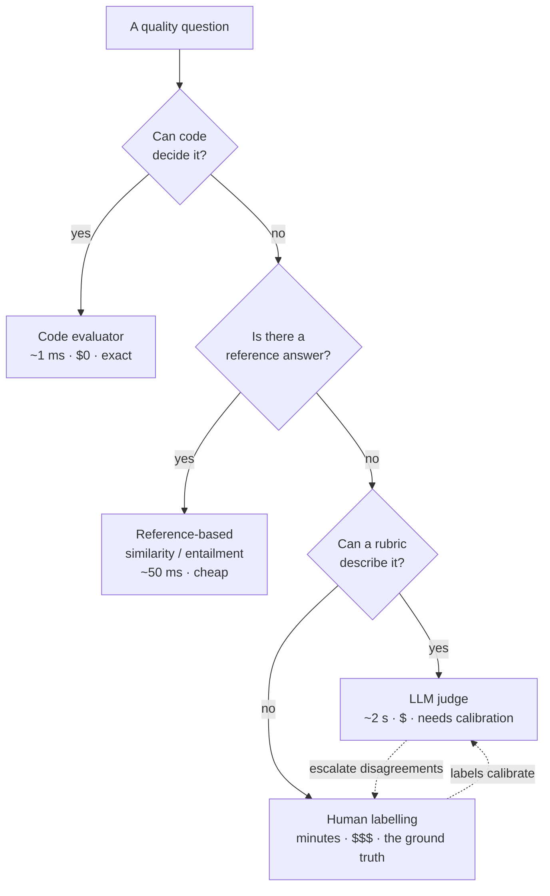
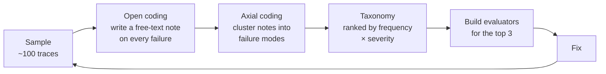
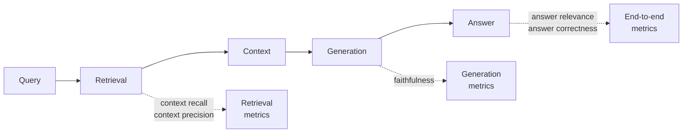
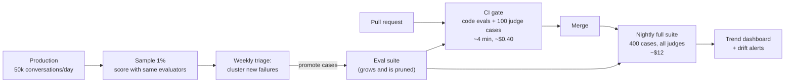

# Module 21: AI Evaluation and Quality

> "Everyone building with LLMs has the same bottleneck, and it is not the model. It is that nobody can tell whether the last change made things better."

You have now designed inference serving (Module 18), retrieval (19), and agents
(20). Every one of those modules ended with a version of the same unanswered
question: **how do you know it works?**

In classic software, that question is answered by a test suite. Tests are cheap,
binary, and deterministic, so you run thousands of them per commit and trust the
green tick. None of those three properties holds for a system whose output is
open-ended text. There is no assertion for "is this answer good", the same input
yields different outputs, and the correct answer is often a judgement rather than
a value.

The teams shipping AI reliably are not the ones with better prompts. They are
the ones who built a measurement apparatus early, and can therefore tell in an
hour whether a change helped. This module is how that apparatus is designed.

## Navigation

| Module | Title | Link |
|--------|-------|------|
| Module 20 | Agent System Architecture | [../20-agent-architecture/](../20-agent-architecture/) |
| **Module 21** | **AI Evaluation and Quality** | **(current)** |
| Module 22 | Production AI System Architecture | [../22-production-ai-system/](../22-production-ai-system/) |

---

## Learning Objectives

By the end of this module, you will be able to:

1. **Explain** why LLM evaluation cannot reuse the assumptions behind a unit test suite
2. **Choose** the right evaluator tier — code, judge, or human — for a given quality question
3. **Run** error analysis that turns a pile of production traces into a ranked failure taxonomy
4. **Design** an LLM-as-judge with a rubric, a bias-controlled protocol, and its own labelled test set
5. **Correct** an observed pass rate for known judge error, and put an honest confidence interval on it
6. **Decompose** RAG and agent evaluation so a failure is attributed to the stage that caused it
7. **Operate** evaluation continuously: regression gates in CI, sampled production scoring, and drift detection

---

## Table of Contents

1. [Why This Is a Different Problem](#1-why-this-is-a-different-problem)
2. [The Evaluation Stack](#2-the-evaluation-stack)
3. [Error Analysis: Deciding What to Measure](#3-error-analysis-deciding-what-to-measure)
4. [Code-Based Evaluators](#4-code-based-evaluators)
5. [LLM-as-Judge](#5-llm-as-judge)
6. [Measuring the Measurement](#6-measuring-the-measurement)
7. [Evaluating RAG](#7-evaluating-rag)
8. [Evaluating Agents and Multi-Step Systems](#8-evaluating-agents-and-multi-step-systems)
9. [Evaluation in Production](#9-evaluation-in-production)
10. [Case Study: Evals for a Support Assistant](#10-case-study-evals-for-a-support-assistant)
11. [Practice Exercise](#11-practice-exercise)
12. [Common Mistakes](#12-common-mistakes)
13. [Discussion Questions](#13-discussion-questions)
14. [Key References](#14-key-references)

---

## 1. Why This Is a Different Problem

| Property of a test suite | Holds for LLM systems? | Consequence |
|---|---|---|
| Deterministic — same input, same output | No | A single run proves nothing; you need samples and intervals |
| Binary — pass or fail, unambiguous | No | Quality is graded, and the grade is a judgement |
| Cheap — thousands per commit, milliseconds each | No | Judge-based evals cost money and seconds; you must budget them |
| Complete — coverage is knowable | No | The input space is natural language; you can never enumerate it |
| Stable — a passing test stays passing | No | A model version change can move everything at once |

The last row is what makes evaluation *infrastructure* rather than a task. In
ordinary software, upgrading a dependency might break a few tests, and the
failures point at the breakage. Swapping a model changes the behaviour of your
entire system in a distribution — a bit better here, worse there, and different
in ways no one predicted. Without a measurement apparatus, a model upgrade is
untestable, and teams either refuse to upgrade or upgrade blind. Both are bad,
and both are extremely common.

> **The core reframe: evals are not a QA activity you do before launch. They are
> the instrument that determines how fast you can iterate, forever.** A team
> that can measure a change in an hour will out-improve a team with better ideas
> and no instrument, because the second team is guessing about which of their
> ideas worked.

### 1.1 The Vibes-to-Rigour Ladder

Everyone starts at the bottom. The mistake is staying there.

```
  LEVEL 0  Vibes
           Someone tries a few prompts, says "that looks better", ships.
           Cost: zero. Reliability: zero. Reversibility: none — you
           cannot tell later whether it was ever better.

  LEVEL 1  A spreadsheet of examples
           20-50 fixed inputs, outputs eyeballed after each change.
           Genuinely useful. Catches gross regressions. Does not
           scale past a few changes a week, and grading drifts as
           the grader gets tired or hopeful.

  LEVEL 2  Automated evaluators on a curated set
           Code-based checks plus a calibrated judge, run on demand.
           Now a change is a number. This is the level most teams
           should reach in their first month and most reach in
           their ninth.

  LEVEL 3  Continuous: CI gate + production sampling
           Every PR scored; a slice of live traffic scored daily;
           regressions caught before users see them; drift visible.

  LEVEL 4  Closed loop
           Production failures are mined, clustered, and promoted
           into the eval set automatically. The instrument improves
           itself from the thing it measures.
```

Each level's cost is roughly an order of magnitude above the one below, and so
is its leverage. The most common strategic error is jumping from 0 to a
purchased eval platform — buying Level 3 tooling while still at Level 0
understanding of *what to measure*, which Section 3 is about.

---

## 2. The Evaluation Stack

Not everything needs a judge. Choose the cheapest evaluator that can answer the
question, and reserve the expensive ones for questions the cheap ones cannot
reach.



| Tier | Latency | Cost per eval | Use for | Never use for |
|------|---------|---------------|---------|---------------|
| **Code** | ~1 ms | ~$0 | Format, schema, citations resolve, no PII, length, latency, tool-call validity | Anything requiring interpretation |
| **Reference-based** | ~50 ms | negligible | Extraction, classification, closed QA with a known answer | Open-ended generation, where many answers are correct |
| **LLM judge** | 1-5 s | $0.001-0.05 | Helpfulness, tone, faithfulness, instruction-following | Anything code can decide; anything without a calibrated rubric |
| **Human** | minutes | $1-10 | Calibrating judges, ambiguous cases, the initial taxonomy | Bulk regression testing — you cannot afford it and you don't need it |

The two arrows between judge and human are the important part of that diagram.
Humans are not a *tier you graduate from* — they are the source of truth that
keeps the judge honest, forever, on a small sample.

> **Start at the bottom of the stack and stay there as long as you can.** A
> shocking fraction of real quality problems are code-decidable: malformed JSON,
> a citation pointing at a document that was never retrieved, a refusal string,
> an empty response, a tool call with the wrong argument type. These are free to
> check, deterministic, and they are what actually breaks in production.

---

## 3. Error Analysis: Deciding What to Measure

This is the highest-leverage practice in the module and the one most teams skip.
It answers the question that precedes all the machinery: **which failures are
worth measuring at all?**

The instinct is to reach for a standard metric set — helpfulness, coherence,
relevance, all scored 1-5. This feels rigorous and is close to useless: generic
metrics are weakly correlated with what is actually wrong with *your* system,
they compress many distinct failures into one blurry number, and a score moving
from 3.8 to 3.9 tells you nothing about what to fix.

Error analysis inverts it. Look at what your system actually did wrong, then
build metrics for *those* things.

### 3.1 The Loop



**Step 1 — Sample deliberately.** 100 traces beats 1,000 unread ones. Stratify:
some random, some from low-confidence or high-latency requests, some from
thumbs-down feedback, some from your riskiest segment. Pure random sampling
under-represents exactly the failures you most want.

**Step 2 — Open coding.** Read each trace and write a short free-text note about
what went wrong. Do not use a predefined category list — the point is to
discover categories, and a list contaminates what you see. One sentence, in your
own words: *"cited a doc that doesn't mention the fee"*, *"answered about the
2023 policy when the user asked about renewals"*.

**Step 3 — Axial coding.** Cluster the notes into recurring failure modes. This
is where the taxonomy appears, and it will not look like the generic metric list.
Real taxonomies look like:

| Failure mode | Count | Severity | Priority |
|---|---|---|---|
| Cited a retrieved doc that doesn't support the claim | 18 | High | **1** |
| Answered from the wrong product tier's policy | 11 | High | **2** |
| Refused a question it could have answered | 9 | Medium | 3 |
| Correct but three paragraphs too long | 14 | Low | 5 |
| Dropped a constraint from a multi-part question | 7 | High | **4** |
| Hallucinated a support phone number | 2 | Critical | **wait** |

**Step 4 — Prioritise by frequency × severity, with a veto.** The verbosity issue
is the second most frequent and near the bottom. The invented phone number
happened twice and jumps the queue anyway, because *severity is not linear* —
some failures are unacceptable at any rate, and a frequency-ordered list will
never surface them.

**Step 5 — Build evaluators for the top three only.** Not for all six. A
taxonomy with 20 metrics gets maintained by nobody.

### 3.2 Why This Beats Generic Metrics

| Generic metric approach | Error analysis approach |
|---|---|
| "Helpfulness: 3.7/5" | "18% of answers cite an unsupporting document" |
| Moved to 3.8 — is that better? | Dropped to 4% — unambiguously better |
| Unclear what to fix | The metric names the fix |
| Same metrics as every other product | Metrics specific to how *your* system fails |
| Correlation with user satisfaction: weak | Correlation: you chose these because users complained about them |

Repeat the loop after each significant change, on a fresh sample. The taxonomy
is not a one-time artefact — when you fix the top failure mode, a different one
becomes the top, and it is frequently one you have never seen because the first
failure was masking it.

---

## 4. Code-Based Evaluators

Cheap, deterministic, and unreasonably effective. Build these first, and run
them on every single request in CI — they cost nothing.

| Category | Checks |
|----------|--------|
| **Structural** | Valid JSON; conforms to schema; required fields present; enum values legal |
| **Grounding** | Every citation ID appears in the retrieved set; every quoted span exists verbatim in a cited document |
| **Safety** | No PII in output; no secrets; no internal hostnames; blocklist terms absent |
| **Constraint** | Within length bounds; correct language; requested format honoured; no forbidden claims |
| **Behavioural** | Not a refusal when refusal is wrong; tool calls have valid argument types; no repeated identical tool calls |
| **Operational** | Latency within budget; token count within budget; cost per request within budget |

```python
"""Code-based evaluators: run on every request, cost nothing, catch a lot."""

import json
import re
from dataclasses import dataclass, field

CITATION = re.compile(r"\[doc:([a-z0-9_-]+)\]")
PII_PATTERNS = {
    "email": re.compile(r"[\w.+-]+@[\w-]+\.[\w.]+"),
    "phone": re.compile(r"\+?\d[\d\s().-]{8,}\d"),
}


@dataclass
class EvalResult:
    passed: bool
    failures: list[str] = field(default_factory=list)

    def check(self, condition: bool, message: str) -> None:
        if not condition:
            self.passed = False
            self.failures.append(message)


def evaluate(answer: str, retrieved_ids: set[str],
             max_chars: int = 1200) -> EvalResult:
    r = EvalResult(passed=True)

    # Grounding: a citation to a document we never retrieved is fabricated,
    # and this is checkable for free. It is also one of the most common
    # real defects in a RAG system.
    cited = set(CITATION.findall(answer))
    unknown = cited - retrieved_ids
    r.check(not unknown, f"citations not in retrieved set: {sorted(unknown)}")
    r.check(bool(cited), "answer contains no citation at all")

    # Safety: leaked contact details are a compliance problem, and the model
    # inventing a plausible support number is worse than refusing.
    for name, pattern in PII_PATTERNS.items():
        found = pattern.findall(answer)
        r.check(not found, f"{name} present in output: {found[:2]}")

    # Constraint
    r.check(len(answer) <= max_chars,
            f"answer {len(answer)} chars exceeds {max_chars}")
    r.check(answer.strip() != "", "empty answer")
    return r


res = evaluate(
    "Your renewal fee is 30 EUR [doc:policy_v3]. Call +49 30 1234567.",
    retrieved_ids={"policy_v3", "faq_billing"},
)
print(res.passed, res.failures)
# False ["phone present in output: ['+49 30 1234567']"]


def parses_as_schema(raw: str, required: set[str]) -> bool:
    try:
        obj = json.loads(raw)
    except json.JSONDecodeError:
        return False
    return isinstance(obj, dict) and required <= set(obj)


print(parses_as_schema('{"intent":"refund","confidence":0.9}',
                       {"intent", "confidence"}))   # True
```

Two notes on what that example demonstrates. First, the citation check catches a
failure mode — *citing a document that was never retrieved* — that people
routinely pay a judge model to detect. Second, the answer above is factually
plausible and would likely pass a helpfulness judge; the phone number is invented.
**Cheap checks catch expensive failures**, which is why they go first.

---

## 5. LLM-as-Judge

For everything code cannot decide. Powerful, and unreliable in specific,
correctable ways.

### 5.1 Pointwise, Pairwise, or Reference-Based

| Protocol | Question to the judge | Strengths | Weaknesses |
|----------|----------------------|-----------|------------|
| **Pointwise** | "Score this answer 1-5 on faithfulness" | Absolute number; trackable over time | Poorly calibrated; scores cluster on 3-4; drifts between judge versions |
| **Pairwise** | "Which answer is better, A or B?" | Much more reliable; humans agree with it more | Only relative — cannot tell you if both are bad |
| **Reference-based** | "Does this answer contain the facts in the reference?" | Most reliable of the three | Needs a reference answer per example |
| **Binary rubric** | "Is every claim supported by the context? yes/no" | Reliable, actionable, cheap to calibrate | One question per criterion |

> **Prefer binary rubric questions over 1-5 scales.** A model asked for a 1-5
> score is being asked to do something it has no grounding for, and the result
> is noise dressed as precision. A model asked "is every claim in this answer
> supported by the provided context — yes or no?" is doing something it is
> actually good at. Decompose your quality criteria into several binary
> questions and report each separately; you lose a spurious decimal point and
> gain a metric that names its own fix.

### 5.2 The Biases, and What to Do About Each

| Bias | What happens | Mitigation |
|------|--------------|------------|
| **Position** | In pairwise, the first (or last) option wins disproportionately | Run both orders, count only consistent verdicts, report the flip rate |
| **Verbosity** | Longer answers score higher regardless of quality | Control for length; add a rubric line that explicitly penalises unnecessary length |
| **Self-preference** | A judge prefers text from its own model family | Use a different model family as judge than the one generating |
| **Formatting** | Bullets, headers, and confident tone inflate scores | Rubric explicitly on substance; consider stripping formatting before judging |
| **Leniency** | Judges pass borderline output; pass rates run optimistic | Calibrate against human labels; correct the rate (Section 6.2) |
| **Anchoring** | A provided reference makes the judge accept near-copies | Ask about specific claims, not overall similarity |

```python
"""Position-bias-controlled pairwise judging."""

from dataclasses import dataclass


@dataclass(frozen=True)
class PairVerdict:
    winner: str | None   # "a", "b", or None when the judge is inconsistent
    consistent: bool


def judge_pair(judge, prompt: str, a: str, b: str) -> PairVerdict:
    """Ask twice, with the candidates swapped. A verdict that flips when
    the order flips is position bias, not a preference — and counting it
    as a win is how a 51/49 result becomes a shipped regression."""
    first = judge(prompt, option_1=a, option_2=b)    # -> "1" or "2"
    second = judge(prompt, option_1=b, option_2=a)   # -> "1" or "2"

    a_wins_first = first == "1"
    a_wins_second = second == "2"
    if a_wins_first == a_wins_second:
        return PairVerdict("a" if a_wins_first else "b", True)
    return PairVerdict(None, False)


def summarise(verdicts: list[PairVerdict]) -> str:
    n = len(verdicts)
    flips = sum(1 for v in verdicts if not v.consistent)
    a = sum(1 for v in verdicts if v.winner == "a")
    b = sum(1 for v in verdicts if v.winner == "b")
    decided = a + b
    rate = f"{a / decided:.0%}" if decided else "n/a"
    return (f"n={n}  inconsistent={flips} ({flips / n:.0%})  "
            f"A wins {a}/{decided} ({rate})")


sample = ([PairVerdict("a", True)] * 42 + [PairVerdict("b", True)] * 31
          + [PairVerdict(None, False)] * 27)
print(summarise(sample))
# n=100  inconsistent=27 (27%)  A wins 42/73 (58%)
```

**The flip rate is a first-class metric, not a diagnostic detail.** At 27%
inconsistency, this judge is barely distinguishing the candidates, and an
apparent 58% win rate is not evidence of anything. Report it alongside every
pairwise result; a rising flip rate means your rubric has stopped discriminating.

### 5.3 Writing a Rubric That Works

A judge prompt is a specification, and vague specifications produce vague
judgements. What separates a working rubric from a decorative one:

- **One criterion per call.** "Rate helpfulness, accuracy, and tone" returns a
  blend of three things that you then cannot act on.
- **Decision rules, not adjectives.** Not "is the answer faithful?" but "does
  every factual claim appear in the provided context? Answer no if any claim,
  including a number or date, is not stated there."
- **Few-shot examples at the boundary.** Two passes and two fails, chosen from
  the *ambiguous* region, teach the threshold far better than clear-cut ones.
- **Require the reason before the verdict.** Making the judge quote the
  offending span first improves accuracy and gives you a debuggable artefact.
- **Version it like code.** A rubric change invalidates historical comparisons.
  Store the rubric version alongside every score, or your time series is
  measuring your rubric edits.

---

## 6. Measuring the Measurement

A judge is a model making predictions. It has an error rate. If you do not
measure it, every downstream number inherits an unknown bias — and the whole
point of the apparatus was to stop guessing.

### 6.1 The Judge Needs Its Own Train/Dev/Test Split

Treat rubric development exactly as you would model development:

```
  Human-labelled examples, split three ways:

    TRAIN  (~50)   Develop the rubric here. Iterate freely.
                   Pick few-shot examples from this set.

    DEV    (~50)   Measure agreement while iterating.
                   You will overfit to this one; that's what it's for.

    TEST   (~100)  Touched once, at the end, to report agreement.
                   If you tune against it, you no longer have a
                   number — you have a hope.

  Agreement below ~0.7 Cohen's kappa: the rubric is ambiguous, or the
  humans disagree with each other. Check inter-human agreement FIRST —
  if two humans only agree 65% of the time, no judge will do better,
  and the task definition is the actual problem.
```

That last point is the one that saves months. **Before blaming the judge, measure
whether your humans agree with each other.** Low inter-annotator agreement means
the criterion is underspecified, and the fix is to sharpen the definition — not
to try a bigger judge model.

```python
"""Cohen's kappa: agreement beyond chance, for judge vs human labels."""


def cohens_kappa(a: list[bool], b: list[bool]) -> float:
    n = len(a)
    observed = sum(x == y for x, y in zip(a, b)) / n
    # Probability two raters agree purely by chance, given their base rates.
    pa, pb = sum(a) / n, sum(b) / n
    expected = pa * pb + (1 - pa) * (1 - pb)
    return (observed - expected) / (1 - expected)


human = [True] * 70 + [False] * 30
judge = [True] * 64 + [False] * 6 + [True] * 8 + [False] * 22
print(f"raw agreement {sum(h == j for h, j in zip(human, judge)) / 100:.0%}")
print(f"kappa {cohens_kappa(human, judge):.2f}")
# raw agreement 86%
# kappa 0.66
```

Note the gap: **86% raw agreement sounds excellent and a kappa of 0.66 is
merely acceptable.** Raw agreement is inflated by the base rate — when 70% of
examples pass, a judge that always says "pass" scores 70% agreement while
containing no information. Always report kappa.

### 6.2 Correcting for Known Judge Error

Once you know the judge's true-positive and false-positive rates from the test
split, you can recover a better estimate of the true pass rate. This matters
because a lenient judge reporting 90% might be hiding a real rate near 80% — and
those two numbers imply different decisions.

```python
"""Rogan-Gladen correction: recover the true rate from a biased judge."""


def corrected_rate(observed: float, tpr: float, fpr: float) -> float:
    """observed = true*TPR + (1-true)*FPR  =>  solve for true.

    tpr: P(judge says pass | actually passes)
    fpr: P(judge says pass | actually fails)
    """
    if tpr <= fpr:
        raise ValueError("judge carries no signal (tpr must exceed fpr)")
    return min(1.0, max(0.0, (observed - fpr) / (tpr - fpr)))


# From the 100-example test split: the judge catches 95% of good answers
# but also passes 20% of bad ones — a typical lenient judge.
print(f"{corrected_rate(0.90, tpr=0.95, fpr=0.20):.1%}")   # 93.3%
print(f"{corrected_rate(0.70, tpr=0.95, fpr=0.20):.1%}")   # 66.7%
```

Both directions appear: at a high observed rate the correction pushes *up*
(because a lenient judge is also passing genuinely-good answers reliably), and at
a middling rate it pushes *down*. You cannot guess the direction, which is the
argument for measuring rather than adding a mental safety margin.

### 6.3 How Many Examples, and What Interval

Eval sets are small, so the noise is large — and comparing two runs of 50
examples without an interval is how teams ship regressions while celebrating.

```python
"""Wilson interval: honest error bars on a small eval set."""

import math


def wilson(passes: int, n: int, z: float = 1.96) -> tuple[float, float]:
    if n == 0:
        return (0.0, 1.0)
    p = passes / n
    denom = 1 + z * z / n
    centre = (p + z * z / (2 * n)) / denom
    half = z / denom * math.sqrt(p * (1 - p) / n + z * z / (4 * n * n))
    return (max(0.0, centre - half), min(1.0, centre + half))


for n in (50, 200, 1000):
    lo, hi = wilson(int(0.80 * n), n)
    print(f"n={n:>4}  80% pass  95% CI [{lo:.1%}, {hi:.1%}]  "
          f"±{(hi - lo) / 2:.1%}")
# n=  50  80% pass  95% CI [67.0%, 88.8%]  ±10.9%
# n= 200  80% pass  95% CI [73.9%, 85.0%]  ±5.5%
# n=1000  80% pass  95% CI [77.4%, 82.4%]  ±2.5%
```

Read that table before designing an eval set. **At n=50, an improvement from 80%
to 85% is invisible** — the intervals overlap almost entirely. Rules of thumb
that follow:

| You want to detect | Roughly need |
|---|---|
| A catastrophic regression (>20 points) | 30-50 examples |
| A meaningful change (~10 points) | 150-250 examples |
| A refinement (~5 points) | 600-1,000 examples |
| A 1-2 point difference | Reconsider; an online test is likely cheaper and more honest |

And for the common case of comparing two versions, **use paired comparison on the
same inputs**. Variance from example difficulty then cancels, and you detect much
smaller differences at the same n than two independent samples allow.

---

## 7. Evaluating RAG

Module 19 built the pipeline. Its evaluation problem is *attribution*: a bad
answer can come from retrieval or from generation, and the fixes are unrelated.
Evaluate the stages separately or you will tune the wrong one for a month.



| Metric | Question | Stage blamed | How |
|--------|----------|--------------|-----|
| **Context recall** | Did retrieval find everything needed? | Retrieval | Compare retrieved chunks against annotated required chunks |
| **Context precision** | Is the needed material ranked high? | Retrieval | Rank position of relevant chunks; noise dilutes the prompt |
| **Faithfulness** | Is every claim supported by the retrieved context? | Generation | Decompose into atomic claims, entail each against context |
| **Answer relevance** | Does it address the question asked? | Generation | Judge, or generate questions from the answer and compare |
| **Answer correctness** | Is it right, against a reference? | End to end | Reference-based; needs a gold answer |

### 7.1 The Attribution Table

The reason to compute all five, rather than just the last one:

| Context recall | Faithfulness | Diagnosis | Fix |
|---|---|---|---|
| Low | High | Retrieval missed it; the model correctly refused to invent | Chunking, embeddings, hybrid search, top-k |
| High | Low | The material was there and the model ignored or embellished it | Prompt, model, claim-level grounding check |
| Low | Low | Retrieval failed *and* the model filled the gap | Fix retrieval first — faithfulness may resolve itself |
| High | High, answer still bad | Correct and grounded but unhelpful | Answer relevance; likely a question-understanding problem |

**Row three is the important one.** Hallucination is very often a *retrieval*
bug wearing a generation costume: give a model nothing and it will produce
something. Teams routinely respond by tightening the generation prompt, which
suppresses the symptom and leaves the user with a confident refusal instead of a
confident fabrication — neither of which is the answer they needed.

### 7.2 Faithfulness Needs Claim Decomposition

Asking "is this answer faithful?" about a paragraph gets you a blurry judgement.
Decompose first:

```
  ANSWER
    "Your renewal fee is 30 EUR and it is waived after three years
     of continuous membership."

  ATOMIC CLAIMS
    1. The renewal fee is 30 EUR.
    2. The fee is waived after three years.
    3. The three years must be continuous.

  ENTAILMENT AGAINST RETRIEVED CONTEXT
    1. supported   (policy_v3: "renewal: 30 EUR")
    2. supported   (policy_v3: "waived from year 4")
    3. UNSUPPORTED — "continuous" appears nowhere

  faithfulness = 2/3

  The unsupported claim is a plausible-sounding detail the model
  added. A paragraph-level judge would very likely have passed this,
  because two-thirds of it is correct and it reads authoritatively.
```

That is the mechanism by which most real hallucinations survive evaluation: they
are small, plausible additions inside otherwise correct answers. Claim-level
decomposition is what catches them, and it is worth the extra judge calls.

---

## 8. Evaluating Agents and Multi-Step Systems

Module 20 established the principle: **evaluate the trajectory, not just the
final answer.** Two agents that return the same correct result — one in 3 steps
for $0.02, one in 24 steps for $0.60 after deleting a file and recovering — are
not equally good, and outcome-only evaluation cannot tell them apart.

| Dimension | Metric | Why it matters |
|-----------|--------|----------------|
| **Outcome** | Task success rate | The thing the user wanted |
| **Trajectory** | Tool-call precision/recall vs a reference path | Right answer by luck is not a repeatable system |
| **Efficiency** | Steps, tokens, wall-clock, cost per task | Directly the operating budget |
| **Safety** | Rate of irreversible or out-of-scope actions | The failure that is not recoverable |
| **Recovery** | Success rate *after* a tool error is injected | The difference between a demo and a product |
| **Termination** | Loop rate, timeout rate, give-up rate | Agents fail by not stopping more often than by being wrong |

### 8.1 Partial Credit and Checkpoints

Binary task success is too coarse for multi-step work: an agent that completes 7
of 8 steps and fails at the last scores identically to one that failed
immediately, so you cannot tell whether a change helped. Define checkpoints:

```
  TASK  "Find the Q3 revenue for the EU region and put it in the deck"

  CHECKPOINT                                    weight
    1. Located the correct data source            0.2
    2. Applied the right region filter            0.2
    3. Extracted the correct number               0.3
    4. Wrote it into the correct slide            0.2
    5. Formatted per the deck's convention        0.1

  Run A: 1,2,3 pass, 4 fails       → 0.7
  Run B: 1 passes, 2 wrong region  → 0.2

  Both are "failures" under binary scoring, and they need
  completely different fixes.
```

### 8.2 Failure-Injection Evaluation

An agent evaluated only on happy paths is evaluated on the case that does not
determine whether it works. Deliberately inject failures and measure recovery:

| Injected fault | What it tests |
|---|---|
| Tool returns a 500 | Retry logic and backoff (Module 07) |
| Tool returns an empty result | Whether the agent invents data to continue |
| Tool returns a schema-violating payload | Input validation before the model sees it |
| A required tool is unavailable | Graceful degradation and honest reporting |
| The task is genuinely impossible | Whether it stops and says so, or loops until the budget dies |

The last row is the most valuable eval in this list and the least commonly run.
**An agent that cannot recognise an impossible task will burn its entire budget
on every one it meets** — and impossible tasks are a large fraction of real
traffic, because users ask for things the tools cannot do.

### 8.3 Multi-Turn Evaluation

Single-turn evals miss the failures that matter in conversation:

- **Context retention** — is a constraint from turn 2 still honoured at turn 9?
- **Correction handling** — when the user says "no, I meant the other one", does
  it actually switch, or apologise and repeat itself?
- **Consistency** — does it contradict what it said three turns ago?
- **State corruption** — after a long conversation, does quality degrade as the
  context fills with its own prior output?

These need scripted multi-turn scenarios with a simulated user, and they are
worth the setup cost: the drift-over-a-long-conversation failure is nearly
invisible to single-turn evaluation and extremely visible to users.

---

## 9. Evaluation in Production

Offline evals measure what you thought to test. Production measures what users
actually do, which is always broader.

### 9.1 Three Loops at Three Speeds

```
  PER COMMIT (CI gate) — minutes
    Code evaluators on every case, judges on a fast subset (~100).
    Blocks the merge on regression beyond threshold.
    Must be fast and cheap or it gets disabled within a month.

  NIGHTLY — the full suite
    Every case, every judge, every segment. Trend lines.
    Where slow degradations become visible.

  CONTINUOUS (production sampling) — always
    Score a sampled slice of live traffic. Catches what no
    offline set contains: the real input distribution, and its
    drift. This is the loop that finds new failure modes.
```

### 9.2 What a Regression Gate Should Actually Do

A naive gate ("block if the average drops") fails in both directions — too noisy
at small n, and blind to a catastrophic failure in a small critical segment.

```python
"""A regression gate with the properties you actually want."""

from dataclasses import dataclass


@dataclass(frozen=True)
class Gate:
    metric: str
    floor: float | None = None      # absolute minimum, regardless of baseline
    max_drop: float = 0.02          # tolerated regression vs baseline
    blocking: bool = True


GATES = (
    # Safety never regresses, at all, ever.
    Gate("no_pii_leak",       floor=1.00, max_drop=0.0),
    Gate("citations_resolve", floor=0.99, max_drop=0.0),
    # Quality tolerates noise-sized movement.
    Gate("faithfulness",      floor=0.85, max_drop=0.02),
    Gate("answer_relevance",  floor=0.80, max_drop=0.03),
    # Cost is tracked, reported, and does not block a merge.
    Gate("cost_per_query",    blocking=False),
)


def check(baseline: dict, candidate: dict) -> tuple[bool, list[str]]:
    blocked, notes = False, []
    for g in GATES:
        new, old = candidate.get(g.metric), baseline.get(g.metric)
        if new is None:
            continue
        if g.floor is not None and new < g.floor:
            notes.append(f"BLOCK {g.metric}={new:.3f} below floor {g.floor}")
            blocked |= g.blocking
        elif old is not None and old - new > g.max_drop:
            notes.append(
                f"{'BLOCK' if g.blocking else 'WARN '} {g.metric} "
                f"{old:.3f} -> {new:.3f}")
            blocked |= g.blocking
    return blocked, notes


base = {"no_pii_leak": 1.0, "citations_resolve": 1.0,
        "faithfulness": 0.91, "answer_relevance": 0.86,
        "cost_per_query": 0.004}
cand = {"no_pii_leak": 1.0, "citations_resolve": 0.97,
        "faithfulness": 0.90, "answer_relevance": 0.81,
        "cost_per_query": 0.009}
blocked, notes = check(base, cand)
print("BLOCKED" if blocked else "passed")
for n in notes:
    print(" ", n)
# BLOCKED
#   BLOCK citations_resolve=0.970 below floor 0.99
#   BLOCK answer_relevance 0.860 -> 0.810
```

Three design decisions worth stating explicitly, because they are what make a
gate survive contact with a team:

- **Safety metrics have a floor and zero tolerance.** They are not traded against
  quality gains, and this must be mechanical rather than a judgement call made
  under deadline.
- **Quality metrics tolerate a small drop.** Set the threshold from the eval
  set's confidence interval (Section 6.3), not from a round number — otherwise
  you are blocking on noise, and a gate that blocks on noise gets disabled.
- **Cost is non-blocking but reported.** Doubling in this example, which someone
  should see at review time without it stopping the merge.

### 9.3 Production Sampling and Drift

Score a small random slice of live traffic with the same evaluators. Three things
this catches that no offline set can:

| Signal | What it means |
|--------|---------------|
| Input distribution shift | Users are asking things your eval set does not contain |
| Quality decay at flat inputs | The model, an index, or a dependency changed underneath you |
| A new failure cluster | Feed it back into the taxonomy — this is Level 4 |

**The closed loop is the goal.** Production failures get clustered, the top
cluster becomes new eval cases, the eval set converges on the real distribution
rather than on what someone imagined at launch. An eval set that never grows is
measuring a snapshot of last quarter's product.

And explicitly: **your eval set has a shelf life.** Cases become stale as the
product changes, and a suite you cannot trust is worse than none, because it
confers false confidence. Budget for pruning as well as adding.

---

## 10. Case Study: Evals for a Support Assistant

A RAG assistant over a help centre, answering billing and account questions,
with escalation to a human. 50,000 conversations a day.

### 10.1 Week One: Error Analysis Before Any Metric

100 sampled conversations — 40 random, 30 thumbs-down, 30 escalated — read and
open-coded. The clusters:

| Failure mode | Count | Severity | Decision |
|---|---|---|---|
| Answered from the wrong plan tier's policy | 19 | High | **Metric 1** |
| Unsupported specific detail added to a correct answer | 14 | High | **Metric 2** |
| Refused a question the docs did answer | 12 | Medium | **Metric 3** |
| Correct but far too long | 21 | Low | Prompt fix, no metric |
| Invented a support phone number | 1 | Critical | **Code check, floor 100%** |
| Lost a constraint in a multi-part question | 8 | High | Backlog — metric 4 next round |

Note what happened: the most frequent failure got a prompt tweak and no metric,
while a single occurrence got a blocking gate. Frequency ranks the work;
severity vetoes the ranking.

### 10.2 The Evaluator Set That Followed

| Metric | Tier | Definition | Gate |
|---|---|---|---|
| `citations_resolve` | Code | Every `[doc:id]` is in the retrieved set | Floor 100% |
| `no_contact_details` | Code | No phone/email pattern in output | Floor 100% |
| `within_length` | Code | ≤ 1,200 characters | Warn only |
| `tier_correct` | Judge (binary) | Does the cited policy match the user's plan tier? | Floor 95% |
| `faithfulness` | Judge (claim-level) | Fraction of atomic claims entailed by context | Floor 90% |
| `should_have_answered` | Judge (binary) | Given the context, was refusal wrong? | Max 5% |
| `context_recall` | Judge + labels | Were the required chunks retrieved? | Tracked |

### 10.3 Calibrating the Judges

```
  300 human-labelled examples → 50 train / 50 dev / 200 test

  faithfulness judge, on the held-out test split:
    raw agreement   0.89
    Cohen's kappa   0.74      ← acceptable; rubric is doing work
    TPR 0.94, FPR 0.13        ← somewhat lenient

  Observed pass rate on the eval suite: 0.88
  Corrected:  (0.88 - 0.13) / (0.94 - 0.13) = 0.926

  Reported as: faithfulness 88% observed, ~93% corrected,
  95% CI [84%, 91%] at n=400.

  Inter-human agreement was checked FIRST: kappa 0.81 between two
  annotators. Had it been 0.55, the criterion would have been the
  problem and no judge could have exceeded it.
```

### 10.4 The Operating Loop After Launch



### 10.5 What It Cost, and What It Returned

```
  COST
    CI gate        ~$0.40 per PR         → ~$120/month
    Nightly        ~$12/night            → ~$360/month
    Production 1%  500 conversations/day → ~$450/month
    Human labelling, ongoing calibration → ~$600/month
    ────────────────────────────────────────────────────
    ~$1,530/month, against an inference bill of ~$40,000

  RETURNED
    A model upgrade evaluated in 40 minutes instead of "we daren't"
    Two regressions caught pre-merge that eval-free review missed
    Faithfulness 88% → 94% in six weeks, because the metric named
      the failure precisely enough to fix it
    Escalation rate down 20%, which is the business metric that
      pays for all of it

  Under 4% of the inference bill. The instrument is close to free
  next to the thing it measures, and it is the reason the thing it
  measures can be changed at all.
```

---

## 11. Practice Exercise

### Design the Evaluation System for a Coding Agent

An agent that takes a GitHub issue and opens a pull request. It reads files,
edits them, runs tests, and iterates. 2,000 issues per day.

**Given:**

- Success is subjective: a PR can pass tests and still be wrong
- Repositories differ wildly in language, size, and test quality
- A bad PR wastes reviewer time — the expensive failure is *plausible* and wrong
- Some actions are irreversible (force-push, deleting a branch)
- Median task takes 18 tool calls; the 95th percentile takes 60

**Deliverables:**

1. **Error analysis plan.** How do you sample the first 100 traces, and from
   where? What stratification, and why not pure random?

2. **The stack.** For each of these, name the cheapest sufficient tier and
   justify it: does it compile; do tests pass; does it solve the issue; is the
   change minimal; are there no secrets in the diff; did it avoid irreversible
   actions.

3. **Trajectory metrics.** Define three, with how you obtain reference
   trajectories. What do you do when several paths are equally valid?

4. **Checkpoints.** Design a partial-credit scheme for the task. State the
   weights and defend them.

5. **Judge design.** Write the rubric for "does this PR solve the issue?" as
   binary questions. Name the biases that threaten it and your controls.

6. **Judge calibration.** How many human labels, split how? What agreement
   would make you abandon the rubric and redefine the criterion instead?

7. **Sample size.** You want to detect a 5-point change in solve rate. How many
   tasks per run? Show the arithmetic and state what paired comparison changes.

8. **Failure injection.** Five faults to inject and what each measures.

9. **The gate.** Which metrics block a merge, which warn, which are tracked?
   Give floors and tolerances and justify each number.

**Follow-ups:**

- Solve rate is 71% offline and reviewers reject 60% of PRs. Both numbers are
  real. Reconcile them, and say which one you would trust for a launch decision.
- A new model version raises solve rate 4 points and doubles median tool calls.
  What do you do, and what would change your answer?
- Your eval set is 400 hand-curated tasks. Six months in, solve rate is 94% and
  users complain constantly. Diagnose.

---

## 12. Common Mistakes

| Mistake | Why It's Wrong | What to Do Instead |
|---------|---------------|-------------------|
| **Shipping on vibes** | Nobody can tell later whether a change helped; improvement becomes guesswork | Reach Level 2 in the first month: automated evaluators on a curated set |
| **Starting with generic metrics** | "Helpfulness 3.7/5" is weakly correlated with your failures and names no fix | Error-analyse first; build metrics for the failures you actually have |
| **Buying a platform before knowing what to measure** | Level 3 tooling on Level 0 understanding; you get dashboards of the wrong numbers | Do the open-coding pass by hand first, on 100 traces |
| **A judge for what code can decide** | Slow, expensive, and *less* reliable than a regex for structural checks | Exhaust code-based evaluators first; they catch the most common real defects |
| **1-5 quality scales** | Scores cluster on 3-4, drift between judge versions, and mix several criteria | Binary rubric questions, one criterion per call, reported separately |
| **Judging pairs in one order** | Position bias alone can produce a 55/45 "preference" | Run both orders, count only consistent verdicts, report the flip rate |
| **Judging with the same model that generated** | Self-preference inflates every score, and by an unknown amount | Different model family for judging |
| **Never validating the judge** | Every downstream number carries an unmeasured bias | Human-labelled train/dev/test; report Cohen's kappa on the untouched test split |
| **Reporting raw agreement** | Inflated by base rate; a judge that always says "pass" scores 70% on a 70%-pass set | Report kappa, and check inter-human agreement first |
| **Blaming the judge for low agreement** | If two humans agree only 65% of the time, the criterion is underspecified | Measure inter-annotator agreement before touching the rubric |
| **Comparing runs without intervals** | At n=50, ±11 points is noise; teams ship regressions while celebrating | Wilson intervals on every number; paired comparison on the same inputs |
| **Tuning against the test split** | You no longer have a measurement, you have a hope | Touch the test split once, at the end |
| **One faithfulness score per paragraph** | Small plausible additions inside correct answers pass every time | Decompose into atomic claims and entail each separately |
| **Evaluating RAG end to end only** | Retrieval and generation failures need unrelated fixes and you can't tell which you have | Context recall/precision and faithfulness separately; use the attribution table |
| **Treating hallucination as a generation bug** | It is frequently retrieval returning nothing useful; tightening the prompt hides it | Check context recall before touching the generation prompt |
| **Grading agents on final answers only** | A 24-step $0.60 path and a 3-step $0.02 path score the same | Trajectory, efficiency, safety, recovery, and termination alongside outcome |
| **Binary success on multi-step tasks** | 7-of-8 steps scores the same as failing immediately, so no change looks like progress | Weighted checkpoints for partial credit |
| **Only happy-path agent evals** | The behaviour that decides whether it works in production is never measured | Inject tool failures, empty results, and genuinely impossible tasks |
| **A CI gate that is slow or expensive** | It gets disabled within a month, quietly, by someone under deadline | Code evals on everything, judges on a ~100-case subset; keep it minutes and cents |
| **Blocking on quality noise** | Same outcome: the gate gets disabled | Set thresholds from the confidence interval; hard floors only for safety |
| **A frozen eval set** | It measures a snapshot of last quarter and grows stale while scores stay high | Promote production failures into the suite; prune stale cases deliberately |
| **Rubric edits without versioning** | Your time series is measuring your rubric changes, not your system | Version rubrics like code; store the version with every score |

---

## 13. Discussion Questions

1. A teammate proposes an eval suite scoring every response 1-5 on helpfulness, accuracy, coherence, and tone, averaged into one quality score. Respond.

   **Model answer**: Three problems, in increasing order of importance. First, 1-5 scales from an LLM judge are poorly calibrated — scores cluster on 3 and 4, they shift when the judge model version changes, and the apparent precision is not real. Binary questions ("is every claim supported by the context?") ask the model to do something it is genuinely good at, and they are far more stable. Second, averaging four dimensions destroys the information you needed: a score moving 3.7 → 3.6 could be tone improving while accuracy collapses, and the one number cannot distinguish those. Report criteria separately and never average across them. Third and most important, these four dimensions were chosen a priori rather than from evidence, so they are probably not how this system fails. Our actual failures might be citing unsupporting documents, or answering from the wrong plan tier — neither of which any of those four metrics detects, while all four would look fine. I'd propose we spend a day open-coding 100 real traces first and build metrics for what we find. That said, the underlying instinct is right and worth protecting: they want a number instead of vibes, and that is the correct direction. The disagreement is only about which numbers.

2. Your faithfulness judge agrees with human labels 91% of the time. Is that good?

   **Model answer**: Unknowable from that number alone, and it is probably less impressive than it sounds. Raw agreement is inflated by the base rate: if 90% of examples are faithful, a judge that says "faithful" unconditionally scores 90% agreement while containing exactly zero information. So the first thing I need is Cohen's kappa, which subtracts chance agreement — at a 90% base rate, 91% raw agreement is roughly kappa 0.1, which is nearly worthless. At a 50% base rate the same 91% would be kappa 0.82, which is strong. Second, I want the error structure, not just the rate: a judge with TPR 0.99 and FPR 0.30 has an acceptable-looking overall rate while waving through nearly a third of unfaithful answers, which is exactly the failure we deployed it to catch. Given the rates I can also apply a Rogan-Gladen correction and report the estimated true rate rather than the observed one. Third, was that 91% measured on a test split that was never used during rubric development? If the rubric was iterated against these same examples, the number is optimistic by an unknown margin. And before any of this: what is inter-human agreement on the same examples? If two humans agree 88% of the time, then 91% against one human's labels is at the ceiling and the criterion itself is the thing to sharpen.

3. You want to detect a 5-point improvement in answer quality. Your eval set has 60 examples. What do you tell the person asking whether the change worked?

   **Model answer**: That 60 examples cannot answer the question, and I'd show the arithmetic rather than assert it. At n=60 and roughly 80% pass, the 95% interval is about ±10 points — so an 80% → 85% move sits comfortably inside the noise, and both "it helped" and "it hurt" are consistent with the data. Three ways forward, in the order I'd try them. First and cheapest: paired comparison. Run both versions on the *same* 60 inputs and compare per-example outcomes rather than aggregate rates. Example difficulty then cancels out, and 60 paired examples detect much smaller differences than 60 independent ones — often this alone is enough. Second: grow the set toward 200-250, which is the range where 10-point changes are clearly resolvable and 5-point ones are borderline; if the change targets a specific failure mode, over-sample that mode rather than adding random cases, since the aggregate dilutes exactly the effect you are looking for. Third, if the 5 points genuinely matter and offline resolution is out of reach, an online A/B test with production traffic is both cheaper and more honest than a large hand-curated set. What I would not do is report "80% → 85%, looks better" — that is how teams ship regressions while celebrating, and doing it once teaches everyone to trust numbers that cannot bear the weight.

4. Faithfulness is 94% and users still report the assistant "makes things up". Both are true. Explain how.

   **Model answer**: Several mechanisms, and they are worth checking in order of cost. The likeliest is that faithfulness is scored per response rather than per claim: a paragraph with one invented detail among five correct ones reads as authoritative and passes a paragraph-level judge, because most of it is right. Claim-level decomposition catches those and paragraph-level scoring systematically cannot. Second, the judge may be lenient — check its FPR on the held-out split, because a judge passing 25% of unfaithful answers turns a real 85% into a reported 94%, and the correction would surface that. Third, and this is the one people miss: faithfulness measures grounding in the *retrieved context*, not truth. If retrieval returns an outdated policy document, a perfectly faithful answer is wrong, and the user experiences that as making things up. That is a context-recall and freshness problem that faithfulness is blind to by construction. Fourth, distribution: 94% on our eval set says nothing about the queries users actually send, and if production traffic has drifted, the real rate could be much lower — production sampling would show it and the offline suite never will. Fifth, the 6% may be concentrated in the questions that matter most, since the failures users bother to report are the consequential ones. The general lesson is that a single high number invites the belief that the problem is solved, and the specific fix here is to score claims rather than responses and to check the retrieved context is actually current.

5. Your team spends 15% of engineering time on evaluation infrastructure. Leadership asks why that isn't spent on features. Make the case, and say what would change your mind.

   **Model answer**: The case is about iteration speed, not quality assurance. Without evals, every change is a guess — we cannot tell whether a prompt change helped, we cannot upgrade a model without risking silent regressions, and we cannot tell whether last month's work improved anything. In practice, teams without evals stop changing things, because change becomes indistinguishable from risk. The concrete number from our own experience: a model upgrade takes 40 minutes to evaluate with the suite and was previously a decision we simply declined to make. That is a capability, not a cost centre. I'd also note the cost is small against the right denominator — our eval spend is under 4% of the inference bill, and the escalation-rate improvement it enabled pays for it several times over. What would change my mind: if the eval suite were not catching anything. If six months of CI gates have blocked zero real regressions, the suite is measuring things that do not break and should be cut back hard. Likewise if offline scores stopped predicting production outcomes — 94% offline while users complain means the instrument is broken, and a broken instrument is worse than none because it confers false confidence. And I'd be honest that 15% is not a permanent rate: the build-out is front-loaded, and steady-state maintenance should be closer to 5%. If it is still 15% next year, that is a legitimate question and I would not have a good answer.

---

## 14. Key References

### Books and Courses

| Resource | Focus |
|----------|-------|
| *AI Engineering* (Chip Huyen) | The evaluation chapters are the closest book-length treatment of this module |
| *Designing Machine Learning Systems* (Chip Huyen) | Offline/online evaluation and monitoring, pre-LLM but structurally the same |
| *Trustworthy Online Controlled Experiments* (Kohavi, Tang, Xu) | The statistics behind Sections 6.3 and 9 |
| Hamel Husain and Shreya Shankar, *AI Evals for Engineers & PMs* | The error-analysis-first methodology in Section 3 |

### Papers

| Resource | Focus |
|----------|-------|
| [Judging LLM-as-a-Judge with MT-Bench and Chatbot Arena (Zheng et al., 2023)](https://arxiv.org/abs/2306.05685) | The foundational judge paper; position, verbosity, and self-enhancement bias |
| [RAGAS: Automated Evaluation of RAG (Es et al., 2023)](https://arxiv.org/abs/2309.15217) | Faithfulness, context relevance, answer relevance as defined in Section 7 |
| [Who Validates the Validators? (Shankar et al., 2024)](https://arxiv.org/abs/2404.12272) | Aligning LLM judges with human preferences; why criteria emerge from grading |
| [Large Language Models are not Fair Evaluators (Wang et al., 2023)](https://arxiv.org/abs/2305.17926) | Position bias measurement and calibration strategies |
| [SWE-bench (Jimenez et al., 2023)](https://arxiv.org/abs/2310.06770) | Task-based agent evaluation on real issues; the exercise's model |
| [τ-bench (Yao et al., 2024)](https://arxiv.org/abs/2406.12045) | Multi-turn agent evaluation with simulated users and rule following |

### Documentation and Tools

| Resource | Focus |
|----------|-------|
| [OpenAI Evals](https://github.com/openai/evals) | An eval harness and a large registry of example evals |
| [Anthropic: Building evaluations](https://docs.anthropic.com/en/docs/test-and-evaluate/eval-tool) | Practical guidance on eval design and the workbench |
| [RAGAS](https://docs.ragas.io/) | Implementations of the RAG metrics in Section 7 |
| [Langfuse](https://langfuse.com/docs) / [Phoenix](https://docs.arize.com/phoenix) | Tracing plus evaluation over production traffic — Section 9's loop |
| [Inspect (UK AISI)](https://inspect.aisi.org.uk/) | A rigorous open framework for model and agent evaluation |

---

## Related Modules

| Module | Connection |
|--------|-----------|
| [Module 15: Observability](../15-observability/README.md) | Traces are the raw material of error analysis; you cannot evaluate what you did not record |
| [Module 17: ML System Design](../17-ml-system-design/README.md) | Offline/online divergence, guardrail metrics, and drift — the pre-LLM version of this module |
| [Module 18: LLM Inference Serving](../18-llm-inference-serving/README.md) | The cost and latency budgets that judge-based evaluation spends |
| [Module 19: RAG at Scale](../19-rag-at-scale/README.md) | The pipeline whose stages Section 7 attributes failures to |
| [Module 20: Agent Architecture](../20-agent-architecture/README.md) | Trajectory evaluation; Section 8 is the measurement half of that module |
| [Module 22: Production AI](../22-production-ai-system/README.md) | Guardrails, rollout, and the online half of the evaluation loop |

---

## Summary

```
┌──────────────────────────────────────────────────────────────┐
│                 AI Evaluation Principles                     │
├──────────────────────────────────────────────────────────────┤
│                                                              │
│  1. Evals are not QA — they are the instrument that sets     │
│     how fast you can iterate, forever                        │
│  2. Error-analyse before you metricise: build measures for   │
│     the failures you have, not the ones in the tutorial      │
│  3. Rank by frequency × severity, and let severity veto      │
│  4. Use the cheapest evaluator that can answer; code         │
│     catches more real defects than anyone expects            │
│  5. Binary rubric questions beat 1-5 scales, always          │
│  6. Control position bias and report the flip rate           │
│  7. The judge is a model — give it a test split, report      │
│     kappa, and correct for its known error                   │
│  8. Check inter-human agreement before blaming the judge     │
│  9. No number without an interval; n=50 hides 10 points      │
│ 10. Decompose: claims for faithfulness, stages for RAG,      │
│     checkpoints for agents                                   │
│ 11. Evaluate agents on trajectory, cost, recovery, and       │
│     termination — not just the final answer                  │
│ 12. Gate hard on safety, softly on quality, never on noise   │
│ 13. Close the loop: production failures become eval cases,   │
│     and stale cases get pruned                               │
│                                                              │
└──────────────────────────────────────────────────────────────┘
```

---

## Navigation

**Previous:** [Module 20: Agent System Architecture](../20-agent-architecture/README.md)

**Next:** [Module 22: Production AI System Architecture](../22-production-ai-system/README.md)

---

*Module 21 of 22 in the System Design Playground*
